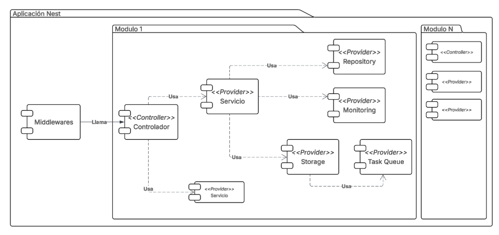

# Lab 1 - Fundamentos de Nest

## Objetivos

- Comprender la arquitectura modular y por capas de NestJS, identificando las responsabilidades de cada componente (Middleware, Controller, Service, Repository).
- Explicar el mecanismo de Inyección de Dependencias de Nest y su papel en la construcción de sistemas con bajo acoplamiento.
- Implementar un CRUD completo en NestJS aplicando las capas de Controller, Service y Repository con TypeORM.
- Definir y validar DTOs usando `class-validator` y `ValidationPipe`.
- Reflexionar sobre decisiones de arquitectura como la descomposición en módulos y la elección de tecnologías de persistencia.

---

## Índice

- [Lab 1 - Fundamentos de Nest](#lab-1---fundamentos-de-nest)
  - [Objetivos](#objetivos)
  - [Índice](#índice)
  - [1. Introducción a Nest](#1-introducción-a-nest)
  - [2. Componentes principales de Nest](#2-componentes-principales-de-nest)
    - [2.1 Middleware](#21-middleware)
    - [2.2 Controladores (Controllers)](#22-controladores-controllers)
    - [2.3 Providers](#23-providers)
    - [2.4 Módulos (Modules)](#24-módulos-modules)
  - [3. Arquitectura que seguiremos en el curso](#3-arquitectura-que-seguiremos-en-el-curso)
  - [4. Inyección de dependencias](#4-inyección-de-dependencias)
    - [¿Cómo funciona?](#cómo-funciona)
    - [Ejemplo concreto](#ejemplo-concreto)
    - [¿Por qué esto importa?](#por-qué-esto-importa)
  - [5. Creación de un CRUD en Nest. Construyendo un CRUD para la aplicación de Chiper](#5-creación-de-un-crud-en-nest-construyendo-un-crud-para-la-aplicación-de-chiper)
    - [5.1 Vista de Información y Funcional de Chiper](#51-vista-de-información-y-funcional-de-chiper)
    - [Instalación del ambiente de desarrollo](#instalación-del-ambiente-de-desarrollo)
      - [Requisitos previos](#requisitos-previos)
      - [Instalación del CLI de Nest](#instalación-del-cli-de-nest)
      - [Creación del proyecto](#creación-del-proyecto)
      - [Instalación de dependencias necesarias](#instalación-de-dependencias-necesarias)
      - [Configuración de base de datos](#configuración-de-base-de-datos)
    - [Paso 0 — Módulo de datasources](#paso-0--módulo-de-datasources)
      - [Componentes principales:](#componentes-principales)
    - [Paso 1 — Definir la entidad](#paso-1--definir-la-entidad)
    - [Paso 2 — Repositorio (persistencia)](#paso-2--repositorio-persistencia)
    - [Paso 3 — Servicio (lógica de aplicación)](#paso-3--servicio-lógica-de-aplicación)
    - [Paso 4 — Controller (rutas HTTP)](#paso-4--controller-rutas-http)
    - [Paso 5 — Wiring en el módulo](#paso-5--wiring-en-el-módulo)
  - [Entregables](#entregables)

---

## 1. Introducción a Nest


NestJS es un framework para construir aplicaciones backend en Node.js, con un enfoque fuerte en TypeScript y en la organización estructurada del código.
  
A diferencia de frameworks más minimalistas, Nest propone desde el inicio **una arquitectura clara y dividida en módulos claros**. Esto puede parecer excesivo al comienzo, pero para sistemas con alto crecimiento, el paradigma modular se convierte en una ventaja a la hora de crear aplicación con alta cohesión y bajo acoplamiento.

Nest sigue una arquitectura modular y por capas, promoviendo separación de responsabilidades y alta cohesión dentro de cada módulo.  
## 2. Componentes principales de Nest
Nest como framework solo distingue 3 capas de responsabilidad, middlewares, controllers y providers. Sin embargo para lograr un acoplamiento aún más bajo entre la capa de lógica de negocio y la capa de infraestructura se plantea la siguiente arquitectura de 4 niveles
### 2.1 Middleware
El middleware es la capa que ejecuta antes de que la petición llegue al controlador.
Se utiliza para declarar la lógica que es transversal a toda o gran parte de la aplicación como:
- **Logging:** En el middleware se pueden escribir logs relacionados a la petición (ruta, verbo http, ip del usuario, etc)
- **Autenticación básica:** Dado que los mecanismos de autenticación pueden ser los mismos para un conjunto o varios de servicios el middleware nos permite manejar esta autenticación y restringir o permitir peticiones incluso antes de que se ejecute la lógica de negocio
- **Métricas:** Se pueden agregar contadores de métricas para poder analizar el tráfico de cada uno de los servicios en el middleware, desacoplando esta lógica de la lógica de negocio 

> Un buen uso de middleware evita repetir lógica en múltiples controladores, lo cual permite mantener una base de código lo más pequeña posible
### 2.2 Controladores (Controllers)  
Son la puerta de entrada HTTP de la aplicación. Reciben las peticiones, delegan el trabajo a la capa de aplicación y retornan la respuesta.  

Un controlador no debería contener reglas de negocio complejas. Su responsabilidad principal es coordinar. Esto debido a que la capa de controladores debería ser fácilmente intercambiable. Por ejemplo si se decide no seguir usando el protocolo HTTP, el controlador no debería tener lógica de negocio que haga difícil este cambio
### 2.3 Providers
Un provider es cualquier clase que puede ser gestionada por el contenedor de Nest, esto significa que el framework se encarga de cargarla en memoria, inicializarla y eventualmente incluso eliminarla para mejor manejo de recursos.

En este curso utilizaremos principalmente dos tipos:
- Servicios (Services): Contienen la lógica de negocio y llaman a los providers de infraestructura necesarios.
- Infraestructura: Manejan el acceso a servicios externos, por ejemplo Repositorios (Repositories) para el acceso a bases de datos, servicios de caché externos, otras bases de datos o almacenamientos en la nube entre otros. En este tutorial solo se crearán repositorios, sin embargo a lo largo del curso conocerán otros tipos de elementos de infraestructura que les servirán como tácticas para satisfacer requerimientos de arquitectura. 
### 2.4 Módulos (Modules)
Un módulo agrupa controladores y providers relacionados bajo un mismo contexto funcional.

Permiten definir límites claros dentro del sistema. Cuando estos límites están bien definidos, el sistema es más fácil de evolucionar. Por ejemplo si se tiene un módulo de logística y uno de ventas, la separación de estos hace que un cambio en uno no afecte al otro. La separación de una aplicación en módulos no es una tarea trivial.
> [!IMPORTANT]
> **Pregunta 1:**
> Separar una aplicación en módulos es una tarea importante de arquitectura, una mala separación puede hacer que un pequeño cambio afecte funcionalidades que no debería. Por el contrario una buena separación hace que diferentes equipos de desarrollo puedan trabajar en una misma base de código con baja necesidad de comunicación
>
> Investigue estos dos patrones de descomposición de aplicaciones, el patrón está orientado a el estilo de arquitectura de microservicios que veremos más adelante en el curso. Sin embargo los conceptos mencionados funcionan para Nest dada su capacidad de encapsular aplicaciones en módulos
> - [Descomposición por capacidades de negocio](https://docs.aws.amazon.com/prescriptive-guidance/latest/modernization-decomposing-monoliths/decompose-business-capability.html)
> - [Descomposición por subdominios](https://docs.aws.amazon.com/es_es/prescriptive-guidance/latest/modernization-decomposing-monoliths/decompose-subdomain.html)
>
> ¿Si usted tuviera que realizar la descomposición de Chiper, teniendo en cuenta su contexto y madurez, qué patrón escogería?
## 3. Arquitectura que seguiremos en el curso

Como se mencionó anteriormente, la arquitectura que utilizaremos es una arquitectura por capas, estas capas vivirán dentro de cada módulo.

Estructura general:
1. Middleware (transversal)
2. Controller (capa de presentación)
3. Service (capa de aplicación / negocio)
4. Providers de infraestructura (repositorios, monitoreo, almacenamiento, colas)


Algunos ejemplos de providers de infraestructura:
- Repository (persistencia en base de datos)
- Monitoring (logs, métricas, trazas)
- Storage (archivos u objetos)
- Task Queue (procesamiento asíncrono)
Una ventaja importante de Nest es que permite agregar, quitar o reemplazar providers fácilmente.

**Por ejemplo:**
- Cambiar un repositorio real por uno en memoria para pruebas.
- Reemplazar una implementación de cola de mensajería por otra.
- Simular integraciones externas sin afectar la capa de negocio.

> [!IMPORTANT]
> **Pregunta 2:**
> Con sus conocimientos en bases de datos, describa algún caso en donde pueda usar como táctica de arquitectura remplazar una base de datos SQL por una no SQL. ¿Qué atributos favorecería? ¿Cuáles desfavorecería?

## 4. Inyección de dependencias

Nest utiliza el patrón de Inyección de Dependencias para gestionar la creación y el ciclo de vida de todos sus componentes. En lugar de que una clase cree sus propias dependencias con `new`, el contenedor de Nest se encarga de instanciarlas y entregarlas automáticamente.

### ¿Cómo funciona?

El flujo es el siguiente:

1. Se marca una clase como inyectable con `@Injectable()`.
2. Se declara esa clase como provider en un módulo.
3. Nest registra el provider en su contenedor.
4. Cuando otra clase la solicita en su constructor, Nest la resuelve y entrega automáticamente.

### Ejemplo concreto

Suponga que tiene un servicio de notificaciones que necesita enviar emails. En lugar de que el servicio de usuarios cree el cliente de email directamente, Nest lo inyecta:

**1. Definir el provider inyectable:**

```typescript
import { Injectable } from '@nestjs/common';

@Injectable()
export class EmailService {
  send(to: string, subject: string): void {
    console.log(`Enviando email a ${to}: ${subject}`);
  }
}
```

**2. Inyectarlo en otro servicio a través del constructor:**

```typescript
import { Injectable } from '@nestjs/common';
import { EmailService } from './email.service';

@Injectable()
export class UserService {
  constructor(private readonly emailService: EmailService) {}

  register(email: string): void {
    this.emailService.send(email, 'Bienvenido a Chiper');
  }
}
```

`UserService` no sabe cómo se construye `EmailService`, ni le importa. Solo declara que lo necesita y Nest se lo entrega.

**3. Registrar ambos en el módulo:**

```typescript
import { Module } from '@nestjs/common';
import { EmailService } from './email.service';
import { UserService } from './user.service';

@Module({
  providers: [EmailService, UserService],
})
export class UserModule {}
```

Con solo listar los providers en el módulo, Nest construye el grafo de dependencias, instancia `EmailService` primero y luego lo pasa al constructor de `UserService`. Todo ocurre de forma automática.

### ¿Por qué esto importa?

La gran es que permite **reemplazar implementaciones sin tocar el código que las usa**. Por ejemplo, para pruebas se puede sustituir `EmailService` por un mock que no envíe emails reales:

```typescript
const moduleRef = await Test.createTestingModule({
  providers: [
    UserService,
    {
      provide: EmailService,
      useValue: { send: jest.fn() },
    },
  ],
}).compile();
```

`UserService` se comporta exactamente igual sin necesidad de modificar su código.

Se recomienda revisar la documentación oficial para profundizar en providers personalizados y scopes:
[https://docs.nestjs.com/fundamentals/custom-providers](https://docs.nestjs.com/fundamentals/custom-providers)

## 5. Creación de un CRUD en Nest. Construyendo un CRUD para la aplicación de Chiper

Este tutorial recorre, paso a paso, cómo está construido un CRUD de la aplicación Chiper. Está pensado como si lo fuéramos implementando desde cero, explicando las decisiones y cómo se conectan `Controller`, `Service`, `Repository`, `Entity` y un cliente externo mock (`TiendaClientMock`).

### 5.1 Vista de Información y Funcional de Chiper
Antes de empezar con el código, es importante entender el modelamiento que se hizo de Chiper, a partir del enunciado se pudo comprender el dominio de la aplicación el cual nos permite entender que entidades tenemos que implementar y como se comporta la aplicación:
- [Diagrama de Dominio](./Modelo_Dominio_Chiper.pdf)

A partir de este modelado, tenemos un entendimiento más profundo de como funciona Chiper, el siguiente paso es comprender la estructura funcional de Chiper. Es decir, cómo podemos organizar y dividir nuestra aplicación en unidades lógicas que tengan sentido entre si. Los diagramas de componentes y conectores nos permiten modelar estas estructuras, sin embargo para lograr esto vamos a separar el modelo de dominio en múltiples subdominios que tengan sentido entre si, recuerde que un subdominio es un conjunto de elementos del dominio que tienen sentido en conjunto. A partir de esta separación llegamos al siguiente diagrama en donde vemos cada subdominio identificado con un color
- [Subdominios](./Subdominios.pdf)

Por último podemos identificar cada uno de estos subdominios como componentes, estos componentes definirán la estructura de nuestra aplicación Nest pues cada componente puede mapearse a un módulo.


Con esta organización en mente, vamos a crear el CRUD de Catálogo perteneciente al módulo de Logística. El objetivo es construir un CRUD REST para `Catalogo` con validación, verificación de existencia en un servicio externo (mock) y persistencia via TypeORM.

**Arquitectura breve:**

- `Controller`: recibe requests HTTP, aplica `ValidationPipe`, delega a `Service`.
- `Service`: orquesta lógica (p. ej. valida existencia de tienda, maneja errores), usa `Repository` para persistencia.
- `Repository`: encapsula acceso a la base de datos (TypeORM `Repository<Catalogo>`), expone métodos CRUD.
- `Entity`: define la tabla `catalogos` y relaciones.
- `Client` (mock): simula la verificación de la tienda remota.

### Instalación del ambiente de desarrollo
Antes de iniciar el laboratorio es necesario preparar el entorno de trabajo.

#### Requisitos previos

Debe tener instalado:

- Node.js (versión LTS recomendada, ≥ 18.x)
- npm
- Docker (opcional pero recomendado para base de datos)

#### Instalación del CLI de Nest
``` bash
npm install -g @nestjs/cli
```
Verificar:

``` bash
nest --version
```

#### Creación del proyecto

``` bash
nest new chiper-backend
```

Estructura inicial generada:

```
src/
 ├── app.controller.ts
 ├── app.service.ts
 ├── app.module.ts
 └── main.ts
```

#### Instalación de dependencias necesarias

Para este laboratorio se utilizará:

- TypeORM: ORM para manejar la persistencia con PostgreSQL.
- PostgreSQL: Cliente de base de datos relacional.
- class-validator: Para validación de DTOs.
- class-transformer: Para transformar objetos (ej. parsear strings a fechas).
- uuid: Manejo de identificadores UUID.

Instalar:

``` bash
npm install @nestjs/typeorm typeorm pg
npm install class-validator class-transformer
npm install uuid
```

#### Configuración de base de datos

**¿Qué es Docker?**

Docker es una herramienta que permite ejecutar aplicaciones dentro de **contenedores**: entornos aislados y ligeros que incluyen todo lo necesario para que una aplicación funcione (sistema operativo base, librerías, configuración). A diferencia de una máquina virtual, un contenedor no virtualiza hardware completo, sino que comparte el kernel del sistema operativo anfitrión, haciéndolo mucho más rápido y liviano.

En el contexto de este laboratorio, Docker permite levantar una base de datos PostgreSQL en segundos, sin necesidad de instalarla directamente en el sistema. Cuando el contenedor se elimina, no queda ningún rastro en la máquina.

Para la instalación se recomienda instalar [Docker Desktop](https://docs.docker.com/get-started/get-docker/)

Se recomienda levantar una instancia PostgreSQL con Docker:

``` bash
docker run --name chiper-db \
  -e POSTGRES_PASSWORD=postgres \
  -e POSTGRES_DB=chiper \
  -p 5432:5432 \
  -d postgres
```

Ejecución del proyecto
``` bash
npm run start:dev
```

Probar en:
``` bash
http://localhost:3000
```

### Paso 0 — Módulo de datasources

El módulo `datasources` es una parte fundamental de la aplicación, ya que se encarga de gestionar la conexión y configuración de las bases de datos. Este módulo encapsula toda la lógica relacionada con la infraestructura de persistencia, permitiendo que otros módulos interactúen con la base de datos de manera desacoplada.

#### Componentes principales:

1. **`database.module.ts`**: Este archivo define el módulo de base de datos y exporta los providers necesarios para que otros módulos puedan utilizarlos.
2. **`database.providers.ts`**: Contiene los providers que configuran la conexión a la base de datos utilizando TypeORM. Aquí se definen las entidades y las configuraciones específicas de la base de datos.
3. **`database-seeder.service.ts`**: Este servicio es responsable de inicializar datos en la base de datos, útil para propósitos de desarrollo o pruebas.

El diseño de este módulo sigue el principio de encapsulación, asegurando que los detalles de la conexión a la base de datos estén aislados y sean fácilmente reemplazables o configurables sin afectar el resto de la aplicación.

### Paso 1 — Definir la entidad

La entidad `Catalogo` modela la tabla `catalogos` con campos: `id`, `tiendaId`, `vigenciaDesde`, `vigenciaHasta`, `zona`, timestamps y relación one-to-many con `CatalogoProducto`.  

``` typescript 
import {
  Column,
  CreateDateColumn,
  Entity,
  OneToMany,
  PrimaryGeneratedColumn,
  UpdateDateColumn,
} from 'typeorm';
import { CatalogoProducto } from './catalogo-producto.entity';

@Entity('catalogos')
export class Catalogo {
  @PrimaryGeneratedColumn('uuid')
  id: string;

  @Column('uuid')
  tiendaId: string;

  @Column('timestamp')
  vigenciaDesde: Date;

  @Column('timestamp')
  vigenciaHasta: Date;

  @Column('varchar', { length: 255 })
  zona: string;

  @CreateDateColumn()
  createdAt: Date;

  @UpdateDateColumn()
  updatedAt: Date;

  @OneToMany(
    () => CatalogoProducto,
    (catalogoProducto) => catalogoProducto.catalogo,
  )
  productos: CatalogoProducto[];
}

```  

Note que con `typeorm` definimos el ID con el decorador `@PrimaryGeneratedColumn('uuid')` usando `uuid` como el tipo de dato del ID. Adicionalmente se usa `@Column(<tipo>)` para definir cada columna y su tipo, y `@CreateDateColumn()` y `@UpdateDateColumn()` para manejar automáticamente los timestamps de creación y actualización. La relación con `CatalogoProducto` se define con `@OneToMany`, para la relación adicionalmente se define dentro del decorador la función que retorna la entidad relacionada y la función que indica el campo de relación inversa.

### Paso 2 — Repositorio (persistencia)

`CatalogoRepository` envuelve un `Repository<Catalogo>` de TypeORM e implementa:
- `create(catalogo: Partial<Catalogo>)` → `repository.save()`
- `findAll(query: QueryCatalogoDto)` → usa `createQueryBuilder` y aplica filtros (ej. `tiendaId`).
- `findById(id)` → `repository.findOne({ where: { id } })`
- `update(id, updates)` → `repository.update` + `findById`
- `delete(id)` → `repository.delete`

``` typescript
import { Inject, Injectable } from '@nestjs/common';
import { Repository } from 'typeorm';
import { QueryCatalogoDto } from '../dtos';
import { Catalogo } from './entities';

@Injectable()
export class CatalogoRepository {
  constructor(
    @Inject('CATALOGO_REPOSITORY')
    private repository: Repository<Catalogo>,
  ) {}

  async create(catalogo: Partial<Catalogo>): Promise<Catalogo> {
	const newCatalogo = this.repository.create(catalogo);
    return this.repository.save(newCatalogo);
  }

  async findAll(query: QueryCatalogoDto): Promise<Catalogo[]> {
    const queryBuilder = this.repository.createQueryBuilder('catalogo');
    
    if (query.tiendaId) {
      queryBuilder.andWhere('catalogo.tiendaId = :tiendaId', {
        tiendaId: query.tiendaId,
      });
    }
    return queryBuilder.getMany();
  }

  async findById(id: string): Promise<Catalogo | null> {
    return this.repository.findOne({ where: { id } });
  }

  async update(id: string, updates: Partial<Catalogo>): 
  Promise<Catalogo | null> {
    await this.repository.update(id, updates);
    return this.findById(id);
  }

  async delete(id: string): Promise<boolean> {
    const result = await this.repository.delete(id);
    return (result.affected ?? 0) > 0;
  }
}
```

Consejos de implementación:
- Es ideal mantener la lógica de filtrado dentro del repo (query builder). Esto reduce el acoplamiento dado que diferentes ORMs y diferentes bases de datos manejan de forma diferente la forma en la que se hacen consultas complejas 
- Se debe devolver `null` o `undefined` cuando no existe, y deja que el `Service` lance `NotFoundException`.

Como se puede ver, este repositorio inyecta una clase `Repository<Catalogo>` usando el identificador del provider (`'CATALOGO_REPOSITORY'`). Este provider define qué entidad maneja y adicionalmente inyecta el provider con la configuración de conexión a la base de datos que se encuentra en el módulo de `datasources`.

``` typescript
import { DataSource } from 'typeorm';
import {
  Catalogo,
} from './entities';

export const repositoryProviders = [
  {
    provide: 'CATALOGO_REPOSITORY',
    useFactory: (dataSource: DataSource) => dataSource.getRepository(Catalogo),
    inject: ['DATA_SOURCE'],
  },
];
```

### Paso 3 — Servicio (lógica de aplicación)

`CatalogoService` hace el trabajo importante:
- Verifica que la `tienda` exista usando `TiendaClientMock` en `create()`.
- Lanza `BadRequestException` si la tienda no existe.
- Lanza `NotFoundException` si se consulta/actualiza/elimina un catálogo inexistente.
- Mappea la entidad a `CatalogoResponseDto` con `mapToResponse`.

>[!TIP]
> Dado que el servicio que trae los datos de la tienda no se ha implementado, se mockea el servicio externo de tienda para crear la lógica teniendo en cuenta este servicio para que en el momento en el que sea implementado, el cambio sea mínimo.
  
``` typescript
import {
  BadRequestException,
  Injectable,
  NotFoundException,
} from '@nestjs/common';
import { TiendaClientMock } from '../clients';
import {
  CatalogoResponseDto,
  CreateCatalogoDto,
  QueryCatalogoDto,
  UpdateCatalogoDto,
} from '../dtos';
import { CatalogoRepository } from '../repositories';
import { Catalogo } from '../repositories/entities';

@Injectable()
export class CatalogoService {
  constructor(
    private readonly catalogoRepository: CatalogoRepository,
    private readonly tiendaClient: TiendaClientMock,
  ) {}

  async create(dto: CreateCatalogoDto): Promise<CatalogoResponseDto> {
    const tiendaExists = await this.tiendaClient.exists(dto.tiendaId);
    if (!tiendaExists) {
      throw new BadRequestException(`Tienda con id ${dto.tiendaId} no existe`);
    }

    const catalogo = await this.catalogoRepository.create(dto);
    return this.mapToResponse(catalogo);
  }

  async findAll(query: QueryCatalogoDto): Promise<CatalogoResponseDto[]> {
    const catalogos = await this.catalogoRepository.findAll(query);
    return catalogos.map((catalogo) => this.mapToResponse(catalogo));
  }

  async findById(id: string): Promise<CatalogoResponseDto> {
    const catalogo = await this.catalogoRepository.findById(id);
    if (!catalogo) {
      throw new NotFoundException(`Catalogo con id ${id} no encontrado`);
    }
    return this.mapToResponse(catalogo);
  }

  async update(
    id: string,
    dto: UpdateCatalogoDto,
  ): Promise<CatalogoResponseDto> {
    const catalogo = await this.catalogoRepository.findById(id);
    if (!catalogo) {
      throw new NotFoundException(`Catalogo con id ${id} no encontrado`);
    }

    const updatedCatalogo = await this.catalogoRepository.update(id, dto);
    return this.mapToResponse(updatedCatalogo!);
  }

  async delete(id: string): Promise<void> {
    const catalogo = await this.catalogoRepository.findById(id);
    if (!catalogo) {
      throw new NotFoundException(`Catalogo con id ${id} no encontrado`);
    }

    await this.catalogoRepository.delete(id);
  }

  private mapToResponse(catalogo: Catalogo): CatalogoResponseDto {
    return {
      id: catalogo.id,
      tiendaId: catalogo.tiendaId,
      vigenciaDesde: catalogo.vigenciaDesde,
      vigenciaHasta: catalogo.vigenciaHasta,
      zona: catalogo.zona,
      createdAt: catalogo.createdAt,
      updatedAt: catalogo.updatedAt,
    };
  }
}

```
> [!IMPORTANT]
> **Pregunta 3:**
> Suponga que en el módulo de Logística y Pedidos se crea un PedidoService que depende de:
> - Un `RepositorioPedido`
> - Un `ServicioDisponibilidadZona`
> - Un `ServicioCalculoPromociones`
>
> Además, la aplicación opera en múltiples países (COP, MXN, BRL) y debe soportar alta concurrencia en quincenas.
> Con base en la documentación oficial de Nest:
> Si desea intercambiar la implementación de RepositorioPedido por una versión distinta (por ejemplo, una que use otro motor de base de datos o una implementación mock para pruebas), ¿cómo debería definir y registrar el provider para evitar acoplamiento directo a la clase concreta?
> Imagine que `ServicioCalculoPromociones` mantiene información temporal del request (por ejemplo, reglas dinámicas por país y tipo de tienda).
> - ¿Qué implicaciones tendría dejarlo como singleton?
> - ¿En qué caso sería más apropiado usar request scope?
> - ¿Qué impacto real tendría esto en memoria y rendimiento bajo alta carga?
> - Si `ServicioDisponibilidadZona` realiza llamadas frecuentes a infraestructura externa (por ejemplo, inventario en tiempo real), ¿en qué escenario un transient provider cambiaría el comportamiento observable del sistema?
> Argumente sus respuestas con base en cómo Nest gestiona el ciclo de vida de los providers y la resolución de dependencias en tiempo de ejecución.

### Paso 4 — Controller (rutas HTTP)

El `CatalogoController` expone rutas RESTful:
- `POST /logistics/catalogos` → `create(dto: CreateCatalogoDto)`
- `GET /logistics/catalogos` → `findAll(query: QueryCatalogoDto)`
- `GET /logistics/catalogos/:id` → `findById(id)`
- `PATCH /logistics/catalogos/:id` → `update(id, dto: UpdateCatalogoDto)`
- `DELETE /logistics/catalogos/:id` → `delete(id)`

``` typescript
import {
  Body,
  Controller,
  Delete,
  Get,
  Param,
  Patch,
  Post,
  Query,
  ValidationPipe,
} from '@nestjs/common';
import {
  CatalogoResponseDto,
  CreateCatalogoDto,
  QueryCatalogoDto,
  UpdateCatalogoDto,
} from '../dtos';
import { CatalogoService } from '../services';

@Controller('logistics/catalogos')
export class CatalogoController {
  constructor(private readonly catalogoService: CatalogoService) {}

  @Post()
  async create(
    @Body(new ValidationPipe({ transform: true }))
    dto: CreateCatalogoDto,
  ): Promise<CatalogoResponseDto> {
    return this.catalogoService.create(dto);
  }

  @Get()
  async findAll(
    @Query(new ValidationPipe({ transform: true }))
    query: QueryCatalogoDto,
  ): Promise<CatalogoResponseDto[]> {
    return this.catalogoService.findAll(query);
  }

  @Get(':id')
  async findById(@Param('id') id: string): Promise<CatalogoResponseDto> {
    return this.catalogoService.findById(id);
  }

  @Patch(':id')
  async update(
    @Param('id') id: string,
    @Body(new ValidationPipe({ transform: true }))
    dto: UpdateCatalogoDto,
  ): Promise<CatalogoResponseDto> {
    return this.catalogoService.update(id, dto);
  }

  @Delete(':id')
  async delete(@Param('id') id: string): Promise<void> {
    return this.catalogoService.delete(id);
  }
}
```

Observaciones:
- `@Body(new ValidationPipe({ transform: true }))` permite transformar/validar DTOs automáticamente.
- `@Query(new ValidationPipe({ transform: true }))` permite parseo y validación de query params.  

Se recomienda consultar más a profundidad los [validation pipes](https://docs.nestjs.com/techniques/validation) de Nest, esta solución es bastante elegante para validar la entrada de datos definiendo un validador, en este caso nuestro validador es el mismo DTO

``` typescript
import { IsDateString, IsString, IsUUID, MaxLength } from 'class-validator';

export class CreateCatalogoDto {
  @IsUUID()
  tiendaId: string;

  @IsDateString()
  vigenciaDesde: Date;

  @IsDateString()
  vigenciaHasta: Date;

  @IsString()
  @MaxLength(255)
  zona: string;
}
```

El DTO además de tener los tipos que debe transportar, una serie de decoradores que van a señalar las validaciones que debe cumplir una instancia de esta clase que llegue en la petición

> [!IMPORTANT]
> **Pregunta 4:**
> - ¿Qué diferencia existe entre Guards, Interceptors, Pipes y Middleware?
> - ¿En qué orden exacto se ejecutan dentro del ciclo de vida de una petición?

### Paso 5 — Wiring en el módulo

`LogisticaModule` importa `DatabaseModule`, registra `repositoryProviders` (instancias de typeorm para cada entidad), provee `TiendaClientMock` y registra `CatalogoService`, `CatalogoController` y `CatalogoRepository`.

``` typescript
import { Module } from '@nestjs/common';
// Database
import { DatabaseModule } from '../datasources/database.module';
// Clients
import { TiendaClientMock } from './clients';
// Repositories
import {
  CatalogoRepository,
} from './repositories';

// Services
import {
  CatalogoService,
} from './services';

// Controllers
import {
  CatalogoController,
} from './controllers';

import { repositoryProviders } from './repositories/repository.providers';

@Module({
  imports: [DatabaseModule],
  controllers: [
    CatalogoController,
  ],
  providers: [
    // Repository Providers
    ...repositoryProviders,
    // Repositories
    CatalogoRepository,
    // Services
    CatalogoService,
    // Mock Clients
    TiendaClientMock,
  ],
  exports: [
    CatalogoService,
  ],
})
export class LogisticaModule {}

```  

> [!IMPORTANT]
> **Pregunta 5:**
> Note que el módulo exporta `CatalogoService` ¿Cómo funciona el mecanismo de exports e imports entre módulos y qué implicaciones tiene en el acoplamiento? ¿Por qué no se exporta el `CatalogoRepository`?

## Entregables

El estudiante debe entregar un documento en PDF que incluya:

1. Respuestas argumentadas a las preguntas del laboratorio

**Nota:** Debe responder con profundidad arquitectónica, no definiciones superficiales.


2. Implementación funcional de los siguientes componentes, con el código fuente adjunto o enlace al repositorio:

   **2.1 CRUD de Producto (módulo de Logística)**

   Tomando como base el diagrama de dominio y el diagrama de componentes, implementar un CRUD completo para la entidad `Producto` dentro del módulo de logística (`LogisticaModule`). Debe seguir la misma arquitectura del CRUD de `Catalogo`:
   - Entidad `Producto` mapeada con TypeORM.
   - `ProductoRepository` con operaciones CRUD y filtros relevantes.
   - `ProductoService` con validaciones y manejo de excepciones.
   - `ProductoController` con rutas RESTful y validación de DTOs.
   - DTOs de creación, actualización y consulta con `class-validator`.

   **2.2 Módulo de Autenticación e Identificación con CRUD de Tienda**

   Crear un nuevo módulo `IdentificacionModule` que encapsule la gestión de tiendas:
   - Entidad `Tienda` mapeada con TypeORM según el diagrama de dominio.
   - `TiendaRepository`, `TiendaService` y `TiendaController` siguiendo la misma arquitectura por capas.
   - CRUD completo expuesto vía HTTP con validación de DTOs.
   - El módulo debe exportar `TiendaService` para que pueda ser consumido por otros módulos.

   **2.3 Reemplazo del mock de Tienda en el servicio de Catálogo**

   Eliminar `TiendaClientMock` del módulo de logística y reemplazar su uso en `CatalogoService` por una llamada real a `TiendaService`:
   - `LogisticaModule` debe importar `IdentificacionModule`.
   - `CatalogoService` debe inyectar `TiendaService` en lugar de `TiendaClientMock`.
   - La verificación de existencia de la tienda al crear un catálogo debe realizarse a través del servicio real.

