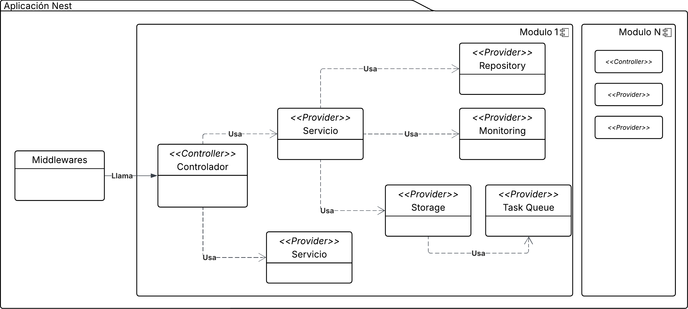
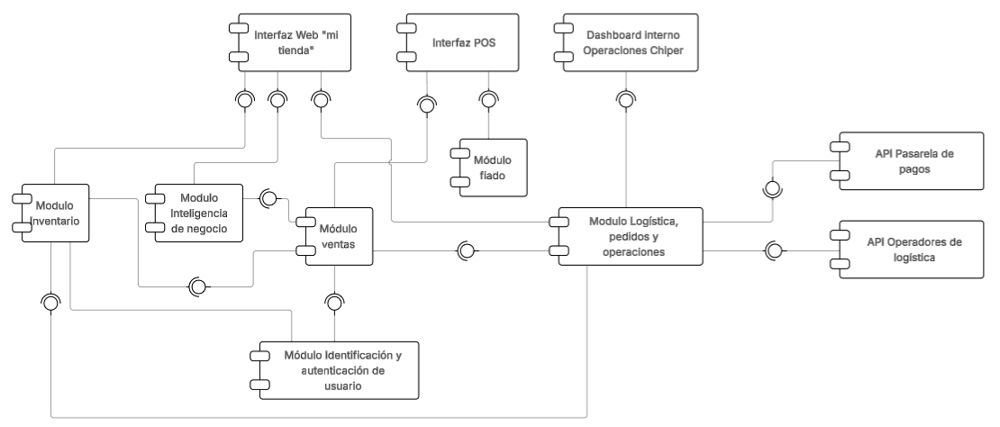

# Lab 1 - Fundamentos de Nest

## Etapas del laboratorio

| Etapa                              | Resumen                                                                           | Uso de IA generativa                                                                                   |
| ---------------------------------- | --------------------------------------------------------------------------------- | ------------------------------------------------------------------------------------------------------ |
| 1. Introduccion y conceptos base   | Contexto de NestJS, arquitectura modular y componentes principales.               | Recomendado para aclarar conceptos y contrastar ejemplos; **validar con documentacion oficial.**       |
| 2. Diseño arquitectonico de Cheapest | Analisis de modularizacion y decisiones de arquitectura por capas para Cheapest.    | Uso acotado: apoyar investigacion, pero la argumentacion debe ser propia del equipo.                   |
| 3. Inyeccion de dependencias       | Comprension practica de providers, contenedor y reemplazo de implementaciones.    | Recomendado para generar ejemplos adicionales y pruebas de comprension.                                |
| 4. Implementacion CRUD             | Construccion paso a paso de entidad, repositorio, servicio y controlador en Nest. | Recomendado para soporte de codigo (snippets, validaciones, pruebas), con revision manual obligatoria. |
| 5. Entregables y evidencia         | Consolidacion de resultados y decisiones tomadas durante el laboratorio.          | No recomendado para redactar conclusiones finales sin analisis propio.                                 |

## Objetivos

- Comprender la arquitectura modular y por capas de NestJS, identificando las responsabilidades de cada componente (Middleware, Controller, Service, Repository).
- Explicar el mecanismo de Inyección de Dependencias de Nest y su papel en la construcción de sistemas con bajo acoplamiento.
- Implementar un CRUD completo en NestJS aplicando las capas de Controller, Service y Repository con TypeORM.
- Definir y validar DTOs usando `class-validator` y `ValidationPipe`.
- Reflexionar sobre decisiones de arquitectura como la descomposición en módulos y la elección de tecnologías de persistencia.

---

## Índice

- [Lab 1 - Fundamentos de Nest](#lab-1---fundamentos-de-nest)
  - [Objetivos](#objetivos)
  - [Índice](#índice)
  - [1. Introducción a Nest](#1-introducción-a-nest)
  - [2. Componentes principales de Nest](#2-componentes-principales-de-nest)
    - [2.1 Middleware](#21-middleware)
    - [2.2 Controladores (Controllers)](#22-controladores-controllers)
    - [2.3 Providers](#23-providers)
    - [2.4 Módulos (Modules)](#24-módulos-modules)
  - [3. Arquitectura que seguiremos en el curso](#3-arquitectura-que-seguiremos-en-el-curso)
  - [4. Inyección de dependencias](#4-inyección-de-dependencias)
    - [¿Cómo funciona?](#cómo-funciona)
    - [Ejemplo concreto](#ejemplo-concreto)
    - [¿Por qué esto importa?](#por-qué-esto-importa)
  - [5. Creación de un CRUD en Nest. Construyendo un CRUD para la aplicación de Cheapest](#5-creación-de-un-crud-en-nest-construyendo-un-crud-para-la-aplicación-de-Cheapest)
    - [5.1 Vista de Información y Funcional de Cheapest](#51-vista-de-información-y-funcional-de-Cheapest)
    - [Instalación del ambiente de desarrollo](#instalación-del-ambiente-de-desarrollo)
      - [Requisitos previos](#requisitos-previos)
      - [Instalación del CLI de Nest](#instalación-del-cli-de-nest)
      - [Creación del proyecto](#creación-del-proyecto)
      - [Instalación de dependencias necesarias](#instalación-de-dependencias-necesarias)
      - [Configuración de base de datos](#configuración-de-base-de-datos)
    - [Paso 0 — Módulo de datasources](#paso-0--módulo-de-datasources)
      - [Componentes principales:](#componentes-principales)
    - [Paso 1 — Definir la entidad](#paso-1--definir-la-entidad)
    - [Paso 2 — Repositorio (persistencia)](#paso-2--repositorio-persistencia)
    - [Paso 3 — Servicio (lógica de aplicación)](#paso-3--servicio-lógica-de-aplicación)
    - [Paso 4 — Controller (rutas HTTP)](#paso-4--controller-rutas-http)
    - [Paso 5 — Wiring en el módulo](#paso-5--wiring-en-el-módulo)
  - [Entregables](#entregables)

---

## 1. Introducción a Nest


NestJS es un framework para construir aplicaciones backend en Node.js, con un enfoque fuerte en TypeScript y en la organización estructurada del código.
  
A diferencia de frameworks más minimalistas, Nest propone desde el inicio **una arquitectura clara y dividida en módulos claros**. Esto puede parecer excesivo al comienzo, pero para sistemas con alto crecimiento, el paradigma modular se convierte en una ventaja a la hora de crear aplicación con alta cohesión y bajo acoplamiento.

Nest sigue una arquitectura modular y por capas, promoviendo separación de responsabilidades y alta cohesión dentro de cada módulo.  
## 2. Componentes principales de Nest
Nest como framework solo distingue 3 capas de responsabilidad, middlewares, controllers y providers. Sin embargo para lograr un acoplamiento aún más bajo entre la capa de lógica de negocio y la capa de infraestructura se plantea la siguiente arquitectura de 4 niveles
1. Middleware (lógica de soporte compartida)
2. Controller (capa de presentación)
3. Service (capa de aplicación / negocio)
4. Providers de infraestructura (repositorios, monitoreo, almacenamiento, colas)

> [!NOTE]
> Estos 4 niveles **no** son una capa adicional que agrega Nest, sino una decisión arquitectónica desde las 3 capas nativas del framework (Middleware, Controllers, Providers) que usaremos en este curso para bajar el acoplamiento. En las subsecciones 2.1–2.4 a continuación, `Service` y `Providers de infraestructura` (niveles 3 y 4) se explican juntos bajo el título **2.3 Providers**, ya que ambos son, desde la perspectiva de Nest, providers gestionados por el mismo contenedor de inyección de dependencias. Adicionalmente se agrega la subsección **2.4 Módulos**, que no es una capa de responsabilidad de negocio sino el mecanismo organizacional que agrupa Middleware, Controllers y Providers dentro de un mismo contexto funcional.

### 2.1 Middleware
El middleware es la capa que ejecuta antes de que la petición llegue al controlador.
Se utiliza para declarar la lógica que es transversal a toda o gran parte de la aplicación como:
- **Logging:** En el middleware se pueden escribir logs relacionados a la petición (ruta, verbo http, ip del usuario, etc)
- **Autenticación básica:** Dado que los mecanismos de autenticación pueden ser los mismos para un conjunto o varios de servicios el middleware nos permite manejar esta autenticación y restringir o permitir peticiones incluso antes de que se ejecute la lógica de negocio
- **Métricas:** Se pueden agregar contadores de métricas para poder analizar el tráfico de cada uno de los servicios en el middleware, desacoplando esta lógica de la lógica de negocio 

> Un buen uso de middleware evita repetir lógica en múltiples controladores, lo cual permite mantener una base de código lo más pequeña posible
### 2.2 Controladores (Controllers)  
Son la puerta de entrada HTTP de la aplicación. Reciben las peticiones, delegan el trabajo a la capa de aplicación y retornan la respuesta.  

Un controlador no debería contener reglas de negocio complejas. Su responsabilidad principal es coordinar. Esto debido a que la capa de controladores debería ser fácilmente intercambiable. Por ejemplo si se decide no seguir usando el protocolo HTTP, el controlador no debería tener lógica de negocio que haga difícil este cambio
### 2.3 Providers
Un provider es cualquier clase que puede ser gestionada por el contenedor de Nest, esto significa que el framework se encarga de cargarla en memoria, inicializarla y eventualmente incluso eliminarla para mejor manejo de recursos.

En este curso utilizaremos principalmente dos tipos:
- Servicios (Services): Contienen la lógica de negocio y llaman a los providers de infraestructura necesarios.
- Infraestructura: Manejan el acceso a servicios externos, por ejemplo Repositorios (Repositories) para el acceso a bases de datos, servicios de caché externos, otras bases de datos o almacenamientos en la nube entre otros. En este tutorial solo se crearán repositorios, sin embargo a lo largo del curso conocerán otros tipos de elementos de infraestructura que les servirán como tácticas para satisfacer requerimientos de arquitectura. 
### 2.4 Módulos (Modules)
Un módulo agrupa controladores y providers relacionados bajo un mismo contexto funcional.

Permiten definir límites claros dentro del sistema. Cuando estos límites están bien definidos, el sistema es más fácil de evolucionar. Por ejemplo si se tiene un módulo de logística y uno de ventas, la separación de estos hace que un cambio en uno no afecte al otro. La separación de una aplicación en módulos no es una tarea trivial.
> [!IMPORTANT]
> **Pregunta 1:**
> Separar una aplicación en módulos es una tarea importante de arquitectura, una mala separación puede hacer que un pequeño cambio afecte funcionalidades que no debería. Por el contrario una buena separación hace que diferentes equipos de desarrollo puedan trabajar en una misma base de código con baja necesidad de comunicación
>
> Investigue estos dos patrones de descomposición de aplicaciones, el patrón está orientado a el estilo de arquitectura de microservicios que veremos más adelante en el curso. Sin embargo los conceptos mencionados funcionan para Nest dada su capacidad de encapsular aplicaciones en módulos
> - [Descomposición por capacidades de negocio](https://docs.aws.amazon.com/es_es/prescriptive-guidance/latest/modernization-decomposing-monoliths/decompose-business-capability.html)
> - [Descomposición por subdominios](https://docs.aws.amazon.com/es_es/prescriptive-guidance/latest/modernization-decomposing-monoliths/decompose-subdomain.html)
>
> ¿Si usted tuviera que realizar la descomposición de Cheapest, teniendo en cuenta su contexto y madurez, qué patrón escogería?
## 3. Arquitectura que seguiremos en el curso

Como se mencionó anteriormente, utilizaremos una arquitectura por capas, estas capas vivirán dentro de cada módulo.

Estructura general:


*Figura 1. Arquitectura por capas dentro de un módulo de Nest: el Middleware se ejecuta antes de llegar al Controller, este delega en el Service (lógica de negocio), y el Service utiliza Providers de infraestructura (Repository, Monitoring, Storage, Task Queue) para interactuar con sistemas externos.*

Algunos ejemplos de providers de infraestructura:
- Repository (persistencia en base de datos)
- Monitoring (logs, métricas, trazas)
- Storage (archivos u objetos)
- Task Queue (procesamiento asíncrono)
Una ventaja importante de Nest es que permite agregar, quitar o reemplazar providers fácilmente.

**Por ejemplo:**
- Cambiar un repositorio real por uno en memoria para pruebas.
- Reemplazar una implementación de cola de mensajería por otra.
- Simular integraciones externas sin afectar la capa de negocio.

> [!IMPORTANT]
> **Pregunta 2:**
> Con sus conocimientos en bases de datos, describa algún caso en donde pueda usar como táctica de arquitectura remplazar una base de datos SQL por una no SQL en el contexto de Cheapest. ¿Qué atributos favorecería? ¿Cuáles desfavorecería?

## 4. Inyección de dependencias

Cuando una clase crea sus propias dependencias con `new` (por ejemplo, `const emailService = new EmailService()` dentro de `UserService`), queda **fuertemente acoplada** a esa implementación concreta: si `EmailService` cambia su constructor, cambia su ubicación, o se quiere reemplazar por otra implementación, hay que modificar cada clase que la instancia directamente. Esto también dificulta el **testing**, porque no hay forma sencilla de sustituir `EmailService` por un doble de prueba (mock/stub) sin tocar el código de `UserService`. Y hace que el sistema sea **rígido**: cambiar de proveedor de email, de base de datos o de cualquier dependencia externa implica salir a buscar y editar cada lugar donde se hizo `new`. La **Inyección de Dependencias (DI)** es un patrón que resuelve este problema invirtiendo el control de la creación de objetos: en lugar de que una clase construya sus dependencias, estas le son "inyectadas" desde afuera (típicamente por el constructor), y un contenedor externo se encarga de construir y entregar esas dependencias. Nest implementa este patrón de forma nativa a través de su contenedor de inyección de dependencias.

Nest utiliza el patrón de Inyección de Dependencias para gestionar la creación y el ciclo de vida de todos sus componentes. En lugar de que una clase cree sus propias dependencias con `new`, el contenedor de Nest se encarga de instanciarlas y entregarlas automáticamente.

### ¿Cómo funciona?

El flujo es el siguiente:

1. Se marca una clase como inyectable con `@Injectable()`.
2. Se declara esa clase como provider en un módulo.
3. Nest registra el provider en su contenedor.
4. Cuando otra clase la solicita en su constructor, Nest la resuelve y entrega automáticamente.

### Ejemplo concreto

Suponga que tiene un servicio de notificaciones que necesita enviar emails. En lugar de que el servicio de usuarios cree el cliente de email directamente, Nest lo inyecta:

**1. Definir el provider inyectable:**

```typescript
import { Injectable } from '@nestjs/common';

@Injectable()
export class EmailService {
  send(to: string, subject: string): void {
    console.log(`Enviando email a ${to}: ${subject}`);
  }
}
```

**2. Inyectarlo en otro servicio a través del constructor:**

```typescript
import { Injectable } from '@nestjs/common';
import { EmailService } from './email.service';

@Injectable()
export class UserService {
  constructor(private readonly emailService: EmailService) {}

  register(email: string): void {
    this.emailService.send(email, 'Bienvenido a Cheapest');
  }
}
```

`UserService` no sabe cómo se construye `EmailService`, ni le importa. Solo declara que lo necesita y Nest se lo entrega.

**3. Registrar ambos en el módulo:**

```typescript
import { Module } from '@nestjs/common';
import { EmailService } from './email.service';
import { UserService } from './user.service';

@Module({
  providers: [EmailService, UserService],
})
export class UserModule {}
```

Con solo listar los providers en el módulo, Nest construye el grafo de dependencias, instancia `EmailService` primero y luego lo pasa al constructor de `UserService`. Todo ocurre de forma automática.

### ¿Por qué esto importa?

La gran ventaja es que permite **reemplazar implementaciones sin tocar el código que las usa**. Por ejemplo, para pruebas se puede sustituir `EmailService` por un mock que no envíe emails reales:

```typescript
const moduleRef = await Test.createTestingModule({
  providers: [
    UserService,
    {
      provide: EmailService,
      useValue: { send: jest.fn() },
    },
  ],
}).compile();
```

`UserService` se comporta exactamente igual sin necesidad de modificar su código.

Se recomienda revisar la documentación oficial para profundizar en providers personalizados y scopes:
[https://docs.nestjs.com/fundamentals/custom-providers](https://docs.nestjs.com/fundamentals/custom-providers)

### ¿Qué genera el CLI de Nest al crear un módulo?

Antes de avanzar al Capítulo 5, es útil saber qué produce el CLI de Nest cuando se generan un módulo y un servicio con los comandos:

```bash
nest generate module logistica
nest generate service logistica/catalogo
```

Esto crea (o modifica) la siguiente estructura dentro de `src/`:

```
src/
 └── logistica/
      ├── logistica.module.ts        # Declara el módulo: importa, provee y exporta sus componentes
      ├── catalogo/
      │    ├── catalogo.service.ts   # Clase marcada con @Injectable(), lógica de negocio
      │    └── catalogo.service.spec.ts  # Test unitario base generado automáticamente
```

- **`logistica.module.ts`**: archivo generado con el decorador `@Module({...})`. Es el punto de entrada del subdominio; aquí se listan `controllers`, `providers` e `imports`/`exports` hacia otros módulos.
- **`catalogo.service.ts`**: clase decorada con `@Injectable()`. Cuando se genera dentro de un módulo existente, el CLI la registra automáticamente en el arreglo `providers` de `logistica.module.ts`.
- **`catalogo.service.spec.ts`**: archivo de pruebas unitarias con un test mínimo que verifica que el servicio se puede instanciar; sirve como punto de partida para agregar pruebas propias.

El mismo patrón aplica para `nest generate controller` (genera `*.controller.ts` y `*.controller.spec.ts`, registrado en `controllers`) y `nest generate resource` (genera módulo, controller, service y DTOs base en un solo comando).

## 5. Creación de un CRUD en Nest. Construyendo un CRUD para la aplicación de Cheapest

Este tutorial recorre, paso a paso, cómo está construido un CRUD de la aplicación Cheapest. Está pensado como si lo fuéramos implementando desde cero, explicando las decisiones y cómo se conectan `Controller`, `Service`, `Repository`, `Entity` y un cliente externo mock (`TiendaClientMock`).

> Puede consultar el [enunciado completo de Cheapest](../enunciado-cheapest.md) para más contexto de negocio sobre la aplicación.

### 5.1 Vista de Información y Funcional de Cheapest
Antes de empezar con el código, es importante entender el modelamiento que se hizo de Cheapest, a partir del enunciado se pudo comprender el dominio de la aplicación el cual nos permite entender que entidades tenemos que implementar y como se comporta la aplicación:
- [Diagrama de Dominio](recursos/Modelo_Dominio_Cheapest.pdf)

A partir de este modelado, tenemos un entendimiento más profundo de como funciona Cheapest, el siguiente paso es comprender la estructura funcional de Cheapest. Es decir, cómo podemos organizar y dividir nuestra aplicación en unidades lógicas que tengan sentido entre si. Los diagramas de componentes y conectores nos permiten modelar estas estructuras, sin embargo para lograr esto vamos a separar el modelo de dominio en múltiples subdominios que tengan sentido entre si, recuerde que un subdominio es un conjunto de elementos del dominio que tienen sentido en conjunto. A partir de esta separación llegamos al siguiente diagrama en donde vemos cada subdominio identificado con un color
- [Subdominios](recursos/Subdominios.pdf)

Por último podemos identificar cada uno de estos subdominios como componentes, estos componentes definirán la estructura de nuestra aplicación Nest pues cada componente puede mapearse a un módulo.


*Figura 2. Diagrama de componentes y conectores de Cheapest. Cada componente (Inventario, Inteligencia de negocio, Ventas, Logística/pedidos/operaciones, Identificación y autenticación, Fiado) corresponde a un subdominio y se mapeará a un módulo de Nest.*

> [!NOTE]
> **Diagrama de dominio vs. diagrama de componentes:** en el [diagrama de subdominios](recursos/Subdominios.pdf), la entidad `Producto` aparece coloreada dentro del subdominio de **Ventas**. Sin embargo, en la implementación (y en el entregable 2.1) `Producto` se construye dentro del módulo de **Logística** (`LogisticaModule`), junto con `Catalogo`. Esta decisión se toma porque, en términos de comportamiento y ciclo de vida, `Producto` está más acoplado a la gestión de catálogo (qué productos existen, sus atributos, su disponibilidad) que a la lógica de venta en sí misma; `Venta` seguirá viviendo conceptualmente en el subdominio de Ventas. Tenga esto en cuenta al leer el diagrama de dominio: no todos los elementos se implementan en el subdominio con el que están coloreados, y donde exista esta discrepancia, priorice lo indicado en el enunciado del entregable sobre el color del diagrama.

A continuación se resume cómo los elementos del modelado (dominio y componentes) se traducen a artefactos concretos en el código Nest:

| Elemento del diagrama | Equivalente en código Nest | Capa |
|---|---|---|
| `Catálogo` (entidad de dominio) | `catalogo.entity.ts` (clase `Catalogo`) | Entity / Repository |
| `Producto` (entidad de dominio) | `producto.entity.ts` (clase `Producto`) | Entity / Repository |
| `Tienda` (entidad de dominio) | `tienda.entity.ts` (clase `Tienda`) | Entity / Repository |
| Capacidad "Gestión de catálogos" | `CatalogoService` | Service |
| Subdominio Logística, pedidos y operaciones | `LogisticaModule` | Module |
| Subdominio Identificación y autenticación de usuario | `IdentificacionModule` | Module |
| Conexión y configuración de base de datos | `datasources/` (`DatabaseModule`, `database.providers.ts`) | Providers de infraestructura |

Con esta organización en mente, vamos a crear el CRUD de Catálogo perteneciente al módulo de Logística. El objetivo es construir un CRUD REST para `Catalogo` con validación, verificación de existencia en un servicio externo (mock) y persistencia via TypeORM.

**Capas del CRUD de Catálogo (resumen de responsabilidades por capa):**

- `Controller`: recibe requests HTTP, aplica `ValidationPipe`, delega a `Service`.
- `Service`: orquesta lógica (p. ej. valida existencia de tienda, maneja errores), usa `Repository` para persistencia.
- `Repository`: encapsula acceso a la base de datos (TypeORM `Repository<Catalogo>`), expone métodos CRUD.
- `Entity`: define la tabla `catalogos` y relaciones.
- `Client` (mock): simula la verificación de la tienda remota.

> [!NOTE]
> **¿Qué es un DTO?** Un DTO (*Data Transfer Object*) es una clase simple cuyo único propósito es definir la forma de los datos que entran o salen de la aplicación (p. ej. el cuerpo de un `POST`), sin contener lógica de negocio. En Nest, los DTOs se combinan con `class-validator` para declarar, con decoradores, qué reglas debe cumplir cada campo (`@IsUUID()`, `@IsString()`, etc.). Se usan DTOs en lugar de exponer directamente las `Entity` para no acoplar el contrato HTTP a la estructura de la base de datos y para poder validar la entrada antes de que llegue a la lógica de negocio. Verá DTOs concretos como `CreateCatalogoDto` más adelante, en el Paso 4.

### Instalación del ambiente de desarrollo
Antes de iniciar el laboratorio es necesario preparar el entorno de trabajo.

#### Requisitos previos

Debe tener instalado:

- Node.js (versión LTS recomendada, ≥ 18.x)
- npm
- Docker (opcional pero recomendado para base de datos)

#### Instalación del CLI de Nest
``` bash
npm install -g @nestjs/cli
```
Verificar:

``` bash
nest --version
```

#### Creación del proyecto

``` bash
nest new Cheapest-backend
```
> _Se recomienda elegir npm como gestor de paquetes para evitar problemas de compatibilidad._

Estructura inicial generada:

```
cheapest-backend/
 ├── src/
 │    ├── app.controller.ts
 │    ├── app.service.ts
 │    ├── app.module.ts
 │    └── main.ts
 ├── node_modules/
 ├── package.json
 ├── tsconfig.json
 └── tsconfig.build.json
```

Además de `src/`, el CLI genera varios archivos y carpetas a nivel de proyecto que vale la pena conocer:

- **`node_modules/`**: carpeta con todas las librerías instaladas localmente (Nest, TypeORM, etc). No se sube al repositorio (está en `.gitignore`); se regenera con `npm install`.
- **`package.json`**: manifiesto del proyecto. Lista las dependencias (`dependencies`/`devDependencies`) y los scripts disponibles, como `npm run start:dev` (levanta la app con recarga automática) o `npm run test`.
- **`tsconfig.json`**: configuración del compilador de TypeScript (versión de ECMAScript de salida, decoradores experimentales habilitados, etc). Nest depende de decoradores (`@Module`, `@Injectable`, `@Entity`...), por lo que esta configuración es necesaria para que compilen.
- **`tsconfig.build.json`**: extiende `tsconfig.json` con ajustes específicos para la compilación de producción (por ejemplo, excluye archivos `*.spec.ts`).

#### Instalación de dependencias necesarias

Para este laboratorio se utilizará:

- **TypeORM**: ORM (*Object-Relational Mapper*) para manejar la persistencia con PostgreSQL. Ver la nota sobre TypeORM en el Paso 1.
- **PostgreSQL (`pg`)**: driver/cliente de Node.js para conectarse a una base de datos PostgreSQL; TypeORM lo usa internamente para ejecutar las queries.
- **class-validator**: permite anotar propiedades de una clase (un DTO) con decoradores de validación (`@IsUUID()`, `@IsString()`, `@MaxLength()`, etc.), reglas que luego `ValidationPipe` evalúa automáticamente en cada request.
- **class-transformer**: transforma objetos planos (por ejemplo, el JSON recibido en un request) en instancias de una clase, y viceversa (ej. parsear un string de fecha en un objeto `Date`). `ValidationPipe` lo usa internamente cuando se configura con `{ transform: true }`.
- **uuid**: librería para generar y validar identificadores UUID.

Instalar:

``` bash
npm install @nestjs/typeorm typeorm pg
npm install class-validator class-transformer
npm install uuid
```

#### Configuración de base de datos

Para el desarrollo en local, se recomienda usar Docker para levantar una instancia de PostgreSQL de forma rápida y sin afectar la máquina local.

 **¿Qué es Docker?**

Docker es una herramienta que permite ejecutar aplicaciones dentro de **contenedores**: entornos aislados y ligeros que incluyen todo lo necesario para que una aplicación funcione (sistema operativo base, librerías, configuración). A diferencia de una máquina virtual, un contenedor no virtualiza hardware completo, sino que comparte el kernel del sistema operativo anfitrión, haciéndolo mucho más rápido y liviano.

En el contexto de este laboratorio, Docker permite levantar una base de datos PostgreSQL en segundos, sin necesidad de instalarla directamente en el sistema. Cuando el contenedor se elimina, no queda ningún rastro en la máquina.

Para la instalación se recomienda instalar [Docker Desktop](https://docs.docker.com/get-started/get-docker/)

Se recomienda levantar una instancia PostgreSQL con Docker:

``` bash
docker run --name cheapest-db  -e POSTGRES_PASSWORD=postgres  -e POSTGRES_DB=cheapest  -p 5432:5432  -d postgres
```

Explicación de cada parámetro:

| Flag | Valor | Descripción |
|---|---|---|
| `--name` | `cheapest-db` | Nombre del contenedor, para referenciarlo fácilmente en comandos posteriores (`docker stop cheapest-db`, etc). |
| `-e POSTGRES_PASSWORD` | `postgres` | Variable de entorno que define la contraseña del usuario `postgres` dentro del contenedor. |
| `-e POSTGRES_DB` | `cheapest` | Variable de entorno que hace que la imagen cree automáticamente una base de datos llamada `cheapest` al iniciar. |
| `-p 5432:5432` | `host:contenedor` | Expone el puerto 5432 del contenedor (donde escucha Postgres) en el puerto 5432 de la máquina host, para poder conectarse desde `localhost`. |
| `-d` | — | Ejecuta el contenedor en segundo plano (*detached*), sin bloquear la terminal. |

Para verificar que el contenedor quedó corriendo correctamente:

``` bash
docker ps
```

Debería aparecer una fila con el contenedor `cheapest-db` y estado `Up`.

> [!WARNING]
> Docker es la forma más sencilla y estandar de levantar la base de datos para este laboratorio, por lo que el equipo del curso no dará soporte a problemas relacionados con la instalación o configuración de PostgreSQL fuera de Docker.

Ejecución del proyecto
``` bash
npm run start:dev
```

Probar en:
``` bash
http://localhost:3000
```

Usted tiene en este momento las herramientas necesarias para levantar un proyecto desde cero, configurar la base de datos y ejecutar la aplicación. Para los siguientes pasos **no seguimos trabajando sobre el proyecto `cheapest-backend` que acabamos de crear**; en su lugar vamos a trabajar con un proyecto ya creado con esta configuración, el cual se encuentra en el [repositorio de Cheapest-api](https://github.com/ISIS-2212-Arquitecturas-Robustas/Cheapest-api), en la rama `main`.

> [!IMPORTANT]
> Debe hacer un **fork** de este repositorio a su cuenta de GitHub (ver la sección [Estandarización del repositorio de entrega](#estandarización-del-repositorio-de-entrega) en Entregables) y luego clonar **su fork**, no el repositorio original:
>
> ```bash
> git clone https://github.com/<su-usuario>/Cheapest-api.git
> cd Cheapest-api
> git checkout main
> npm install
> ```
>
> El paso `npm install` es indispensable: la carpeta `node_modules/` no se sube al repositorio, así que el proyecto no correrá hasta instalar las dependencias declaradas en `package.json`.

Estructura de carpetas del repositorio (dentro de `src/`), donde cada carpeta de primer nivel corresponde a un subdominio/módulo:

```
src/
 ├── datasources/        # Configuración y providers de conexión a la base de datos (TypeORM/DataSource)
 ├── logistica/           # Subdominio de Logística, pedidos y operaciones (Catálogo, Producto)
 │    ├── controllers/
 │    ├── services/
 │    ├── repositories/
 │    │    └── entities/
 │    ├── dtos/
 │    └── clients/        # Clientes (o mocks) hacia servicios externos, ej. TiendaClientMock
 ├── identificacion/      # Subdominio de identificación y autenticación de usuario (Tienda)
 │    ├── controllers/
 │    ├── services/
 │    ├── repositories/
 │    └── dtos/
 ├── app.module.ts        # Módulo raíz, importa LogisticaModule e IdentificacionModule
 └── main.ts               # Punto de entrada; arranca la aplicación Nest
```

### Paso 0 — Módulo de datasources

El módulo `datasources` es una parte fundamental de la aplicación, ya que se encarga de gestionar la conexión y configuración de las bases de datos. Este módulo encapsula toda la lógica relacionada con la infraestructura de persistencia, permitiendo que otros módulos interactúen con la base de datos de manera desacoplada.

#### Componentes principales:

1. **`src/datasources/database.module.ts`**: Este archivo define el módulo de base de datos y exporta los providers necesarios para que otros módulos puedan utilizarlos. ([ver en GitHub](https://github.com/ISIS-2212-Arquitecturas-Robustas/Cheapest-api/blob/main/src/datasources/database.module.ts))
2. **`src/datasources/database.providers.ts`**: Contiene los providers que configuran la conexión a la base de datos utilizando TypeORM. Aquí se definen las entidades y las configuraciones específicas de la base de datos. ([ver en GitHub](https://github.com/ISIS-2212-Arquitecturas-Robustas/Cheapest-api/blob/main/src/datasources/database.providers.ts))
3. **`src/datasources/database-seeder.service.ts`**: Este servicio es responsable de inicializar datos en la base de datos, útil para propósitos de desarrollo o pruebas. ([ver en GitHub](https://github.com/ISIS-2212-Arquitecturas-Robustas/Cheapest-api/blob/main/src/datasources/database-seeder.service.ts))

> [!NOTE]
> Si alguno de estos enlaces no coincide exactamente con la ruta del archivo en el repositorio (por renombramientos posteriores), navegue el repositorio desde la raíz siguiendo la carpeta `src/datasources/`.

El diseño de este módulo sigue el principio de encapsulación, asegurando que los detalles de la conexión a la base de datos estén aislados y sean fácilmente reemplazables o configurables sin afectar el resto de la aplicación.

### Paso 1 — Definir la entidad

> [!NOTE]
> **¿Qué es TypeORM?** Un ORM (*Object-Relational Mapper*) es una librería que traduce entre el modelo de objetos de un lenguaje de programación (clases de TypeScript) y el modelo relacional de una base de datos (tablas, filas, columnas), evitando escribir SQL a mano para las operaciones más comunes. TypeORM es el ORM que usaremos: permite mapear una clase TypeScript a una tabla usando el decorador `@Entity()`, sus propiedades a columnas con `@Column()`, y sus relaciones (`@OneToMany`, `@ManyToMany`, etc.) a llaves foráneas o tablas intermedias. Esto agiliza el desarrollo y reduce errores de sincronización entre el modelo de datos y el código, a cambio de una capa de abstracción adicional. Documentación oficial: [https://typeorm.io](https://typeorm.io).
>
> **¿Qué es una `Entity`?** En el contexto de un ORM, una entidad es una clase que representa una tabla de la base de datos: cada instancia de la clase corresponde a una fila, y cada propiedad decorada corresponde a una columna. En TypeORM se declara con el decorador `@Entity('nombre_tabla')`.

La entidad `Catalogo` modela la tabla `catalogos` con campos: `id`, `tiendaId`, `vigenciaDesde`, `vigenciaHasta`, `zona`, timestamps y relación many-to-many con `Producto`.  

``` typescript 
import {
  Column,
  CreateDateColumn,
  Entity,
  JoinTable,
  ManyToMany,
  PrimaryGeneratedColumn,
  UpdateDateColumn,
} from 'typeorm';
import { Producto } from './producto.entity';

@Entity('catalogos')
export class Catalogo {
  @PrimaryGeneratedColumn('uuid')
  id: string;

  @Column('uuid')
  tiendaId: string;

  @Column('timestamp')
  vigenciaDesde: Date;

  @Column('timestamp')
  vigenciaHasta: Date;

  @Column('varchar', { length: 255 })
  zona: string;

  @CreateDateColumn()
  createdAt: Date;

  @UpdateDateColumn()
  updatedAt: Date;

  @ManyToMany(() => Producto, (producto) => producto.catalogos)
  @JoinTable()
  productos: Producto[];
}

```  

Note que con `typeorm` definimos el ID con el decorador `@PrimaryGeneratedColumn('uuid')` usando `uuid` como el tipo de dato del ID. Adicionalmente se usa `@Column(<tipo>)` para definir cada columna y su tipo, y `@CreateDateColumn()` y `@UpdateDateColumn()` para manejar automáticamente los timestamps de creación y actualización. La relación con `Producto` se define como `ManyToMany` dado que un catálogo puede tener múltiples productos y un producto puede estar en múltiples catálogos. TypeORM se encargará de crear la tabla intermedia para esta relación.

### Paso 2 — Repositorio (persistencia)

`CatalogoRepository` envuelve un `Repository<Catalogo>` de TypeORM e implementa:
- `create(catalogo: Partial<Catalogo>)` → `repository.save()`
- `findAll(query: QueryCatalogoDto)` → usa `createQueryBuilder` y aplica filtros (ej. `tiendaId`).
- `findById(id)` → `repository.findOne({ where: { id } })`
- `update(id, updates)` → `repository.update` + `findById`
- `delete(id)` → `repository.delete`

``` typescript
import { Inject, Injectable } from '@nestjs/common';
import { Repository } from 'typeorm';
import { QueryCatalogoDto } from '../dtos';
import { Catalogo } from './entities';

@Injectable()
export class CatalogoRepository {
  constructor(
    @Inject('CATALOGO_REPOSITORY')
    private repository: Repository<Catalogo>,
  ) {}

  async create(catalogo: Partial<Catalogo>): Promise<Catalogo> {
    const newCatalogo = this.repository.create(catalogo);
    return this.repository.save(newCatalogo);
  }

  async findAll(query: QueryCatalogoDto): Promise<Catalogo[]> {
    const queryBuilder = this.repository.createQueryBuilder('catalogo');

    if (query.tiendaId) {
      queryBuilder.andWhere('catalogo.tiendaId = :tiendaId', {
        tiendaId: query.tiendaId,
      });
    }

    return queryBuilder.getMany();
  }

  async findById(id: string): Promise<Catalogo | null> {
    return this.repository.findOne({ where: { id } });
  }

  async update(
    id: string,
    updates: Partial<Catalogo>,
  ): Promise<Catalogo | null> {
    await this.repository.update(id, updates);
    return this.findById(id);
  }

  async delete(id: string): Promise<boolean> {
    const result = await this.repository.delete(id);
    return (result.affected ?? 0) > 0;
  }
}

```

Consejos de implementación:
- Es ideal mantener la lógica de filtrado dentro del repo (query builder). Esto reduce el acoplamiento dado que diferentes ORMs y diferentes bases de datos manejan de forma diferente la forma en la que se hacen consultas complejas 
- Se debe devolver `null` o `undefined` cuando no existe, y deja que el `Service` lance `NotFoundException`.

Como se puede ver, este repositorio inyecta una clase `Repository<Catalogo>` usando el identificador del provider (`'CATALOGO_REPOSITORY'`). Este provider define qué entidad maneja y adicionalmente inyecta el provider con la configuración de conexión a la base de datos que se encuentra en el módulo de `datasources`.

``` typescript
import { DataSource } from 'typeorm';
import {
  Catalogo,
} from './entities';

export const repositoryProviders = [
  {
    provide: 'CATALOGO_REPOSITORY',
    useFactory: (dataSource: DataSource) => dataSource.getRepository(Catalogo),
    inject: ['DATA_SOURCE'],
  },
];
```

### Paso 3 — Servicio (lógica de aplicación)

`CatalogoService` hace el trabajo importante:
- Verifica que la `tienda` exista usando `TiendaClientMock` en `create()`.
- Lanza `BadRequestException` si la tienda no existe.
- Lanza `NotFoundException` si se consulta/actualiza/elimina un catálogo inexistente.
- Mappea la entidad a `CatalogoResponseDto` con `mapToResponse`.

>[!TIP]
> Dado que el servicio que trae los datos de la tienda no se ha implementado, se mockea el servicio externo de tienda para crear la lógica teniendo en cuenta este servicio para que en el momento en el que sea implementado, el cambio sea mínimo.
  
``` typescript
import {
  BadRequestException,
  Injectable,
  NotFoundException,
} from '@nestjs/common';
import { TiendaClientMock } from '../clients';
import {
  CatalogoResponseDto,
  CreateCatalogoDto,
  QueryCatalogoDto,
  UpdateCatalogoDto,
} from '../dtos';
import { CatalogoRepository } from '../repositories';
import { Catalogo } from '../repositories/entities';

@Injectable()
export class CatalogoService {
  constructor(
    private readonly catalogoRepository: CatalogoRepository,
    private readonly tiendaClient: TiendaClientMock,
  ) {}

  async create(dto: CreateCatalogoDto): Promise<CatalogoResponseDto> {
    const tiendaExists = await this.tiendaClient.exists(dto.tiendaId);
    if (!tiendaExists) {
      throw new BadRequestException(`Tienda con id ${dto.tiendaId} no existe`);
    }

    const catalogo = await this.catalogoRepository.create(dto);
    return this.mapToResponse(catalogo);
  }

  async findAll(query: QueryCatalogoDto): Promise<CatalogoResponseDto[]> {
    const catalogos = await this.catalogoRepository.findAll(query);
    return catalogos.map((catalogo) => this.mapToResponse(catalogo));
  }

  async findById(id: string): Promise<CatalogoResponseDto> {
    const catalogo = await this.catalogoRepository.findById(id);
    if (!catalogo) {
      throw new NotFoundException(`Catalogo con id ${id} no encontrado`);
    }
    return this.mapToResponse(catalogo);
  }

  async update(
    id: string,
    dto: UpdateCatalogoDto,
  ): Promise<CatalogoResponseDto> {
    const catalogo = await this.catalogoRepository.findById(id);
    if (!catalogo) {
      throw new NotFoundException(`Catalogo con id ${id} no encontrado`);
    }

    const updatedCatalogo = await this.catalogoRepository.update(id, dto);
    return this.mapToResponse(updatedCatalogo!);
  }

  async delete(id: string): Promise<void> {
    const catalogo = await this.catalogoRepository.findById(id);
    if (!catalogo) {
      throw new NotFoundException(`Catalogo con id ${id} no encontrado`);
    }

    await this.catalogoRepository.delete(id);
  }

  private mapToResponse(catalogo: Catalogo): CatalogoResponseDto {
    return {
      id: catalogo.id,
      tiendaId: catalogo.tiendaId,
      vigenciaDesde: catalogo.vigenciaDesde,
      vigenciaHasta: catalogo.vigenciaHasta,
      zona: catalogo.zona,
      createdAt: catalogo.createdAt,
      updatedAt: catalogo.updatedAt,
    };
  }
}

```
> [!IMPORTANT]
> **Pregunta 3:**
> Suponga que en el módulo de Logística y Pedidos se crea un PedidoService que depende de:
> - Un `RepositorioPedido`
> - Un `ServicioDisponibilidadZona`
> - Un `ServicioCalculoPromociones`
>
> Además, la aplicación opera en múltiples países (COP, MXN, BRL) y debe soportar alta concurrencia en quincenas.
> Imagine que `ServicioCalculoPromociones` mantiene información temporal del request (por ejemplo, reglas dinámicas por país y tipo de tienda).
> - ¿Qué scope (singleton, request, transient) recomendaría para cada uno de estos providers? Justifique su respuesta.
> - ¿Qué impacto real tendría esto en memoria y rendimiento bajo alta carga? Suponga que en alta carga se reciben 1000 pedidos por segundo, cual sería la complejidad espacial (Notación Big O) de cada uno de estos scopes en este escenario?
>

### Paso 4 — Controller (rutas HTTP)

> [!NOTE]
> **¿Qué es `ValidationPipe`?** Un *Pipe* en Nest es una clase que se ejecuta justo antes de que un argumento llegue a un handler del controller, y puede transformar el dato o validar que cumpla ciertas reglas (lanzando una excepción si no las cumple). `ValidationPipe` es un pipe integrado en Nest que toma un DTO (con decoradores de `class-validator`) y verifica automáticamente que el payload recibido (`@Body`, `@Query`, etc.) cumpla esas reglas; con la opción `{ transform: true }` además convierte el objeto plano recibido en una instancia real de la clase DTO (usando `class-transformer`), incluyendo conversión de tipos (ej. strings de query params a números o fechas).

El `CatalogoController` expone rutas RESTful:
- `POST /logistics/catalogos` → `create(dto: CreateCatalogoDto)`
- `GET /logistics/catalogos` → `findAll(query: QueryCatalogoDto)`
- `GET /logistics/catalogos/:id` → `findById(id)`
- `PATCH /logistics/catalogos/:id` → `update(id, dto: UpdateCatalogoDto)`
- `DELETE /logistics/catalogos/:id` → `delete(id)`

``` typescript
import {
  Body,
  Controller,
  Delete,
  Get,
  Param,
  Patch,
  Post,
  Query,
  ValidationPipe,
} from '@nestjs/common';
import {
  CatalogoResponseDto,
  CreateCatalogoDto,
  QueryCatalogoDto,
  UpdateCatalogoDto,
} from '../dtos';
import { CatalogoService } from '../services';

@Controller('logistics/catalogos')
export class CatalogoController {
  constructor(private readonly catalogoService: CatalogoService) {}

  @Post()
  async create(
    @Body(new ValidationPipe({ transform: true }))
    dto: CreateCatalogoDto,
  ): Promise<CatalogoResponseDto> {
    return this.catalogoService.create(dto);
  }

  @Get()
  async findAll(
    @Query(new ValidationPipe({ transform: true }))
    query: QueryCatalogoDto,
  ): Promise<CatalogoResponseDto[]> {
    return this.catalogoService.findAll(query);
  }

  @Get(':id')
  async findById(@Param('id') id: string): Promise<CatalogoResponseDto> {
    return this.catalogoService.findById(id);
  }

  @Patch(':id')
  async update(
    @Param('id') id: string,
    @Body(new ValidationPipe({ transform: true }))
    dto: UpdateCatalogoDto,
  ): Promise<CatalogoResponseDto> {
    return this.catalogoService.update(id, dto);
  }

  @Delete(':id')
  async delete(@Param('id') id: string): Promise<void> {
    return this.catalogoService.delete(id);
  }
}
```

Observaciones:
- `@Body(new ValidationPipe({ transform: true }))` permite transformar/validar DTOs automáticamente.
- `@Query(new ValidationPipe({ transform: true }))` permite parseo y validación de query params.  

Se recomienda consultar más a profundidad los [validation pipes](https://docs.nestjs.com/techniques/validation) de Nest, esta solución es bastante elegante para validar la entrada de datos definiendo un validador, en este caso nuestro validador es el mismo DTO

``` typescript
import { IsDateString, IsString, IsUUID, MaxLength } from 'class-validator';

export class CreateCatalogoDto {
  @IsUUID()
  tiendaId: string;

  @IsDateString()
  vigenciaDesde: Date;

  @IsDateString()
  vigenciaHasta: Date;

  @IsString()
  @MaxLength(255)
  zona: string;
}
```

El DTO además de tener los tipos que debe transportar, una serie de decoradores que van a señalar las validaciones que debe cumplir una instancia de esta clase que llegue en la petición

> [!IMPORTANT]
> **Pregunta 4:**
> - ¿Qué diferencia existe entre Guards, Interceptors, Pipes y Middleware?
> - ¿En qué orden exacto se ejecutan dentro del ciclo de vida de una petición?

### Paso 5 — Wiring en el módulo

`LogisticaModule` importa `DatabaseModule`, registra `repositoryProviders` (instancias de typeorm para cada entidad), provee `TiendaClientMock` y registra `CatalogoService`, `CatalogoController` y `CatalogoRepository`.

``` typescript
import { Module } from '@nestjs/common';
// Database
import { DatabaseModule } from '../datasources/database.module';
// Clients
import { TiendaClientMock } from './clients';
// Repositories
import {
  CatalogoRepository,
} from './repositories';

// Services
import {
  CatalogoService,
} from './services';

// Controllers
import {
  CatalogoController,
} from './controllers';

import { repositoryProviders } from './repositories/repository.providers';

@Module({
  imports: [DatabaseModule],
  controllers: [
    CatalogoController,
  ],
  providers: [
    // Repository Providers
    ...repositoryProviders,
    // Repositories
    CatalogoRepository,
    // Services
    CatalogoService,
    // Mock Clients
    TiendaClientMock,
  ],
  exports: [
    CatalogoService,
  ],
})
export class LogisticaModule {}

```  

> [!IMPORTANT]
> **Pregunta 5:**
> Note que el módulo exporta `CatalogoService` ¿Cómo funciona el mecanismo de exports e imports entre módulos y qué implicaciones tiene en el acoplamiento? ¿Por qué no se exporta el `CatalogoRepository`?

## Entregables

1. El estudiante debe entregar un documento en PDF que incluya las respuestas argumentadas a las preguntas del laboratorio, debe ir más allá de lo superficial.

2. Implementación funcional de los siguientes componentes, con el código fuente adjunto como un **archivo comprimido (.zip)** junto con el PDF. No se debe entregar un enlace a repositorio en este laboratorio.

   **2.1 CRUD de Producto (módulo de Logística)**

   Tomando como base el diagrama de dominio y el diagrama de componentes de Cheapest, implementar un CRUD completo para la entidad `Producto` dentro del módulo de logística (`LogisticaModule`). Debe seguir la misma arquitectura del CRUD de `Catalogo`:
   - Entidad `Producto` mapeada con TypeORM.
   - `ProductoRepository` con operaciones CRUD y filtros relevantes.
   - `ProductoService` con validaciones y manejo de excepciones.
   - `ProductoController` con rutas RESTful y validación de DTOs.
   - DTOs de creación, actualización y consulta con `class-validator`.

   **2.2 Módulo de Autenticación e Identificación con CRUD de Tienda**

   Crear un nuevo módulo `IdentificacionModule` que encapsule la gestión de tiendas:
   - Entidad `Tienda` mapeada con TypeORM según el diagrama de dominio.
   - `TiendaRepository`, `TiendaService` y `TiendaController` siguiendo la misma arquitectura por capas.
   - CRUD completo expuesto vía HTTP con validación de DTOs.
   - El módulo debe exportar `TiendaService` para que pueda ser consumido por otros módulos.

   **2.3 Reemplazo del mock de Tienda en el servicio de Catálogo**

   Eliminar `TiendaClientMock` del módulo de logística y reemplazar su uso en `CatalogoService` por una llamada real a `TiendaService`:
   - `LogisticaModule` debe importar `IdentificacionModule`.
   - `CatalogoService` debe inyectar `TiendaService` en lugar de `TiendaClientMock`.
   - La verificación de existencia de la tienda al crear un catálogo debe realizarse a través del servicio real.

> [!IMPORTANT]
> **¿A dónde se suben los entregables?**
> A la Actividad correspondiente en el aula de Bloque Neón de su sección.
