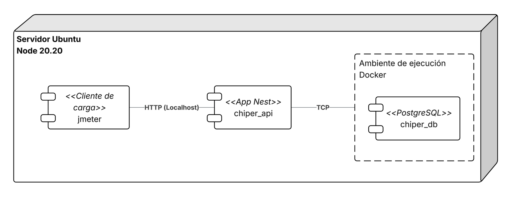
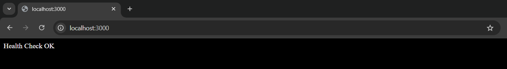
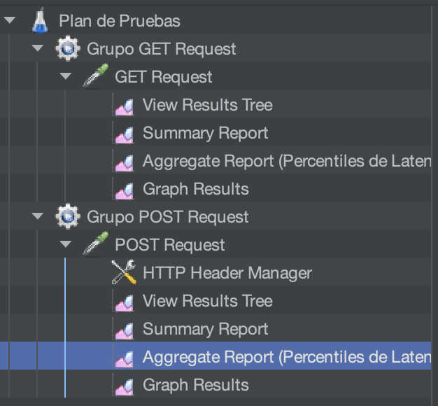

# Lab 2 — Pruebas de Carga al Monolito de Cheapest

## Índice
- [Etapas del laboratorio](#etapas-del-laboratorio)
- [Objetivos](#objetivos)
- [Descripción del Experimento](#descripción-del-experimento)
- [ASRs evaluados](#asrs-evaluados)
- [Diagrama de despliegue](#diagrama-de-despliegue)
- [Estilos de arquitectura](#estilos-de-arquitectura)
- [Tecnologías asociadas](#tecnologías-asociadas)
- [Preparación del entorno](#preparación-del-entorno)
- [Diseño de la prueba de carga](#diseño-de-la-prueba-de-carga)
- [Pruebas de carga](#pruebas-de-carga)
- [Entregables](#entregables)
  - [Formato de entrega](#formato-de-entrega)
  - [1. Tabla de resultados](#1-tabla-de-resultados)
  - [2. Análisis de resultados](#2-análisis-de-resultados)

## Etapas del laboratorio

| Etapa                           | Resumen                                                                                | Uso de IA generativa                                                                          |
| ------------------------------- | -------------------------------------------------------------------------------------- | --------------------------------------------------------------------------------------------- |
| 1. Contexto experimental y ASRs | Definición del experimento, criterios de éxito y marco de evaluación del monolito.     | Uso acotado para entender ASRs; el análisis de impacto debe ser propio.                     |
| 2. Preparación del entorno      | Levantamiento de base de datos, backend y verificación inicial del entorno de pruebas. | Recomendado para resolver bloqueos técnicos de instalación y configuración.                   |
| 3. Diseño de pruebas            | Definición de distribución de datos, matriz de carga e hipótesis de degradación.       | Puede ayudar a proponer diseños, pero se debe justificar con el contexto de Cheapest. |
| 4. Ejecución de pruebas         | Ejecución con JMeter y opción de script en Python para cargas altas.                   | Recomendado en cargas altas para generar o ajustar scripts de prueba y análisis.              |
| 5. Entregables y conclusiones   | Reporte de resultados, punto de inflexion y propuestas de mejora arquitectónica.       | No recomendado para redactar conclusiones sin evidencia del experimento.                      |

## Objetivos

- Ejecutar **pruebas de carga locales** sobre el backend monolítico de Cheapest.
- Encontrar el **punto de inflexión** del sistema (máximo de usuarios/hilos antes de incumplir un ASRs).
- Analizar el comportamiento del monolito bajo carga: latencia, throughput, errores y cuellos de botella.
- Proponer mejoras de arquitectura y tácticas para mejorar desempeño y disponibilidad.

## Descripción del Experimento

| **Título del experimento**    | Prueba de carga al backend monolítico de Cheapest                                                                                                                                                                                                                                      |
| ----------------------------- | ------------------------------------------------------------------------------------------------------------------------------------------------------------------------------------------------------------------------------------------------------------------------------------ |
| **Propósito**                 | Determinar el punto de inflexión del sistema bajo carga concurrente de dos endpoints críticos <br><br>- Servicio GET de consulta con múltiples JOINs<br>- Servicio POST de escritura de una entidad extensa                                                                          |
| **Sistema bajo prueba**       | Backend monolítico Cheapest (NestJS + PostgreSQL)                                                                                                                                                                                                                                      |
| **Resultados esperados**      | - Obtener el punto de inflexión (número máximo de usuarios en que los requerimientos no funcionales, e.g., ASR1 y ASR2, se dejan de respetar) de los servicios REST del sistema. |
| **Infraestructura requerida** | Local (Node.js + PostgreSQL en Docker opcional)<br><br>Cliente local pruebas (JMeter o script propio) |

## ASRs evaluados

| ID    | Descripción                                                                                                                                                                                                                                                           | Medidas de respuesta a satisfacer |
| ----- | --------------------------------------------------------------------------------------------------------------------------------------------------------------------------------------------------------------------------------------------------------------------- | --------------------- |
| ASR 1 | Como tendero, quiero consultar los productos que alguna vez he pedido, que actualmente estén en promoción y disponibles en el catálogo de mi zona, con una latencia p99 de **1000 ms** en operación normal (500 req/min).                                                       | Latencia p99 < 1000ms |
| ASR 2 | Como director de operaciones de Cheapest, durante eventos con promociones en donde múltiples tiendas están comprando, quiero que al menos el **98% de los pedidos** sean creados exitosamente, aun cuando un alto número de tenderos realicen pedidos simultáneamente, se estiman (5000 req/min). | Error % ≤ 2%          |


> **Criterio de punto de inflexión:** *basta con que se incumpla **al menos uno** de los dos ASRs.*


Los dos endpoints evaluados en este laboratorio corresponden directamente a los ASRs definidos. Ambos forman parte del módulo `logistica` del backend monolítico de Cheapest.

---

### ASR 1 — GET `/logistics/tenderos/productos-disponibles`

**Método:** `GET`  
**Ruta:** `/logistics/tenderos/productos-disponibles`

**Query params:**

| Parámetro  | Tipo   | Validación        | Descripción                                |
| ---------- | ------ | ----------------- | ------------------------------------------ |
| `tiendaId` | string | UUID, requerido   | Identificador de la tienda del tendero     |
| `zona`     | string | string, requerido | Zona geográfica sobre la que se consulta   |

**Ejemplo de request:**
```
GET /logistics/tenderos/productos-disponibles?tiendaId=bbbbbbbb-bbbb-4bbb-8bbb-bbbbbbbbbbbb&zona=Zona+Norte
```

**Respuesta exitosa (200):** arreglo de productos con campos `id`, `nombre`, `marca`, `categoria`, `presentacion`, `precioBase`, entre otros.

**Lógica interna:**
El endpoint resuelve la intersección de tres condiciones sobre la tabla `productos`, mediante **una sola consulta** con tres subconsultas `EXISTS` correlacionadas (todo el trabajo ocurre en PostgreSQL, no en la aplicación):
1. `EXISTS` sobre `items_pedido` ⋈ `pedidos` filtrando por `tiendaId`: el producto fue pedido alguna vez por esa tienda.
2. `EXISTS` sobre `promociones` ⋈ `promocion_tiendas`: hay una promoción vigente hoy para ese producto y esa tienda.
3. `EXISTS` sobre `disponibilidad_zona` ⋈ `catalogos` filtrando por `zona`: hay disponibilidad > 0 en un catálogo de la zona.

> Revise la implementación real en `src/logistica/repositories/producto.repository.ts`
> (`findProductosDisponiblesParaTendero`) y contrástela con esta descripción y con la del POST antes de responder las preguntas de cuello de botella: ¿el costo está en los `EXISTS` de esta lectura o en otra parte? Note que **no hay índices** sobre `pedidos.tiendaId`, `items_pedido.productoId`, `catalogos.zona` ni `disponibilidad_zona.productoId`, y que el pool de conexiones usa el valor por defecto de `pg` (10), porque `src/datasources/database.providers.ts` no lo configura.

---

### ASR 2 — POST `/logistics/pedidos`

**Método:** `POST`  
**Ruta:** `/logistics/pedidos`  
**Content-Type:** `application/json`

**Body (ejemplo con 2 ítems):**
```json
{
  "identificador": "PED-20260601-001",
  "tiendaId": "bbbbbbbb-bbbb-4bbb-8bbb-bbbbbbbbbbbb",
  "fechaHoraCreacion": "2026-06-01T10:00:00.000Z",
  "montoTotal": 85000,
  "monedaId": "cccccccc-cccc-4ccc-8ccc-cccccccccccc",
  "estado": "creado",
  "items": [
    { "productoId": "aaaaaaaa-aaaa-4aaa-8aaa-aaaaaaaaaaaa", "cantidad": 5, "precioUnitario": 12000, "descuento": 0,   "monedaId": "cccccccc-cccc-4ccc-8ccc-cccccccccccc" },
    { "productoId": "aaaaaaaa-aaaa-4aaa-8aaa-aaaaaaaaaaab", "cantidad": 3, "precioUnitario": 8500,  "descuento": 500, "monedaId": "cccccccc-cccc-4ccc-8ccc-cccccccccccc" }
  ]
}
```

**Campos requeridos del body:**

| Campo               | Tipo             | Descripción                               |
| ------------------- | ---------------- | ----------------------------------------- |
| `identificador`     | string (max 100) | Código único del pedido                   |
| `tiendaId`          | UUID             | Tienda que realiza el pedido              |
| `fechaHoraCreacion` | ISO 8601         | Fecha y hora de creación                  |
| `montoTotal`        | number > 0       | Valor total del pedido                    |
| `monedaId`          | UUID             | Moneda en que se expresa el monto         |
| `estado`            | enum (opcional)  | Estado inicial del pedido                 |
| `items`             | array (mín. 1)   | Productos con `productoId`, `cantidad`, `precioUnitario`, `descuento` y `monedaId` |

**Respuesta exitosa (201):** objeto pedido creado con su `id` y lista de ítems.

> Este endpoint realiza escritura transaccional en la base de datos. Bajo alta concurrencia puede generar contención de locks y saturación del pool de conexiones.

---


> [!IMPORTANT]
> **Pregunta 1:**
> En el contexto de Cheapest, el endpoint GET evaluado combina lectura histórica, promociones y disponibilidad por zona, mientras el POST confirma pedidos en eventos de alta demanda.
> Si solo pudiera optimizar **uno** antes de un pico comercial, ¿cuál priorizaría y por qué?
>
> Argumente su decisión en términos de:
> - impacto en negocio,
> - riesgo de incumplimiento de ASRs,
> - tipo de carga,
> - y costo/tiempo de implementación de mejoras.

## Diagrama de despliegue



*Figura 1. Despliegue de los componentes del backend monolítico de Cheapest (API, base de datos) sobre un único nodo de ejecución local.*

Note que todos los componentes están desplegados en un único nodo de ejecución, en este caso su máquina local, de igual forma note que la comunicación entre componentes sigue los mismos protocolos que seguiría si se ejecutaran en nodos distintos.

## Estilos de arquitectura

| Estilos de Arquitectura asociados | Análisis |
| --------------------------------- | ------------------------------------------------------------------------------------------------------------------------- |
| Monolito                          | - Favorece latencia y testeabilidad.<br>- Desfavorece escalabilidad y disponibilidad.                                     |
| Cliente-servidor                  | - Favorece seguridad (el control de acceso a los datos es centralizado).<br>- Puede introducir un cuello de botella o punto único de falla en el servidor si este no se replica; esto no descarta que el servidor pueda escalarse horizontalmente. |
| Capas                             | - Favorece la mantenibilidad y la flexibilidad del sistema.<br>- Desfavorece latencia y aumenta la complejidad.           |

## Tecnologías asociadas

| Tecnologías asociadas         | Selección y Justificación                                                                                                                                                                          |
| ----------------------------- | -------------------------------------------------------------------------------------------------------------------------------------------------------------------------------------------------- |
| **Frameworks**                | - **NestJS:** Framework backend para Node.js basado en TypeScript que promueve arquitectura modular, inyección de dependencias y separación por capas, facilitando mantenibilidad y escalabilidad. |
| **Lenguajes de programación** | - **TypeScript:** Lenguaje principal del backend, aporta tipado estático y mayor robustez en el desarrollo.                                                                                        |
| **Plataforma de ejecución**   | - **Node.js:** Entorno de ejecución basado en event loop, adecuado para aplicaciones I/O intensivas como APIs REST.                                                                                |
| **Bases de datos**            | - **PostgreSQL:** Base de datos relacional robusta que soporta transacciones ACID, índices avanzados y optimización de consultas complejas (JOINs).                                                |
| **Herramientas de análisis**  | - **Apache JMeter:** Herramienta de pruebas de carga utilizada para simular concurrencia y medir latencia, throughput y porcentaje de error.                                                      |
| **Contenedores (opcional)**   | - **Docker:** Permite levantar servicios en entornos aislados para facilitar reproducibilidad del experimento.                                                                                     |
| **Librerías**                 | - **TypeORM:** ORM utilizado por NestJS para mapear entidades a tablas y manejar consultas, relaciones y transacciones.                                                                            |


## Preparación del entorno
En el repo del backend ([Cheapest-api](https://github.com/ISIS-2212-Arquitecturas-Robustas/Cheapest-api)) diríjase a la rama `load_tests`:

```bash
git checkout load_tests
```

### Levantar PostgreSQL con Docker (recomendado)

Ejecute el siguiente comando **desde el directorio base del repositorio** (donde se encuentra el archivo `docker-compose.yml`); si lo ejecuta desde otro directorio, Docker no encontrará el archivo y fallará. El flag `up` crea (si no existe) y levanta el contenedor definido en el `docker-compose.yml` para el servicio `postgres`, dejándolo corriendo en segundo plano (`-d`):

```bash
docker compose up postgres -d
```

> [!WARNING]
> Si en un laboratorio anterior levantó una base de datos con el mismo nombre de contenedor (`cheapest-postgres`) y no va a reutilizarla, es muy probable que el puerto `5432` siga ocupado y el comando anterior falle con un error similar a:
> ```
> Error response from daemon: failed to set up container networking: driver failed programming external connectivity on endpoint cheapest-postgres (5d86a48a3d107d38bfa708e8f6a067bf9cf5210839d04ff07a5e176bd25d855e): Bind for 0.0.0.0:5432 failed: port is already allocated
> ```
> Antes de levantar el nuevo entorno, limpie el contenedor del laboratorio anterior:
> ```bash
> docker stop cheapest-postgres
> docker rm cheapest-postgres
> ```
> o alternativamente detenga el `docker-compose` del laboratorio previo desde su propio directorio.

### Levantar el backend monolítico

```bash
npm install
npm run start:dev
```

Verifique que la aplicación está corriendo:
- http://localhost:3000/health

Usted debería ver algo así:



## Diseño de la prueba de carga

Hay dos escenarios de carga importantes para este laboratorio (tomados de los ASRs):
- **Operación normal:** 500 req/min (≈ 8.3 req/s).
- **Evento de promociones (pico):** 5000 req/min (≈ 83.3 req/s).

El objetivo de las pruebas en un primer momento es **simular los escenarios** basados en las necesidades de negocio. Note también que las pruebas de carga no tendrán los mismos resultados para un diferente número de datos, por esa razón en el proyecto base se agrega un script (como provider de Nest) para agregar un número de datos. El script se encuentra en la siguiente ruta `src/datasources/database-seeder.service.ts` puede configurar el número de entidades, el número de tiendas y zonas, y la distribución modificando `src/datasources/load-seed.yaml`

> [!WARNING]
> Parte de la tarea es diseñar el número y la distribución de datos en las tablas para que las pruebas tengan sentido. Para mayor facilidad el script lee un archivo `yaml` en donde usted puede definir el número de datos por cada prueba. **En los entregables tiene que justificar el número de datos y distribución para cada prueba y la justificación de los mismos**. Para saber lo que se espera de este entregable puede ir al
> [`lab_2_warmup.md`](lab_2_warmup.md) donde se diseña el `load-seed.yaml`.
>
> **Nota:** el `load-seed.yaml` que trae la rama `load_tests` viene con **valores placeholder arbitrarios y uniformes** (todos números redondos), pensados solo para que la app arranque. **No son un escenario de prueba válido** y no deben usarse tal cual. Parte del trabajo (warm-up + entregable 1) es reemplazarlos por su propio diseño de datos: conteos por tabla, `tiendas`, `zonas` y `distribucion`, cada uno **justificado con el contexto de Cheapest**. Un diseño realista no es uniforme (distribución tipo Pareto). Se espera además que ajuste el archivo por escenario (p. ej. inflar histórico de pedidos para estresar el GET, concentrar demanda para estresar el POST).
> Dado que debe modificar múltiples veces el número de datos, tiene que **eliminar el volumen persistente de PostgreSQL** entre corridas. El comando para hacer esto es:
> ```bash
> docker compose down -v
> ```
> `docker compose down -v` borra el contenedor **y el volumen con nombre `postgres_data`** donde viven los datos.
>
> Después de `docker compose down -v` debe volver a levantar la base (`docker compose up postgres -d`) y reiniciar el backend para que el seeder re-poblé la base con el `load-seed.yaml` vigente.

> [!CAUTION]
> **Contaminación entre corridas.** Si al arrancar encuentra que ya hay ≥ el número de `pedidos` configurado, no agrega ni recorta nada. Pero **cada corrida del POST inserta pedidos reales** para la misma tienda (`bbbbbbbb-...-bbbb`) que consulta el GET, y el GET se encarece con el histórico de esa tienda. Si encadena corridas sin limpiar, cada corrida del POST degrada el GET de la siguiente y el "punto de inflexión" que reporte quedará corrido.
> Por eso, para que las repeticiones sean repeticiones del *mismo* experimento y no una serie degradante:
> - Ejecute `docker compose down -v` + re-seed **entre la campaña completa de GET y la campaña completa de POST**, y
> - vuelva a limpiar y re-sembrar cada vez que cambie el `load-seed.yaml`.
> De igual forma en el archivo `src/datasources/seed.sql` va a encontrar IDs de ejemplo que serán creados cada vez que ejecute el script. Dado que el resto de datos (y por ende IDs) son aleatorios, le serán de ayuda para el cuerpo de las peticiones al momento de ejecutar las pruebas. Por ejemplo: `tiendaId = bbbbbbbb-bbbb-4bbb-8bbb-bbbbbbbbbbbb`, `zona = Zona Norte`, `monedaId = cccccccc-cccc-4ccc-8ccc-cccccccccccc` y `productoId = aaaaaaaa-aaaa-4aaa-8aaa-aaaaaaaaaaaa`.

> [!IMPORTANT]
> **Pregunta 2:**
> Diseñe una distribución de datos que haga realista el escenario de Cheapest en hora pico (tiendas con comportamientos heterogéneos, zonas con distinta densidad de pedidos y promociones activas). Tome como punto de partida el warm-up ([`lab_2_warmup.md`](lab_2_warmup.md)).
> - ¿Qué sesgos introduciría una distribución uniforme y cómo podría llevar a conclusiones erróneas sobre el punto de inflexión?
> - Proponga al menos **dos estrategias de distribución** y explique qué hipótesis de arquitectura valida cada una (una orientada a estresar el GET / ASR 1 y otra el POST / ASR 2).

Las pruebas en JMeter se definen con los siguientes parámetros
#### Threads:
Indica el número de threads que se lanzarán en 1 Loop (Iteración).
#### Ramp-Up Period:
Tiempo en segundos en los cuales se deben lanzar los threads. Para el primer caso de prueba será de 5 segundos, lo cual indica que 5 threads se crearan y enviaran peticiones en 5 segundos. Cada petición creada se enviará cada segundo:
#### Loop Count (Iteraciones):
Indica el número de iteraciones que se van a hacer del escenario de prueba. En cada iteración se van a ejecutar el no. de threads indicados en el primer parámetro (i.e., number of threads). 
### Matriz mínima de pruebas (mínimo recomendado)

Cada corrida se ejecuta **por endpoint**: una para el GET (ASR 1) y otra para el POST (ASR 2), porque los dos ASRs se miden por separado (p99 del GET, Error % del POST) y el análisis de resultados de los entregables pide comparar cuál degradó primero. Es decir, los conteos de abajo son por endpoint.

Repeticiones mínimas **por endpoint**:
- **Operación normal** y **Estrés fuerte** (los dos puntos donde se evalúan los ASRs): **5 corridas** cada uno.
- **Alta carga**, **Muy alta carga**, **Estrés**: **3 corridas** cada uno (más si el quiebre no es claro).
- **Smoke test**, **Baja carga**, **Carga media**: **1 corrida** cada uno (sanity check de la línea base).

Esto da como mínimo 22 corridas por endpoint ≈ **44 corridas en total**. Si algún ASR no se rompe dentro de la matriz, extienda con más threads / ramp-up más corto hasta ubicar el punto de inflexión.

Las columnas **Ramp-Up** y **Loops** aplican a JMeter (escenarios hasta 450 threads). Los escenarios que se ejecutan con el script de Python (> 450 threads) no usan Loops sino **Duración**: el script corre `--duration` segundos sosteniendo la concurrencia objetivo. Use **60 s** de duración para esos cuatro escenarios salvo que necesite más para estabilizar el throughput.

| Test                 | Herramienta | Ramp-Up | Threads / `--users` | Loops | Duración | Throughput objetivo (req/s) |
| -------------------- | ----------- | ------- | ------------------- | ----- | -------- | --------------------------- |
| **Smoke test**       | JMeter      | 5s      | 5                   | 1     | —        | 1                           |
| **Baja carga**       | JMeter      | 10s     | 30                  | 1     | —        | 3                           |
| **Carga media**      | JMeter      | 20s     | 100                 | 1     | —        | 5                           |
| **Operación normal** | JMeter      | 50s     | 450                 | 1     | —        | 9                           |
| **Alta carga**       | Script Py   | 75s     | 1500                | N/A   | 60s      | 20                          |
| **Muy alta carga**   | Script Py   | 100s    | 3000                | N/A   | 60s      | 30                          |
| **Estrés**           | Script Py   | 150s    | 7500                | N/A   | 60s      | 50                          |
| **Estrés fuerte** (= "Evento de promociones / pico", 5000 req/min ≈ 90 req/s) | Script Py | 200s | 18000 | N/A | 60s | 90 |

> [!IMPORTANT]
> **Pregunta 3:**
> La matriz propuesta aumenta la carga de forma escalonada, pero no necesariamente separa bien las causas de degradación.
> ¿Qué cambiaría en el diseño experimental para distinguir si el quiebre proviene principalmente de:
> - saturación del **pool de conexiones** (`pg` usa el valor por defecto 10, no configurado en `src/datasources/database.providers.ts`),
> - **consultas SQL ineficientes** (no hay índices en `pedidos.tiendaId`, `items_pedido.productoId`, `catalogos.zona` ni `disponibilidad_zona.productoId`),
> - **límites del generador de carga** (JMeter deja de ser confiable por encima de 450 threads)?
>
> Defina un diseño alternativo con **variables controladas** y los **resultados esperados para cada hipótesis**.

## Pruebas de carga

A continuación, descargue Apache JMeter en su máquina personal y realice las pruebas de carga indicados en la sección anterior (Matriz mínima de pruebas).

Descargue el archivo [`load_test.jmx`](recursos/load_test.jmx) el cual contiene las pruebas GET y POST. Este archivo contiene un Summary Report el cual resume métricas de la prueba como Throughput, % de Error, desviación estándar, entre otras. Además, ya trae incluido un listener "Aggregate Report" (renombrado "Percentiles de Latencia") con métricas como P95 y P99.



Un **Plan de Pruebas** es el archivo completo que se abre en la herramienta. Dentro de él, un **Thread Group** ("grupo de hilos") simula a un grupo de usuarios reales — cada "hilo" (thread) es un usuario simulado enviando peticiones al mismo tiempo. Dentro de cada Thread Group hay un **sampler**, que es la petición HTTP concreta que ese usuario va a enviar (en este caso, un GET o un POST), y varios **listeners**, que son las pantallas donde JMeter muestra los resultados de esas peticiones (tiempos de respuesta, errores, gráficas, etc.).

El archivo `load_test.jmx` que se descarga ya trae todo esto configurado — no hay que armarlo desde cero. Trae dos Thread Groups independientes (uno para cada endpoint), cada uno con su sampler y el mismo set de 4 listeners:

- **Grupo GET Request**: simula 5 usuarios (threads) que se van "conectando" en 5 segundos (ramp-up) y cada uno envía la petición una sola vez (1 loop). La petición es `GET /logistics/tenderos/productos-disponibles?tiendaId=...&zona=Zona Norte`.
- **Grupo POST Request**: simula 1 solo usuario, que envía una petición `POST /logistics/pedidos` con headers `Content-Type: application/json` y `Accept: application/json`, y un cuerpo (body) en JSON que representa un pedido con 4 ítems.

> Nota: estos números de threads (5 y 1) son solo el ejemplo inicial que trae el archivo — en la sección de "Diseño de la prueba de carga" usted va a modificarlos para simular la carga baja, media, normal y pico que pide cada ASR.

Cada grupo incluye los mismos 4 listeners, que son distintas formas de ver los resultados de la misma prueba:
- **View Results Tree**: muestra el detalle de cada petición y respuesta individual (útil para depurar si algo falla, por ejemplo ver el mensaje de error exacto que devolvió el servidor).
- **Summary Report**: una tabla resumen con throughput (peticiones por segundo), tiempo promedio, mínimo y máximo — pero sin percentiles.
- **Aggregate Report** (aquí renombrado "Percentiles de Latencia"): es la tabla que interesa para los ASRs de este laboratorio, porque ya trae columnas de percentil 90, 95 y 99 calculadas automáticamente — no hay que configurar nada extra para obtener el p95 o el p99 que piden las medidas de respuesta.
- **Graph Results**: una gráfica de los tiempos de respuesta a lo largo del tiempo que dura la prueba.

**¿Qué es un percentil y por qué importa aquí?** El "p99" (percentil 99) de la latencia significa: "el 99% de las peticiones respondieron en este tiempo o menos". Es una medida más realista que el promedio, porque el promedio puede esconder a ese pequeño porcentaje de usuarios que tuvo una experiencia muy lenta. Por eso el ASR 1 exige `p99 < 1000ms` en vez de simplemente un "tiempo promedio" — y por eso el Aggregate Report, que calcula ese percentil directamente, es el listener que se debe reportar como evidencia.

El siguiente [recurso](https://testertina.medium.com/a-beginners-guide-to-performance-testing-with-apache-jmeter-be7a7eb0a6ad) contiene información de que componentes tiene JMeter, apréndalos para modificar los argumentos necesarios en el test que le proveemos.

Si no tiene JMeter instalado, descárguelo desde la [página oficial de descarga](https://jmeter.apache.org/download_jmeter.cgi). Requisito previo: JMeter necesita una versión de **Java (JDK) 8 o superior** instalada y configurada en el `PATH` (verifique con `java -version`); una instalación de Java faltante o incorrecta es una causa frecuente de errores confusos al intentar arrancar JMeter. Pasos generales de instalación:
- **Windows:** descargue el `.zip` (binario) desde la página oficial, descomprímalo en una carpeta de su preferencia y ejecute `bin\jmeter.bat`.
- **macOS:** descargue el `.tgz` desde la página oficial (o instale con `brew install jmeter`), descomprímalo y ejecute `bin/jmeter.sh`. También puede requerir que Java esté instalado (`brew install openjdk`).
- **Linux:** descargue el `.tgz`, descomprímalo (`tar -xzf apache-jmeter-x.x.tgz`) y ejecute `bin/jmeter.sh`. Asegúrese de tener el JDK instalado (por ejemplo `sudo apt install default-jdk`).

#### Ejecución de pruebas de carga alta

> [!NOTE]
> JMeter se usa en este laboratorio para los escenarios de carga baja, media y de operación normal (hasta **450 threads**), ya que permite visualizar y aprender de forma gráfica los componentes de una prueba de carga (ese es su valor pedagógico). Para escenarios de **más de 450 threads**, JMeter deja de ser una herramienta confiable en este entorno, por lo que el uso de un script propio en Python **es obligatorio** (no una alternativa opcional) para esos escenarios.

Para escenarios de alta carga > 450 threads, dado que JMeter empieza a tener limitaciones de performance, **debe usar copilot o el agente de IA de su preferencia para generar un script para la ejecución de pruebas**, este script debe tener las siguientes características:
- Las peticiones deben ser http a los endpoints a los cuales se busca hacer la prueba
- El script debe permitir configurar Ramp-Up y Threads para cada prueba
- Para POST, usar un body JSON realista de “pedido grande” con > 20 ítems (productoId y cantidad)
- Debe registrar por request: timestamp, método, endpoint, status_code, latency_ms, error (si aplica).
- Debe calcular al final:  
	- total requests por tipo (GET/POST)  
	- throughput (req/s)  
	- latencia promedio, p95 y p99 por tipo  
	- Error % por tipo (status >= 400 + timeouts + connection errors)
- Idealmente debería generar la tabla y gráficos para **SU** análisis

Le dejamos un prompt de ejemplo, note que debe cambiar algunos valores para ajustarlo al laboratorio
```
Vamos a realizar pruebas de performance. Necesito un script en Python para ejecutar pruebas de carga ligeras contra un backend NestJS usando HTTP.

Contexto:
- Base URL: http://localhost:3000
- Endpoints a probar:
  - Endpoint GET (lectura pesada): `/logistics/tenderos/productos-disponibles?tiendaId=<uuid>&zona=<zona>`
  - Endpoint POST (escritura): `/logistics/pedidos`

Requerimientos del script:
* Debe permitir configurar por argumentos CLI o variables:
   - --endpoint (endpoint a testear)
   - --users (concurrencia máxima)
   - --ramp-up (segundos)
   - --duration (segundos)
   - --body (para POST, un JSON con > 20 ítems)

* Para POST, usar un body JSON realista de “pedido grande” con > 20 ítems (productoId y cantidad).

* Debe registrar por request: timestamp, método, endpoint, status_code, latency_ms, error (si aplica).
* Debe calcular al final:
   - total requests por tipo (GET/POST)
   - throughput (req/s)
   - latencia promedio, p95 y p99 por tipo
   - Error % por tipo (status >= 400 + timeouts + connection errors)
* Debe exportar resultados a CSV: results_get.csv y results_post.csv con columnas:
   timestamp_iso,status_code,latency_ms,error
* Debe imprimir un resumen final claro en consola. Opcionalmente, generar gráficos de latencia y throughput usando matplotlib o seaborn.

Restricciones:
- Usa solo librerías estándar o, si necesitas, sugiere instalar exactamente UNA librería: httpx o aiohttp. Prefiero async/await.
- Maneja timeouts y errores de conexión, debes registrarlos.
- Incluye instrucciones de ejecución y ejemplo:
  python load_test.py --users 100 --ramp-up 50 --duration 60 --endpoint POST --body sample_body.json
```

Como estudiante usted tiene acceso a Github copilot para generación de código, este [tutorial](../tutoriales/como_usar_github_copilot.md) le explicará como usarlo.

> [!IMPORTANT]
> **Pregunta 4:**
> Para los escenarios de más de 450 threads debe generar un script de carga con ayuda de un agente de IA. En un equipo real, varias personas generarían código con IA sobre el mismo repositorio de Cheapest y es fácil que el estilo, las convenciones y las decisiones de arquitectura se vuelvan inconsistentes.
> Investigue qué técnicas existen para lograr que los agentes de IA generen código siguiendo de forma consistente los patrones y reglas de desarrollo definidas por todo el equipo.

## Entregables

> [!WARNING]
> - Todos los entregables deben estar bien organizados y documentados en un archivo de Word o PDF.
> - Las capturas de pantalla mostrando la ejecución del laboratorio son tan importantes como los resultados.
> - Incluir los prompts utilizados para la generación de pruebas.
> - En el documento debe incluir también la respuesta a las preguntas planteadas a lo largo del laboratorio.

### Formato de entrega

Suba a la Actividad correspondiente en el aula de Bloque Neón de su sección **un único archivo comprimido (`.zip`)** que contenga:

1. **Informe** en PDF o Word (`.pdf` o `.docx`) con:
   - La tabla de resultados de las pruebas de carga (sección 1).
   - Las capturas de pantalla de evidencia ("Summary Report", "Aggregate Report" / "Percentiles de Latencia", y las configuraciones de JMeter y/o del script de Python).
   - Los prompts utilizados para generar el script de carga.
   - Las **respuestas argumentadas a la Pregunta 1 a la Pregunta 4** (planteadas a lo largo de la guía) y el **análisis de resultados** de la sección 2. Todo debe ir más allá de lo superficial.
2. **Código** (no se debe entregar un enlace a repositorio):
   - El archivo `load-seed.yaml` final utilizado en cada escenario (si usó más de una variante, inclúyalas todas e indique a qué escenario corresponde cada una).
   - El **script de Python** de pruebas de carga generado con IA.
   - Los archivos de resultados que haya producido (`results_get.csv`, `results_post.csv`) y las gráficas generadas.

### 1. Tabla de resultados

Complete la siguiente tabla con los resultados que obtuvo en las pruebas del laboratorio. En el documento deben ir las capturas de pantalla como evidencia de las pruebas realizadas. Estas capturas incluyen el "Summary Report", el "Aggregate Report" / "Percentiles de Latencia", y las configuraciones de JMeter (o del script de Python).

> [!IMPORTANT]
> No es suficiente con reportar únicamente los escenarios de operación normal y evento de promociones; se espera que documente el incremento progresivo de carga y las repeticiones indicadas en la [matriz mínima de pruebas](#matriz-mínima-de-pruebas-mínimo-recomendado), con el fin de ubicar con precisión el punto de inflexión.
> **La tabla se llena por endpoint** (una fila por corrida de GET y una por corrida de POST), porque el ASR 1 se evalúa sobre el p99 del GET y el ASR 2 sobre el Error % del POST. Repeticiones mínimas **por endpoint**:
> - **Operación normal** y **Estrés fuerte**: **5 corridas** cada uno.
> - **Alta carga**, **Muy alta carga**, **Estrés**: **3 corridas** cada uno.
> - **Smoke test**, **Baja carga**, **Carga media**: **1 corrida** cada uno.
>
> Total mínimo ≈ 22 corridas por endpoint (≈ 44 en total). Para los escenarios con script de Python registre también la **Duración** usada (`--duration`, por defecto 60 s). Si ningún ASR se rompe dentro de la matriz, extienda con más `--users` o ramp-up más corto y repórtelo.

Use una tabla como la siguiente (replique las filas según el número de corridas de cada escenario; puede mantener GET y POST en una sola tabla con la columna **Endpoint** o hacer dos tablas separadas):

| Escenario | Endpoint | Corrida | Threads / users | Ramp-up | Duración | p99 (ms) | p95 (ms) | Throughput | Error % |
| --------- | -------- | ------- | --------------- | ------- | -------- | -------- | -------- | ---------- | ------- |
| Smoke test | GET  | 1 | 5 | 5s | — |  |  |  |  |
| Smoke test | POST | 1 | 5 | 5s | — |  |  |  |  |
| Baja carga | GET | 1 | 30 | 10s | — |  |  |  |  |
| Baja carga | POST | 1 | 30 | 10s | — |  |  |  |  |
| Carga media | GET | 1 | 100 | 20s | — |  |  |  |  |
| Carga media | POST | 1 | 100 | 20s | — |  |  |  |  |
| Operación normal | GET  | 1–5 | 450 | 50s | — |  |  |  |  |
| Operación normal | POST | 1–5 | 450 | 50s | — |  |  |  |  |
| Alta carga | GET  | 1–3 | 1500 | 75s | 60s |  |  |  |  |
| Alta carga | POST | 1–3 | 1500 | 75s | 60s |  |  |  |  |
| Muy alta carga | GET  | 1–3 | 3000 | 100s | 60s |  |  |  |  |
| Muy alta carga | POST | 1–3 | 3000 | 100s | 60s |  |  |  |  |
| Estrés | GET  | 1–3 | 7500 | 150s | 60s |  |  |  |  |
| Estrés | POST | 1–3 | 7500 | 150s | 60s |  |  |  |  |
| Estrés fuerte (pico) | GET  | 1–5 | 18000 | 200s | 60s |  |  |  |  |
| Estrés fuerte (pico) | POST | 1–5 | 18000 | 200s | 60s |  |  |  |  |


### 2. Análisis de resultados

Con base en las tablas y la evidencia, incluya un análisis (1–2 páginas) que cubra:

- **Punto de inflexión:** en qué nivel de carga se alcanzó y cuál ASR se incumplió primero, con los datos que lo respaldan.
- **Cuello de botella y patrón de degradación:** dónde está el cuello de botella y si la degradación fue gradual o abrupta. Sustente su respuesta revisando el código real de los dos endpoints (`producto.repository.ts` para el GET; `pedido.service.ts` + `pedido.repository.ts` para el POST): ¿el trabajo pesado del GET ocurre en la aplicación o dentro de PostgreSQL? ¿cuántos round-trips a la base hace el POST por cada ítem del pedido? Considere también la ausencia de índices y el tamaño del pool de conexiones. Indique **qué endpoint degradó primero y por qué**.
- **Distribución de datos:** confirme qué distribución usó finalmente en cada escenario y por qué, de forma coherente con su respuesta a la **Pregunta 2**.
- **Arquitectura:** ¿el diseño monolítico favorece el cumplimiento de los ASRs evaluados? Si es así, explique cómo se beneficiaron; de lo contrario, qué modificaciones de arquitectura (estilos o tácticas) haría para cumplirlos.
