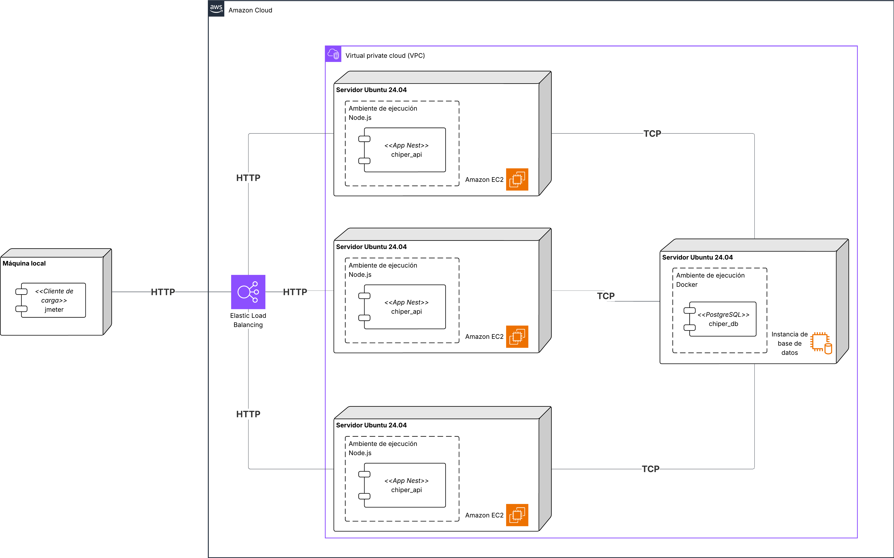

# Lab 3 — Pruebas de Carga en AWS para el Monolito de Chiper

## Etapas del laboratorio

| Etapa                                  | Resumen                                                                                                   | Uso de IA generativa                                                                                                       |
| -------------------------------------- | --------------------------------------------------------------------------------------------------------- | -------------------------------------------------------------------------------------------------------------------------- |
| 1. Experimento y ASRs                  | Definicion de objetivo de carga y criterios de exito para el monolito en AWS.                            | Uso acotado para apoyo conceptual; el criterio de priorizacion debe ser propio.                                            |
| 2. Analisis de arquitectura desplegada | Revision de topologia monolito + ALB + multiples instancias y sus implicaciones.                          | Recomendado para contrastar patrones de escalamiento y limites del enfoque.                                                |
| 3. Despliegue en AWS                   | Seguridad, provisionamiento de EC2, configuracion App/DB y ALB.                                            | Recomendado para apoyo operativo y deteccion de inconsistencias de configuracion.                                          |
| 4. Diseno y ejecucion de pruebas       | Aplicacion de matriz de carga con JMeter o script Python para cargas altas.                               | Recomendado para automatizar ejecuciones y analizar resultados, con validacion de que el cliente no sea cuello de botella. |
| 5. Interpretacion y entregables        | Identificacion robusta del punto de inflexion y documentacion de evidencia.                               | No recomendado para redactar conclusiones sin trazabilidad de datos.                                                       |


> Este laboratorio continúa el trabajo del **Lab 2**. El objetivo es ejecutar **pruebas de carga con JMeter** sobre los **endpoints (GET y POST)** definidos en el Lab 2, ahora desplegados en **AWS (EC2)** con **Application Load Balancer (ALB)** y **tres instancias** del backend.

## Objetivos

- Ejecutar **pruebas de carga** sobre el backend monolítico de Chiper desplegado en AWS (EC2) detrás de un **Application Load Balancer (ALB)**.
- Preparar la infraestructura en AWS (Security Groups, EC2 App/DB y ALB) necesaria para las pruebas.
- Encontrar el **punto de inflexión** del sistema (máximo de usuarios/hilos antes de incumplir ASRs).
- Analizar el comportamiento del monolito bajo carga: **latencia, throughput, errores** y posibles cuellos de botella.
- Proponer **mejoras de arquitectura y/o tácticas** para mejorar desempeño y disponibilidad.

## Índice

- [1. Experimento](#1-experimento)
- [2. Arquitectura](#2-arquitectura)
- [3. Tecnologías](#3-tecnologías)
- [4. Despliegue (AWS)](#4-despliegue-aws)
- [5. Pruebas de carga](#5-pruebas-de-carga-con-jmeter)
- [6. Interpretación de resultados](#6-interpretación-de-resultados)
- [7. Entregables](#7-entregables)

## 1. Experimento

### 1.1 Descripción

| Elemento             | Detalle                                                                                                                                         |
| -------------------- | ----------------------------------------------------------------------------------------------------------------------------------------------- |
| Título               | Prueba de carga al monolito de Chiper en AWS                                                                                                    |
| Propósito            | Determinar el **punto de inflexión** de un endpoint **GET** (consulta compleja) y un endpoint **POST** (escritura pesada) definidos en el Lab 2 |
| Resultados esperados | Identificar el número máximo de usuarios concurrentes en el que los **ASRs** se dejan de respetar                                               |
| Infraestructura      | 4 instancias **EC2** (3 App + 1 DB) + 1 **ALB** + computador personal para ejecutar JMeter                                                      |


### 1.2 ASRs involucrados (del Lab 2)

| ID | Descripcion | Metricas a satisfacer |
| --- | --- | --- |
| REQ1 | Como tendero, quiero confirmar un pedido en menos de **2000 ms**. | **P99 < 2000 ms** |
| REQ2 | Como Chiper, quiero que al menos el **90% de las peticiones** sean exitosas bajo alta demanda. | **Error % <= 10%** |

> En este laboratorio medimos REQ1 y REQ2 con el **Summary Report** de JMeter.

> [!IMPORTANT]
> **Pregunta 1:**
> REQ1 y REQ2 pueden entrar en tensión en picos de demanda.
> En el contexto de Chiper, si una decisión de arquitectura mejora el p99 pero empeora el porcentaje de éxito, ¿qué criterio de priorización usaría y por qué?
> Responda considerando impacto al tendero e impacto al negocio.

### 1.3 Qué se va a probar

Se prueban dos escenarios (del Lab 2):

1) **GET (lectura pesada / consulta con JOINs):**
   - Consultar **productos que un usuario alguna vez haya pedido**, que estén **en promoción** y **disponibles** en el catálogo.
   - Debe involucrar múltiples JOINs (Usuario → Pedidos → Items → Producto → Promoción → Catálogo/Inventario).

2) **POST (escritura pesada / entidad grande):**
   - Confirmar/crear un pedido con una carga grande (por ejemplo, **muchos items**, direcciones/detalles, totales, auditoría, etc.).
   - Debe crear varias filas relacionadas (Pedido + Items + posible historial).

## 2. Arquitectura

### 2.1 Diagrama de despliegue




### 2.2 Estilos de arquitectura asociados (y efectos)

| Estilos de arquitectura asociados | Analisis (atributos de calidad que favorece y desfavorece) |
| --- | --- |
| Monolito | Favorece latencia y mantenibilidad.<br>Desfavorece escalabilidad y disponibilidad. |
| Cliente / Servidor | Favorece control centralizado.<br>Desfavorece escalabilidad y disponibilidad. |
| Capas (Nest: Controller -> Service -> Repository/ORM) | Favorece mantenibilidad.<br>Puede desfavorecer latencia (mas saltos y abstraccion) y complejidad. |

> [!IMPORTANT]
> **Pregunta 2:**
> La topología de este laboratorio combina monolito + ALB + múltiples instancias.
> ¿Qué atributo de calidad está mejorando realmente y cuál podría estar sobreestimándose si no se analizan correctamente las métricas?
> Qué criterio usaría para evitar conclusiones engañosas cuando hay balanceo de carga pero no hay desacoplamiento funcional interno.

### 2.3 Arquitectura de despliegue objetivo

**Objetivo:** separar App y DB en máquinas distintas y escalar el monolito con balanceo.

- **EC2 chiper-db**: PostgreSQL
- **EC2 chiper-app-1/2/3**: NestJS (monolito)
- Cliente: su computador (JMeter se usa para generar carga)

> [!IMPORTANT]
> **Pregunta 3:**
> Antes de desplegar, justifique por qué en Chiper tendría sentido separar App y DB en instancias distintas incluso si el costo y la complejidad operativa aumentan.
> ¿Qué riesgos de arquitectura está mitigando y cuáles está introduciendo al mover un monolito local a una topología distribuida en AWS?
> Represente su respuesta con una tabla comparativa donde se vean explícitamente los riesgos mitigados e introducidos.

### 2.4 Tácticas

| Tacticas | Analisis |
| --- | --- |
| No aplica tactica especifica | En este experimento se mide el comportamiento base del monolito sin incorporar tacticas adicionales para comparar contra una linea base. |
| Balanceador de carga (ALB) | Distribuye el trafico entrante entre 3 instancias EC2 para reducir hotspots y mejorar disponibilidad percibida. No elimina cuellos internos del monolito ni garantiza menor latencia si la base de datos es el limite. |

### 2.5 Tactica: Balanceador de carga (ALB)

El **Application Load Balancer (ALB)** se usa como tactica de escalamiento horizontal del monolito. En lugar de un solo backend, el trafico se reparte entre **tres instancias EC2** con la misma aplicacion.

**Que resuelve en este lab**

- Aumenta capacidad total de procesamiento al repartir solicitudes.
- Reduce el riesgo de que una sola instancia se sature primero.
- Mejora disponibilidad percibida si una instancia falla (el ALB deja de enrutarle).

**Que no resuelve**

- No evita cuellos de botella compartidos (DB, pool de conexiones, locks).
- No mejora el desempeno de una consulta costosa por si sola.
- Puede ocultar inconsistencia de configuracion entre instancias si no se revisan metricas por target.

**Como se observa en los resultados**

- Throughput total mayor que el de una instancia individual, hasta el limite de la base de datos.
- p95/p99 mas estables en cargas medias, pero degradacion similar si la DB se satura.

## 3. Tecnologías

| Categoría                | Tecnologías   |
| ------------------------ | ------------- |
| Framework backend        | NestJS        |
| Lenguaje                 | TypeScript    |
| Base de datos            | PostgreSQL    |
| ORM                      | TypeORM       |
| Plataforma de despliegue | AWS EC2       |
| Pruebas de carga         | Apache JMeter |

## 4. Despliegue (AWS)

### 4.1 Pre-requisitos y acceso a AWS Academy

La consola de administración de AWS es una plataforma web que unifica el acceso y manejo de todos los servicios ofrecidos por AWS. Usaremos la consola para desarrollar los laboratorios que son propios del curso y el proyecto. La mayoría de los servicios de nube se cobran por demanda y se pueden detener cuando usted lo necesite. En este curso se hará uso de AWS Academy que proporciona créditos para poder acceder a los recursos de AWS. Estos créditos son limitados así que úselos de forma consciente.

#### 4.1.1 Acceso a AWS Academy

La invitación a AWS Academy debió haber llegado a su correo Uniandes con el asunto: “Invitación al curso”. De lo contrario, revise en correo no deseado o informe al personal docente. Dentro del correo oprima el botón de “Comenzar” y siga las instrucciones para iniciar sesión como estudiante.


Cuando ingrese a la plataforma de AWS Academy podrá observar la sección “Módulos”. Bajo el módulo “Bienvenida e información general sobre el curso” entre a “Guía del estudiante del Laboratorio de aprendizaje de AWS Academy”.


Inicie el **Learning Lab** (esto habilita los créditos del curso). Usted debe ver algo así


> [!WARNING]
> Para este laboratorio y los siguientes se van a crear en múltiples oportunidades elementos comunes de infraestructura. Para esto usted tendrá disponibles los tutoriales de AWS, estos le presentarán dos formas de crear los recursos, con la herramienta CloudShell o a través de la consola de AWS. Usted puede escoger cualquiera de las dos formas, sin embargo **es importante que sepa como usar la UI (consola de AWS) ya que sus evidencias deben ser capturas de pantalla de la misma en donde se vea la infraestructura desplegada.** Se recomienda que use ambas formas de usar AWS al menos una vez y después escoja la que más le convenga.

> [!IMPORTANT]
> **Pregunta 4:**
> En un incidente de Chiper previo a un pico promocional, debe reconstruir rápidamente la infraestructura mínima del laboratorio.
> ¿Qué partes implementaría por consola y cuáles por CloudShell para equilibrar velocidad de recuperación y control de errores de configuración?
> Incluya un diagrama de flujo del plan de recuperación que propondría (pasos, decisiones y validaciones) con la decisión que tome para reiniciar una instancia de EC2 que falló.

### 4.2 Configuración de seguridad (Security Groups)

> Nota práctica: use nombres **sin tildes** y sin caracteres especiales.

Cree los siguientes Security Groups (VPC por defecto del lab):
- [Tutorial para crear Security Groups en AWS](../tutoriales/crear_security_groups.md)

#### 4.2.1 Security Group 1 — SSH

| Parámetro    | Valor                          |
| ------------ | ------------------------------ |
| Nombre       | `chiper-ssh`                   |
| Descripción  | Acceso SSH a instancias        |
| Inbound rule | SSH (22) desde `Anywhere-IPv4` |

#### 4.2.2 Security Group 2 — PostgreSQL

| Parámetro    | Valor                          |
| ------------ | ------------------------------ |
| Nombre       | `chiper-db`                    |
| Descripción  | Acceso a PostgreSQL            |
| Inbound rule | TCP 5432 desde `Anywhere-IPv4` |

> En un entorno real, 5432 **no** se abre a todo internet. Para el laboratorio lo haremos así por simplicidad.

> [!IMPORTANT]
> **Pregunta 5:**
> Proponga un diseño mínimo de seguridad para Chiper que elimine la exposición pública de infraestructura que debería ser privada.
>
> Debe incluir al menos:
> - origen permitido de tráfico,
> - estrategia de segmentación de red
>
> Pista: Uno de los principios más importantes de seguridad es *least permissions*, que menciona que un sistema debería tener la cantidad mínima de permisos posibles. Revise qué configuraciones podría modificar para reducir los permisos de la infraestructura.
> Presente la propuesta con un diagrama de red (subredes, security groups y flujos permitidos/bloqueados).

#### 4.2.3 Security Group 3 — HTTP API (Chiper)

| Parámetro    | Valor                          |
| ------------ | ------------------------------ |
| Nombre       | `chiper-http`                  |
| Descripción  | Acceso HTTP al monolito (API)  |
| Inbound rule | TCP 3000 desde `Anywhere-IPv4` |

> Si su backend corre en otro puerto, ajuste esta regla para que coincida con su configuración.

Usted debe ver algo así


### 4.3 Crear instancia EC2 para Base de Datos (PostgreSQL)

- [Tutorial para crear instancias de EC2 en AWS](../tutoriales/crear_instancia_ec2.md)

Cree una instancia EC2 con los parámetros:

| Parámetro         | Valor                      |
| ----------------- | -------------------------- |
| Nombre            | `chiper-db`                |
| AMI               | Ubuntu Server 24.04 LTS    |
| Tipo de instancia | `t2.nano`                  |
| IP pública        | Habilitar                  |
| Security Groups   | `chiper-ssh` + `chiper-db` |
| Almacenamiento    | 8 GB                       |

#### 4.3.1 Conexión por SSH

Conéctese a la instancia:

```bash
ssh -i <archivo>.pem ubuntu@<IP_PUBLICA_DB>
```

#### 4.3.2 Ejecutar la base de datos (chiper-db)

1. Conéctese por SSH a `chiper-db`.
2. Verifique que Docker está instalado y corriendo ([Tutorial para instalar Docker](../tutoriales/instalar_docker_en_una_maquina_EC2.md)):

```bash
sudo docker --version
sudo service docker status
```

3. Levante PostgreSQL con Docker (si no existe el contenedor, créelo; si existe, inícielo):

```bash
# Opción A: crear y levantar (primera vez)
sudo docker run --name chiper-db  -e POSTGRES_PASSWORD=postgres  -e POSTGRES_DB=chiper  -p 5432:5432  -d postgres

# Opción B: si ya existe, solo iniciar
sudo docker start chiper-db
```

4. Verifique que está arriba:

```bash
sudo docker ps
```


### 4.4 Crear instancias EC2 para la App (Chiper Monolito)

Cree **tres** instancias EC2 con los mismos parámetros (nombre sugerido: `chiper-app-1`, `chiper-app-2`, `chiper-app-3`).

| Parámetro         | Valor                        |
| ----------------- | ---------------------------- |
| Nombre            | `chiper-app-1`               |
| AMI               | Ubuntu Server 24.04 LTS      |
| Tipo de instancia | `t2.nano`                    |
| IP pública        | Habilitar                    |
| Security Groups   | `chiper-ssh` + `chiper-http` |
| Almacenamiento    | 8 GB                         |

#### 4.4.1 Conexión por SSH

```bash
ssh -i <archivo>.pem ubuntu@<IP_PUBLICA_APP>
```

#### 4.4.2 Instalación de Node.js (LTS), npm y Git

```bash
# Dependencias básicas
sudo apt update
sudo apt install -y git curl

# Instalar NVM
curl -o- https://raw.githubusercontent.com/nvm-sh/nvm/v0.39.7/install.sh | bash

# Cargar NVM en la sesión actual
export NVM_DIR="$HOME/.nvm"
[ -s "$NVM_DIR/nvm.sh" ] && \. "$NVM_DIR/nvm.sh"

# Instalar Node LTS
nvm install --lts

# Usar la versión LTS por defecto
nvm alias default 'lts/*'
nvm use default

# Verificar instalación
node -v
npm -v
```

#### 4.4.3 Clonar el repositorio del backend

Clone el repositorio del backend de su proyecto (reemplace la URL):

```bash
git clone <URL_REPO_BACKEND_CHIPER>
cd <CARPETA_REPO>
```

Instale dependencias:

```bash
npm install
```

#### 4.4.4 Configuración de conexión a la base de datos

Configure variables de entorno o archivo `.env` (según cómo esté el proyecto). La idea es que **HOST** apunte a la **IP privada** de `chiper-db` (misma VPC).

Ejemplo de variables típicas:

```bash
DB_HOST=<IP_PRIVADA_DB>
DB_PORT=5432
DB_USER=chiper_user
DB_PASSWORD=chiper_pwd
DB_NAME=chiper_db
PORT=3000
```

> [!IMPORTANT]
> **Pregunta 6:**
> Para el laboratorio usaremos la IP privada para conectar la aplicación a la base de datos. Compare el uso de IP privada vs IP pública para la conexión entre App y Base de Datos en este laboratorio.
>
> ¿Qué diferencias esperaría en seguridad, latencia, estabilidad y costo operativo para Chiper, y en qué casos podría justificarse usar cada opción?
> Apoye la comparación con una tabla de trade-offs.

#### 4.4.5 Migraciones / seed de datos (si aplica)

Ejecute los comandos que su proyecto defina para crear tablas y datos.

Ejemplos (ajuste a su repo):

```bash
# Ejemplo A: migraciones TypeORM
npm run migration:run
```

> El Lab 3 asume que el backend ya tiene datos suficientes para ejecutar las pruebas del Lab 2 (consulta con JOINs y escritura de entidad grande).

#### 4.4.6 Verificación rápida desde el navegador

En su computador:
- `http://<IP_PUBLICA_APP>:3000/health`

### 4.5 Configurar balanceador y targets (ALB)

1. Configure o verifique su balanceador:
   - [Tutorial para configurar Load Balancer](../tutoriales/configurar_load_balancer.md)
2. Registre como targets las instancias `chiper-app-1`, `chiper-app-2` y `chiper-app-3`.
3. Identifique el **DNS del ALB** (lo usará JMeter).

### 4.6 Iniciar servicios en las instancias

Si las instancias quedaron detenidas, inícielas antes de ejecutar las pruebas:

1. Inicie `chiper-db` y verifique el contenedor de PostgreSQL:

```bash
sudo docker start chiper-db
sudo docker ps
```

2. En cada instancia de app, levante la aplicación:

```bash
npm run start:dev
```

> Si su repo está listo para producción, puede usar `npm run start`.

> [!IMPORTANT]
> **Pregunta 7:**
> Si una de las tres instancias queda con configuración de entorno distinta (por ejemplo timeout, pool de conexiones o variables de DB), ¿cómo se manifestaría este problema en resultados agregados?
> Incluya al menos una gráfica de ejemplo (p95/p99/error %) que muestre cómo detectaría visualmente la inconsistencia entre instancias.

### 4.7 Verificación rápida desde el navegador

En su computador:
- `http://<DNS_ALB>/health`

## 5. Pruebas de carga

> En el **Lab 2** ya aprendió a usar JMeter. En este laboratorio el foco es: **diseñar y ejecutar una matriz de pruebas**, medir **p99/p95**, y detectar el **punto de inflexión**.
>
> Además de JMeter, para cargas altas puede usar un **script en Python** como generador de carga (Puede ser el mismo que el del anterior laboratorio, solo recuerde que ya no está apuntando a `localhost`).

### 5.1 Escenarios de carga (derivados de ASRs)

- **Operación normal:** 500 req/min (≈ 8.3 req/s)
- **Evento de promociones (pico):** 5000 req/min (≈ 83.3 req/s)

### 5.2 Matriz mínima de pruebas

Ejecute al menos **8 ejecuciones** para *Operación normal* y *Estrés fuerte*. Para el resto, ejecute al menos **4** (o más si el quiebre no es claro):

| Test                 | Ramp-Up | Threads | Loops | Usuarios concurrentes (req/seg) |
| -------------------- | ------- | ------- | ----- | ------------------------------- |
| **Smoke test**       | 5s      | 5       | 1     | 1                               |
| **Baja carga**       | 10s     | 10      | 1     | 3                               |
| **Carga media**      | 20s     | 100     | 1     | 5                               |
| **Operación normal** | 50s     | 450     | 1     | 9                               |
| **Alta carga**       | 75s     | 1500    | N/A   | 20                              |
| **Muy alta carga**   | 100s    | 3000    | N/A   | 30                              |
| **Estrés**           | 150s    | 7500    | N/A   | 50                              |
| **Estrés fuerte**    | 200s    | 18000   | N/A   | 90                              |

> Mantenga constantes los parámetros base para que el comparativo sea válido.

### 5.3 Ejecutar con JMeter

1. Descargue del repositorio el archivo `load-tests.jmx` (incluye las pruebas **GET** y **POST**).
2. Actualice en el plan:
   - `Server Name or IP` = `DNS_ALB`
   - `Port` = `80`
3. Ejecute la primera parte de la matriz de pruebas.


### 5.4 Opción B — Cargas altas con script en Python

A partir de **> 450 threads**, JMeter puede empezar a ser el cuello de botella del cliente. En esos casos use el script en Python del anterior laboratorio

## 6. Interpretación de resultados

Saque conclusiones respecto a los siguientes parámetros registrados:

- **# Samples:** cantidad total de peticiones.
- **Average:** tiempo promedio de respuesta (ms).
- **Min/Max:** tiempos extremos.
- **Std. Dev.:** variabilidad.
- **Error %:** porcentaje de fallos.
- **Throughput:** peticiones por segundo.

### 6.1 Umbrales por ASR

- **REQ1 (Latencia):** `p99 < 2000 ms`
- **REQ2 (Disponibilidad):** `Error % ≤ 10%`

### 6.2 Definir punto de inflexión

Para cada endpoint:

- Es el **mayor** número de threads donde **todavía** se cumplen ambos:
  - p99 < 2000 ms
  - Error % ≤ 10%

Luego reporte el primer punto (threads) donde dejan de cumplirse.
## 7. Entregables

### 7.1 Tablas de resultados

Entregue **dos tablas** (una por endpoint):

- Tabla A: Resultados del **GET**
- Tabla B: Resultados del **POST**

Use este formato (con **p95 y p99**):

| # threads/users | Ramp-up (s) | p99 (ms) | p95 (ms) | Throughput (req/s) | Error % |
|---:|---:|---:|---:|---:|---:|
| 5 | 5 |  |  |  |  |
| 10 | 10 |  |  |  |  |
| ... | ... |  |  |  |  |

- Marque el registro del **punto de inflexión**.
### 7.2 Evidencias

Adjunte capturas de pantalla de:

- `Summary Report` por iteración (o al menos de las iteraciones relevantes)
- La iteración donde **deja de cumplir** REQ1 o REQ2

### 7.3 Evidencias y prompts

Adjunte evidencias de:

- Configuración de la prueba (JMeter o script Python).
- Ejecución de pruebas (capturas de Summary Report o logs del script).
- Iteración donde **deja de cumplir** algún ASR.
- **Prompts utilizados** (si usó IA) y el **script final**.

### 7.4 Análisis breve

Incluya un análisis (1–2 páginas) que responda:

1. ¿Cuál fue el punto de inflexión y cuál ASR se rompió primero?
2. Con base en los resultados, ¿el diseño monolítico favorece el cumplimiento de los ASRs? Explique.
3. ¿Qué cambios de arquitectura (estilos o tácticas) propondría para cumplir los ASRs?
4. ¿El patrón de degradación fue gradual o abrupto? ¿Cuál fue el cuello de botella más probable?
5. ¿Qué endpoint degradó primero y por qué ocurrió?
6. Existen múltiples algoritmos que se pueden usar para el balanceo de cargas, cada uno responde a características del tráfico que pueda tener el servicio a balancear, número de usuarios y comportamiento de los mismos con los sistemas o incluso características de hardware. Investigue qué algoritmo usa ALB y haga una tabla comparativa en múltiples aspectos con los algoritmos Round-robbin, Hashing por IP, Least conn, Least response. En esta tabla **debe comparar las características de los algoritmos aplicadas a Chiper**

## Nota final (créditos AWS)

Cuando termine:
- **Detenga o elimine** las instancias según la regla del curso.