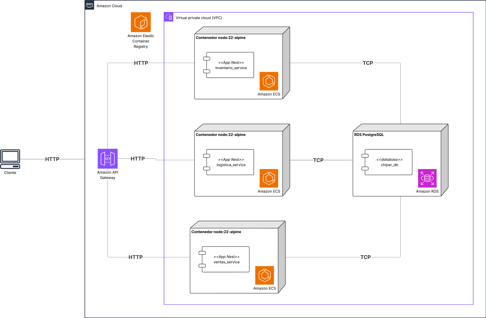
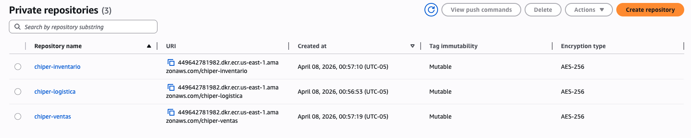
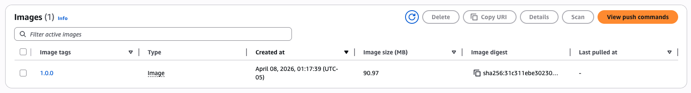

# Lab 4 — Pruebas de Carga en AWS para la Arquitectura de Microservicios

## Etapas del laboratorio

| Etapa                                  | Resumen                                                                                     | Uso de IA generativa                                                                            |
| -------------------------------------- | ------------------------------------------------------------------------------------------- | ----------------------------------------------------------------------------------------------- |
| 1. Experimento y ASRs de escalabilidad | Definicion de objetivos de carga simultanea y criterios de exito para microservicios.       | Uso acotado para ordenar hipotesis; la priorizacion de ASRs debe ser propia.                    |
| 2. Analisis arquitectonico             | Evaluacion de estilos (microservicios, API Gateway) y tacticas de escalamiento.             | Recomendado para contrastar trade-offs y disenar criterios de diagnostico.                      |
| 3. Despliegue en AWS                   | Publicacion de imagenes, configuracion de RDS, ECS y API Gateway.                           | Recomendado para asistencia operativa (comandos/configuracion), con verificacion manual en AWS. |
| 4. Pruebas de carga simultaneas        | Ejecucion de GET y POST en paralelo para observar aislamiento y escalabilidad por servicio. | Recomendado para automatizar experimentos y documentar metricas por endpoint.                   |
| 5. Interpretacion y entregables        | Analisis de eficiencia de escalamiento y consolidacion de resultados.                       | No recomendado para generar conclusiones sin evidencia cuantitativa.                            |

## Objetivos

- Desplegar la aplicación de Chiper en una arquitectura de microservicios usando AWS.
- Ejecutar pruebas de carga sobre dos endpoints criticos (GET y POST) en simultaneo.
- Evaluar el atributo de calidad principal del laboratorio: escalabilidad.
- Analizar el comportamiento del sistema distribuido bajo carga: latencia, throughput, errores y capacidad de escalar por servicio.
- Proponer mejoras de arquitectura y configuracion de infraestructura para mejorar escalabilidad y disponibilidad.

## Índice

- [1. Experimento](#1-experimento)
- [2. Arquitectura](#2-arquitectura)
- [3. Tecnologías](#3-tecnologías)
- [4. Despliegue (AWS)](#4-despliegue-aws)
- [5. Pruebas de carga](#5-pruebas-de-carga-con-jmeter)
- [6. Interpretación de resultados](#6-interpretación-de-resultados)
- [7. Entregables](#7-entregables)

## 1. Experimento

### 1.1 Descripción

| Elemento | Detalle |
|---|---|
| Título | Prueba de carga a arquitectura de microservicios de Chiper en AWS |
| Propósito | Evaluar la escalabilidad del sistema al ejecutar cargas simultaneas en endpoints GET y POST |
| Resultados esperados | Evidenciar como la separacion en microservicios permite escalar de forma independiente y sostener mayor carga |
| Infraestructura | API Gateway + ECS/Fargate (microservicios) + ECR + RDS + computador personal para ejecutar JMeter |

### 1.2 ASRs involucrados

| ID | Descripcion | Metricas a satisfacer |
| --- | --- | --- |
| REQ1 | Como tendero, quiero confirmar un pedido dentro del umbral de tiempo definido por el curso. | p99 < 2000 ms |
| REQ2 | Como negocio, quiero mantener una alta proporcion de respuestas exitosas incluso en eventos de alta demanda. | Error % <= 10% |
| REQ3 | Como tendero, quiero que la aplicacion funcione correctamente incluso durante picos de carga de 5000 req/min. | Durante 5000 req/min en ejecucion simultanea GET + POST, sostener throughput total >= 83.3 req/s y Error % <= 10%. |

> [!IMPORTANT]
> **Pregunta 1:**
> REQ1, REQ2 y REQ3 pueden degradarse de forma diferente por servicio.
> Defina un criterio matemático simple (por ejemplo, ganancia marginal de throughput vs. incremento de recursos), represéntelo en una gráfica con sus resultados y explique en qué punto la curva muestra que el sistema deja de escalar eficientemente en Chiper.

### 1.3 Qué se va a probar

Se prueban dos escenarios funcionales, pero ahora en paralelo:

1. GET (lectura pesada / consulta con JOINs)
   - Consultar productos que un usuario haya pedido, que esten en promocion y disponibles.

2. POST (escritura pesada / entidad grande)
   - Confirmar o crear pedidos con carga grande (multiples items y datos asociados).

3. Ejecucion simultanea GET + POST
   - Ambas cargas se ejecutan al mismo tiempo para observar aislamiento entre servicios y comportamiento de escalamiento.

## 2. Arquitectura

### 2.1 Diagrama de despliegue

### 2.2 Estilos de arquitectura asociados

| Estilos de arquitectura asociados | Analisis (atributos de calidad que favorece y desfavorece) |
| --- | --- |
| Microservicios | Favorece escalabilidad independiente por dominio funcional, despliegue desacoplado y resiliencia localizada. Desfavorece complejidad operativa, observabilidad y mayor costo de coordinacion. |
| API Gateway | Favorece seguridad y control de trafico. Puede desfavorecer latencia adicional por salto de red y posible cuello de botella si no se configura bien. |

### 2.3 Tácticas

| Tacticas | Analisis (atributos de calidad que favorece y desfavorece) |
| --- | --- |
| Replicacion horizontal de tareas ECS | Favorece mayor capacidad de procesamiento y tolerancia a fallos por redundancia. Desfavorece aumento de costo y mayor complejidad para controlar estado compartido y consistencia. |
| Escalamiento independiente por microservicio | Favorece optimizacion de recursos al escalar solo los servicios que lo requieren. Desfavorece riesgo de desbalance entre servicios y necesidad de observabilidad por componente. |
| Balanceo de trafico por servicio | Favorece distribucion uniforme de carga y menor saturacion de instancias individuales. Desfavorece posible latencia adicional y dependencia de una configuracion correcta del balanceo. |
| Uso de base de datos administrada (RDS) para separar responsabilidades de infraestructura | Favorece alta disponibilidad operativa, simplificacion de administracion y backups gestionados. Desfavorece posible cuello de botella centralizado y mayor costo bajo cargas altas. |

> [!IMPORTANT]
> **Pregunta 2:**
> Si el sistema no cumple REQ3 durante carga simultánea, ¿cómo determinaría si el problema está en desacoplamiento insuficiente entre microservicios o en capacidad de infraestructura (ECS/RDS/API Gateway)?
> Presente su respuesta con un diagrama de diagnóstico (hipótesis -> métricas -> evidencia -> decisión) y al menos una gráfica comparativa de soporte.
## 3. Tecnologías

| Categoría | Tecnologías |
| --- | --- |
| Gateway de entrada | Amazon API Gateway |
| Orquestación de contenedores | Amazon ECS (Fargate) |
| Registro de imágenes | Amazon ECR |
| Base de datos relacional | Amazon RDS (PostgreSQL) |
| Framework backend | NestJS |
| Lenguaje | TypeScript |
| ORM | TypeORM |
| Pruebas de carga | Apache JMeter |

## 4. Despliegue (AWS)

Antes de iniciar el despliegue, revise la guía de migración, es importante que entienda los cambios principales ya que los cambios aunque no son el foco del laboratorio, impactan directamente en como debe desplegar y configurar los servicios:

- [Guia de migracion de monolito a microservicios](./guia_migracion_monolito_microservicios.md)

### 4.1 Publicar imágenes en ECR

Debe crear un repositorio por servicio

| Servicio   | Nombre sugerido repositorio | Tag imagen |
| ---------- | --------------------------- | ---------- |
| Logistica  | `chiper-logistica`          | `1.0.0`    |
| Inventario | `chiper-inventario`         | `1.0.0`    |
| Ventas     | `chiper-ventas`             | `1.0.0`    |

Para cada servicio debe: construir una imagen, etiquetar con el URI del repositorio y publicar en ECR.

Tutorial de apoyo:
- [Subir imágenes Docker a Amazon ECR](../tutoriales/subir_imagenes%20_a_ecr.md)

Al final tendrá que ver algo así:

Y dentro de cada repositorio

### 4.2 Configurar base de datos en RDS

Tutorial de apoyo:
- [Crear una instancia RDS PostgreSQL para Chiper](../tutoriales/crear_instancia_rds.md)

1. Cree una instancia RDS PostgreSQL para el laboratorio.
2. Configure Security Groups para permitir trafico solo desde ECS.
3. Configure las variables de entorno de los microservicios para apuntar a RDS.

### 4.3 Crear servicios en ECS

Recursos de ECS (Fargate) y parametros necesarios para el proyecto del curso:

| Servicio   | Task Definition        | Servicio ECS            | Puerto contenedor | Desired count inicial | Variables a declarar                                                                         |
| ---------- | ---------------------- | ----------------------- | ----------------- | --------------------- | -------------------------------------------------------------------------------------------- |
| Logistica  | `td-chiper-logistica`  | `svc-chiper-logistica`  | 3001              | 1                     | `PORT=3001`, `DB_HOST`, `DB_PORT`, `DB_USER`, `DB_PASSWORD`, `DB_NAME`                       |
| Inventario | `td-chiper-inventario` | `svc-chiper-inventario` | 3002              | 1                     | `PORT=3002`, `DB_HOST`, `DB_PORT`, `DB_USER`, `DB_PASSWORD`, `DB_NAME`, `LOGISTICA_BASE_URL` |

Verifique que todas las tareas queden en estado RUNNING antes de pasar a API Gateway.

> [!IMPORTANT]
> **Pregunta 3:**
> Suponga que solo puede aumentar `desired count` en un servicio antes de una ventana comercial crítica.
> ¿Cuál escalaría primero en Chiper y bajo qué evidencia cuantitativa tomaría esa decisión?
> Incluya qué métrica usaría para evitar escalar a ciegas.
> Muestre esa decisión en una gráfica por servicio (por ejemplo saturación o costo-beneficio marginal) para justificar por qué ese servicio se prioriza.

Tutorial de apoyo:
- [Crear un servicio en Amazon ECS](../tutoriales/crear_instancia_ecs.md)

### 4.4 Exponer APIs con API Gateway

Tutorial de apoyo:
- [Configurar API Gateway para microservicios de Chiper](../tutoriales/configurar_api_gateway.md)

Recursos de API Gateway (una ruta por servicio) y parametros necesarios:

| Servicio   | Route track (prefijo) |
| ---------- | --------------------- |
| Logistica  | `/logistica/*`        |
| Inventario | `/inventario/*`       |
| Ventas     | `/ventas/*`           |

Recursos globales de API Gateway y parametros necesarios:

| Recurso global | Nombre sugerido | Parametros necesarios                                                                   |
| -------------- | --------------- | --------------------------------------------------------------------------------------- |
| API            | `chiper-ms-api` | Tipo de API (HTTP/REST), CORS y esquema de autenticacion/autorizacion para laboratorio. |
| Stage          | `lab`           | Nombre de stage y variables de stage (si aplica).                                       |
| Deployment     | `deploy-lab`    | Stage destino y version/publicacion de rutas e integraciones.                           |

### 4.5 Verificación rápida

Desde su computador:

- GET: `https://<API_ID>.execute-api.<REGION>.amazonaws.com/<STAGE>/health`

Verifique que ambos endpoints respondan correctamente antes de iniciar pruebas de carga.

## 5. Pruebas de carga con JMeter

> Las pruebas base son las mismas de labs anteriores, pero ahora el escenario principal ejecuta GET y POST en simultaneo para evaluar escalabilidad de servicios independientes.

### 5.1 Escenarios de carga

- Operación normal: 500 req/min total.
- Evento de promociones (pico): 5000 req/min total.

Distribuya la carga entre GET y POST segun su diseno de experimento (ejemplo 60/40 o 50/50), y justifiquelo en entregables.

### 5.2 Matriz mínima de pruebas

Ejecute al menos 8 repeticiones para operacion normal y estres fuerte. Para el resto, al menos 4:

| Test | Ramp-Up | Threads totales | Loops | Carga concurrente total (req/s) |
| --- | --- | --- | --- | --- |
| Smoke test | 5s | 10 | 1 | 1 |
| Baja carga | 10s | 40 | 1 | 3 |
| Carga media | 20s | 200 | 1 | 5 |
| Operación normal | 50s | 900 | 1 | 9 |
| Alta carga | 75s | 3000 | N/A | 20 |
| Muy alta carga | 100s | 6000 | N/A | 30 |
| Estrés | 150s | 12000 | N/A | 50 |
| Estrés fuerte | 200s | 24000 | N/A | 90 |

> Recomendacion: configure dos Thread Groups (GET y POST) y ejecutelos al tiempo en el mismo plan de prueba.

> [!IMPORTANT]
> **Pregunta 4:**
> Diseñe una estrategia de distribución de carga GET/POST (por ejemplo 70/30, 60/40, 50/50) que represente un lunes de alta demanda en Chiper.
> ¿Qué distribución escogería para evaluar riesgo real y cuál para estresar el peor caso técnico?
> Justifique por qué no necesariamente deben coincidir.
> Incluya una gráfica comparativa de escenarios (barras o líneas) que muestre el efecto esperado de cada distribución sobre p99, throughput y error %.

### 5.3 Ejecutar con JMeter

1. Duplique o adapte su plan de pruebas del Lab 2/Lab 3.
2. Configure dos grupos de carga paralelos:
   - Grupo GET -> endpoint GET por API Gateway.
   - Grupo POST -> endpoint POST por API Gateway.
3. Mantenga consistencia en ramp-up y ventanas de ejecucion para comparabilidad.
4. Ejecute la matriz y guarde resultados por iteracion.

### 5.4 Opción B - Cargas altas con script en Python

Para escenarios de alta concurrencia donde JMeter sea limitante, puede usar un script en Python como generador de carga, manteniendo:

- ejecucion simultanea GET y POST,
- metricas por endpoint (p95, p99, throughput, error %),
- y trazabilidad temporal de resultados.

## 6. Interpretación de resultados

Analice resultados con enfoque en escalabilidad:

- Samples por endpoint.
- Latencia promedio, p95 y p99 por endpoint.
- Error % por endpoint.
- Throughput total y por endpoint.
- Comportamiento al escalar tareas ECS por servicio.

### 6.1 Umbrales por ASR

- REQ1 (Latencia): p99 < 2000 ms
- REQ2 (Disponibilidad): Error % <= 10%
- REQ3 (Escalabilidad): en pico de 5000 req/min, throughput total >= 83.3 req/s y Error % <= 10% durante ejecucion simultanea GET + POST.

### 6.2 Punto de inflexión

Para este laboratorio, reporte:

- Punto de inflexion de GET bajo carga simultanea.
- Punto de inflexion de POST bajo carga simultanea.
- Punto de inflexion global del sistema (cuando el comportamiento deja de escalar de forma eficiente).

> [!IMPORTANT]
> **Pregunta 5:**
> ¿Qué significa exactamente "dejar de escalar eficientemente" en términos medibles para este laboratorio?
> Defina un criterio y represéntelo en una gráfica con sus resultados y explique en qué punto la curva evidencia que el sistema deja de escalar eficientemente en Chiper.

## 7. Entregables

### 7.1 Tablas de resultados

Entregue dos tablas principales (una por endpoint):

- Tabla A: Resultados GET (en escenario simultaneo)
- Tabla B: Resultados POST (en escenario simultaneo)

Formato sugerido:

| # threads/users | Ramp-up (s) | p99 (ms) | p95 (ms) | Throughput (req/s) | Error % |
| ---: | ---: | ---: | ---: | ---: | ---: |
| 10 | 5 |  |  |  |  |
| 40 | 10 |  |  |  |  |
| ... | ... |  |  |  |  |

Marque el registro del punto de inflexion en cada tabla.

### 7.2 Evidencias

Adjunte capturas de:

- Configuracion de API Gateway y rutas usadas.
- Servicios ECS y cantidad de tareas por servicio.
- RDS en estado disponible.
- Configuracion de JMeter (Thread Groups GET y POST en simultaneo).
- Summary Report (o resultados del script) por iteracion.
- Iteracion donde deja de cumplirse al menos un ASR.

### 7.3 Evidencias y prompts

Adjunte:

- Prompts utilizados (si uso IA).
- Script final (si aplica).
- Evidencia de ejecucion de pruebas.

### 7.4 Análisis breve

Incluya un analisis de 1 a 2 paginas que responda:

1. Cual fue el punto de inflexion de GET y POST cuando se ejecutaron simultaneamente.
2. Que servicio degrado primero y por que.
3. Como cambio el comportamiento frente al monolito del Lab 3.
4. Que tanto aporto el escalamiento independiente de microservicios al cumplimiento de ASRs.
5. El patron de degradacion fue gradual o abrupto.
6. Cual fue el cuello de botella principal (aplicacion, red, API Gateway, RDS u otro).
7. Dada la evidencia recolectada, que estrategia de escalamiento en ECS recomiendan (horizontal, vertical o mixta) y por que.
8. Que cambios de arquitectura proponen para reducir el acoplamiento con RDS y que trade-offs introducen. Investigue que tácticas (diferentes de una base de datos por servicio) puede usar y justifique basado en el contexto de Chiper
9. Si tuvieran que priorizar una inversion de infraestructura para el siguiente pico de 5000 req/min, cual componente reforzarían primero y como justifican la decision con las medidas de respuesta.

## Nota final (créditos AWS)

Cuando termine:

- Detenga o elimine recursos de ECS, RDS, API Gateway y artefactos no usados en ECR para evitar consumo innecesario de creditos.
