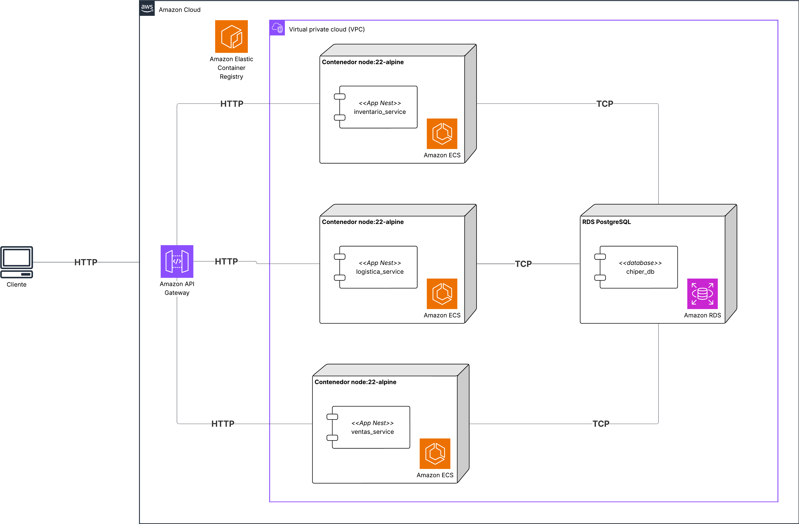

# Lab 4 — Pruebas de Carga en AWS para la Arquitectura de Microservicios

## Etapas del laboratorio

| Etapa                                  | Resumen                                                                                     | Uso de IA generativa                                                                            |
| -------------------------------------- | ------------------------------------------------------------------------------------------- | ----------------------------------------------------------------------------------------------- |
| 1. Experimento y ASRs de escalabilidad | Definicion de objetivos de carga simultanea y criterios de exito para microservicios.       | Uso acotado para ordenar hipotesis; la priorizacion de ASRs debe ser propia en la pregunta 1.                    |
| 2. Analisis arquitectonico             | Evaluacion de estilos (microservicios, API Gateway) y tacticas de escalamiento.             | Recomendado para contrastar trade-offs.                      |
| 3. Despliegue en AWS                   | Publicacion de imagenes, configuracion de RDS, ECS y API Gateway.                           | Recomendado para asistencia operativa (comandos/configuracion), con verificacion manual en AWS. |
| 4. Pruebas de carga simultaneas        | Ejecucion de GET y POST en paralelo para observar aislamiento y escalabilidad por servicio. | Recomendado para automatizar experimentos.                   |
| 5. Interpretacion y entregables        | Analisis de eficiencia de escalamiento y consolidacion de resultados.                       | No recomendado para generar conclusiones sin evidencia cuantitativa.                            |

## Objetivos

- Desplegar la aplicación de Cheapest en una arquitectura de microservicios usando AWS.
- Ejecutar pruebas de carga sobre dos endpoints criticos (GET y POST) en simultaneo.
- Evaluar el atributo de calidad principal del laboratorio: escalabilidad.
- Analizar el comportamiento del sistema distribuido bajo carga: latencia, throughput, errores y capacidad de escalar por servicio.
- Proponer mejoras de arquitectura y configuracion de infraestructura para mejorar escalabilidad y disponibilidad.

## Índice

- [1. Experimento](#1-experimento)
- [2. Arquitectura](#2-arquitectura)
- [3. Tecnologías](#3-tecnologías)
- [4. Despliegue (AWS)](#4-despliegue-aws)
- [5. Pruebas de carga](#5-pruebas-de-carga-con-jmeter)
- [6. Interpretación de resultados](#6-interpretación-de-resultados)
- [7. Entregables](#7-entregables)

## 1. Experimento

### 1.1 Descripción

| Elemento | Detalle |
|---|---|
| Título | Prueba de carga a arquitectura de microservicios de Cheapest en AWS |
| Propósito | Evaluar la escalabilidad del sistema al ejecutar cargas simultaneas en endpoints GET y POST |
| Resultados esperados | Evidenciar como la separacion en microservicios permite escalar de forma independiente y sostener mayor carga |
| Infraestructura | API Gateway + ECS/Fargate + ECR + RDS + computador personal para ejecutar JMeter |

### 1.2 ASRs involucrados

| ID | Fuente del estímulo | Estímulo | Artefacto | Entorno/Contexto | Respuesta | Medida de la respuesta |
| --- | --- | --- | --- | --- | --- | --- |
| REQ1 | Tendero (usuario final) mediante la aplicación | Solicitud de confirmación de un pedido (endpoint `POST /logistics/pedidos`) | Microservicio de Logística, que es el que expone `/logistics/pedidos` (y servicios dependientes) | Operación normal / pico de carga, ejecución concurrente con otros endpoints | El sistema procesa y responde la confirmación del pedido | p99 < 2000 ms |
| REQ2 | Tráfico agregado de tenderos/clientes durante un evento de alta demanda | Ráfaga de solicitudes concurrentes GET + POST | API Gateway y microservicios expuestos | Evento de alta demanda (pico de carga simultanea) | El sistema responde exitosamente a la mayoría de solicitudes en vez de fallar | Error % <= 10% |
| REQ3 | Tráfico agregado de tenderos/clientes en un pico comercial (ej. promociones) | Carga simultanea GET + POST sostenida en 5000 req/min | Arquitectura de microservicios completa (API Gateway, ECS/Fargate, RDS) | Pico de carga de 5000 req/min, ejecución simultanea GET + POST | El sistema sostiene el throughput agregado sin degradarse por debajo del umbral | Throughput total >= 83.3 req/s y Error % <= 10% durante la ejecución simultanea |

> [!IMPORTANT]
> **Pregunta 1:**
> REQ1, REQ2 y REQ3 (ya estructurados como escenarios de calidad arriba) pueden degradarse de forma diferente por servicio.
> Antes de desplegar los microservicios, analice qué tan eficiente es escalar el monolito **agregando recursos** (eje X: instancias, vCPU o memoria; no carga). Con sus resultados del **Lab 3** como datos de partida, defina un criterio matemático simple (por ejemplo, ganancia marginal de throughput por recurso agregado, `ΔThroughput / ΔRecursos`), represéntelo en una gráfica de throughput vs. recursos junto a la línea de escalamiento ideal (lineal) y explique a partir de qué punto agregar recursos deja de traducirse en throughput proporcional en Cheapest y qué componente de la arquitectura lo explica.
> La respuesta debe apoyarse en los ASRs correctamente estructurados (estímulo, fuente, entorno, artefacto, respuesta, medida de respuesta); un ASR mal definido invalida el análisis pedido.

### 1.3 Qué se va a probar

Se prueban dos escenarios funcionales:

1. GET (lectura pesada / consulta con JOINs)
   - Consultar productos que un usuario haya pedido, que esten en promocion y disponibles.

2. POST (escritura pesada / entidad grande)
   - Confirmar o crear pedidos con carga grande (multiples items y datos asociados).

3. Ejecucion simultanea GET + POST
   - Ambas cargas se ejecutan al mismo tiempo para observar aislamiento entre servicios y comportamiento de escalamiento.

## 2. Arquitectura

### 2.1 Diagrama de despliegue



> [!NOTE]
> El diagrama representa la topología general del despliegue (API Gateway, servicios ECS/Fargate, RDS), pero **no** muestra explícitamente múltiples tareas por servicio ni un `desired count` distinto por microservicio. Las tácticas de "Replicación horizontal de tareas ECS" y "Escalamiento independiente por microservicio" (sección 2.3) se evidencian en la **configuración de ECS (sección 4.3)**, no en el diagrama. No asuma que el diagrama por sí solo demuestra esas tácticas.

### 2.2 Estilos de arquitectura asociados

| Estilos de arquitectura asociados | Analisis (atributos de calidad que favorece y desfavorece) |
| --- | --- |
| Microservicios | Favorece escalabilidad independiente por dominio funcional, despliegue desacoplado y resiliencia localizada.<br>Desfavorece complejidad operativa, observabilidad y mayor costo de coordinacion. |
| API Gateway | Favorece seguridad y control de trafico.<br>Puede desfavorecer latencia adicional por salto de red y posible cuello de botella si no se configura bien. |

### 2.3 Tácticas

| Tacticas | Analisis (atributos de calidad que favorece y desfavorece) |
| --- | --- |
| Replicacion horizontal | Favorece mayor capacidad de procesamiento y tolerancia a fallos por redundancia.<br>Desfavorece costos y mantenibilidad. |
| Escalamiento independiente por microservicio | Favorece costos, escalabilidad y elasticidad.<br>Desfavorece mantenibilidad. |
| Balanceo de trafico por servicio | Favorece disponibilidad.<br>Desfavorece latencia y mantenibilidad. |
| Uso de base de datos administrada | Favorece disponibilidad y mantenibilidad.<br>Desfavorece costos y portabilidad. |

> [!IMPORTANT]
> **Pregunta 2:**
> Si el sistema no cumple REQ3 durante carga simultánea, ¿cómo determinaría si el problema está en desacoplamiento insuficiente entre microservicios o en capacidad de infraestructura (ECS/RDS/API Gateway)?
> Presente su respuesta con un diagrama de diagnóstico (hipótesis -> métricas -> evidencia -> decisión) y al menos una gráfica comparativa de soporte.

## 3. Tecnologías

| Categoría | Tecnologías | Recurso de referencia |
| --- | --- | --- |
| Gateway de entrada | Amazon API Gateway | [Documentación oficial API Gateway](https://docs.aws.amazon.com/apigateway/) |
| Orquestación de contenedores | Amazon ECS (Fargate) | [Documentación oficial Amazon ECS](https://docs.aws.amazon.com/ecs/) |
| Registro de imágenes | Amazon ECR | [Documentación oficial Amazon ECR](https://docs.aws.amazon.com/ecr/) |
| Base de datos relacional | Amazon RDS (PostgreSQL) | [Documentación oficial Amazon RDS](https://docs.aws.amazon.com/rds/) |
| Framework backend | NestJS | [Documentación oficial NestJS](https://docs.nestjs.com/) |
| Lenguaje | TypeScript | [Documentación oficial TypeScript](https://www.typescriptlang.org/docs/) |
| ORM | TypeORM | [Documentación oficial TypeORM](https://typeorm.io/) |
| Pruebas de carga | Apache JMeter | [Documentación oficial Apache JMeter](https://jmeter.apache.org/usermanual/index.html) |

> [!NOTE]
> Si alguna tecnología es nueva para usted (especialmente API Gateway, ECS/Fargate y ECR), se recomienda usar IA generativa antes de iniciar la sección 4 (Despliegue) para explorar en detalle qué hace cada servicio y cómo encaja en la arquitectura de microservicios propuesta (por ejemplo: "¿qué rol cumple ECR frente a ECS y en qué momento del despliegue se usa cada uno?").

## 4. Despliegue (AWS)

Antes de iniciar el despliegue, revise la guía de migración, es importante que entienda los cambios principales ya que los cambios aunque no son el foco del laboratorio, impactan directamente en como debe desplegar y configurar los servicios:

- [Guia de migracion de monolito a microservicios](./guia_migracion_monolito_microservicios.md)

> [!NOTE]
> **Warm-up en clase:** la sección 4.1 (Publicar imágenes en ECR) está disponible como una sesión práctica de 40 minutos para trabajar en clase: [`lab_4_warmup.md`](lab_4_warmup.md). Si su profesor ya realizó esta sesión en clase, puede saltar directamente a la sección **4.2 Configurar base de datos en RDS**.

### 4.1 Publicar imágenes en ECR

Debe crear un repositorio por servicio. Los cambios con respecto al monolito están en la rama `microservicios`

| Servicio   | Nombre sugerido del repositorio | Nombre de la imagen | Tag imagen |
| ---------- | --------------------------- | ---------- | ---------- |
| Logistica  | `cheapest-logistica`          | `logistica-service`          | `1.0.0`    |
| Inventario | `cheapest-inventario`         | `inventario-service`         | `1.0.0`    |
| Ventas     | `cheapest-ventas`             | `ventas-service`             | `1.0.0`    |

Para cada servicio debe: construir una imagen, etiquetar con el URI del repositorio y publicar en ECR.

Tutorial de apoyo:
- [Subir imágenes Docker a Amazon ECR](../tutoriales/subir_imagenes%20_a_ecr.md)

Al final tendrá que ver algo así:

Y dentro de cada repositorio


### 4.2 Configurar base de datos en RDS

Tutorial de apoyo:
- [Crear una instancia RDS PostgreSQL para Cheapest](../tutoriales/crear_instancia_rds.md)

1. Cree una instancia RDS PostgreSQL para el laboratorio (pasos 1 a 6 del tutorial). Anote el endpoint (`DB_HOST`), el nombre de la base (`--db-name`, `Cheapest` en el tutorial) y la contraseña del usuario `postgres`.
2. Configure Security Groups para permitir trafico solo desde ECS.
3. Cree el esquema y cargue los datos base (sección 4.2.1).
4. Configure las variables de entorno de los microservicios para apuntar a RDS (sección 4.3).

#### 4.2.1 Crear el esquema y cargar los datos base

La RDS se crea **vacía**: sin tablas y sin datos. A diferencia del Lab 3, en la rama `microservicios` los servicios **no** ejecutan un seeder al arrancar. Sin este paso, las pruebas de carga no tienen datos: el GET responde una lista vacía y el POST falla porque la tienda, los productos y la moneda del pedido no existen.

- **Esquema (tablas):** lo crea TypeORM (`synchronize`) cuando `DB_SYNCHRONIZE=true`. El script de seed también sincroniza el esquema completo (las entidades de los tres servicios) antes de insertar los datos.
- **Datos:** el script `npm run db:seed` de la rama `microservicios` carga `libs/shared/database/src/seed.sql`, que contiene los mismos UUID fijos que usa el plan de JMeter del Lab 2 (tiendas `bbbbbbbb-...`, productos `aaaaaaaa-...`, moneda `cccccccc-...`, zonas `Zona Norte`/`Zona Sur`). Si detecta que la base ya tiene datos, no inserta nada.

Ejecútelo **una sola vez**, desde su computador, con el repositorio en la rama `microservicios` (después de `npm install`) y **antes** de crear los servicios de ECS. Como la RDS no es pública, siga la sección **7. Cargar datos base** del [tutorial de RDS](../tutoriales/crear_instancia_rds.md#7-cargar-datos-base-npm-run-dbseed): hacer la RDS temporalmente pública, abrir el 5432 solo para su IP, correr el seed y **revertir ambos cambios**. El comando es:

```bash
DB_HOST=<ENDPOINT_RDS> DB_PORT=5432 DB_USERNAME=postgres DB_PASSWORD=<PASSWORD> DB_NAME=Cheapest npm run db:seed
```

> En Windows (PowerShell), defina cada variable antes del comando: `$env:DB_HOST="<ENDPOINT_RDS>"`, `$env:DB_USERNAME="postgres"`, etc., y luego ejecute `npm run db:seed`.

Salida esperada: `Database seeded successfully.` (o `Database already seeded. Skipping.` si ya se había cargado).

> [!WARNING]
> Defina siempre `DB_HOST` al correr el seed. Si lo omite, el script usa `127.0.0.1` y, si tiene un Postgres local corriendo, lo sembrará a él y el comando terminará sin errores aunque la RDS siga vacía.

### 4.3 Crear servicios en ECS

Recursos de ECS (Fargate) y parametros necesarios para el proyecto del curso:

| Servicio   | Task Definition        | Servicio ECS            | Puerto contenedor | Desired count inicial | Variables a declarar                                                                         |
| ---------- | ---------------------- | ----------------------- | ----------------- | --------------------- | -------------------------------------------------------------------------------------------- |
| Logistica  | `td-Cheapest-logistica`  | `svc-Cheapest-logistica`  | 3001              | 1                     | `PORT=3001`, `DB_HOST`, `DB_PORT`, `DB_USERNAME`, `DB_PASSWORD`, `DB_NAME`, `DB_SYNCHRONIZE=true`                       |
| Inventario | `td-Cheapest-inventario` | `svc-Cheapest-inventario` | 3002              | 1                     | `PORT=3002`, `DB_HOST`, `DB_PORT`, `DB_USERNAME`, `DB_PASSWORD`, `DB_NAME`, `DB_SYNCHRONIZE=true`, `LOGISTICA_BASE_URL` |
| Ventas     | `td-Cheapest-ventas`     | `svc-Cheapest-ventas`     | 3003              | 1                     | `PORT=3003`, `DB_HOST`, `DB_PORT`, `DB_USERNAME`, `DB_PASSWORD`, `DB_NAME`, `DB_SYNCHRONIZE=true`, `LOGISTICA_BASE_URL` |

Valores de las variables:

| Variable | Valor |
| --- | --- |
| `DB_HOST` | Endpoint de la RDS (paso 6 del tutorial de RDS), por ejemplo `cheapest-rds.xxxxxxxx.us-east-1.rds.amazonaws.com` |
| `DB_PORT` | `5432` |
| `DB_USERNAME` | `postgres` (el `--master-username` de la RDS) |
| `DB_PASSWORD` | La contraseña que definió en `--master-user-password` |
| `DB_NAME` | El `--db-name` de la RDS (`Cheapest` en el tutorial; respete mayúsculas y minúsculas) |
| `DB_SYNCHRONIZE` | `true`: cada servicio crea o actualiza las tablas de sus entidades al arrancar. El código también usa `true` si la variable no está definida, pero declárela explícitamente para no depender de ese valor por defecto |
| `LOGISTICA_BASE_URL` | `http://<IP_PRIVADA_TAREA_LOGISTICA>:3001`, sin `/` final ni prefijo `/logistics` (el cliente HTTP lo agrega) |

> [!NOTE]
> Use el nombre `DB_USERNAME`, el mismo del `.env.example`, del `docker-compose.yml` y de la [guía de migración](./guia_migracion_monolito_microservicios.md#4-variables-de-entorno). El código también acepta `DB_USER` como alias, pero use un solo nombre en las tres task definitions.

**Orden de creación:** inventario y ventas llaman a logística por HTTP a través de `LOGISTICA_BASE_URL`, así que ese valor debe existir antes de registrar sus task definitions:

1. Cree primero el servicio de **logística** y espere a que su tarea quede en `RUNNING`.
2. Obtenga la **IP privada** de esa tarea (la comunicación entre servicios ocurre dentro de la VPC):

   ```bash
   aws ecs describe-tasks --cluster Cheapest-cluster --tasks <TASK_ARN_LOGISTICA> --query "tasks[0].attachments[0].details[?name=='privateIPv4Address'].value" --output text
   ```

3. Use esa IP en `LOGISTICA_BASE_URL` y cree los servicios de **inventario** y **ventas**.

> [!WARNING]
> La IP de la tarea de logística **cambia** cada vez que la tarea se reinicia. Si eso ocurre, inventario y ventas quedan apuntando a la IP anterior. Vea en la sección 4.5 qué debe actualizar.

Antes de crear los servicios, configure el security group de las tareas para permitir trafico entrante en los puertos 3001, 3002 y 3003. Sin esa regla, las tareas quedan en `RUNNING` pero inaccesibles desde afuera, y tanto el curl directo como los healthchecks de API Gateway fallaran con timeout.

Verifique que todas las tareas queden en estado RUNNING antes de pasar a API Gateway.

> [!IMPORTANT]
> **Pregunta 3:**
> Suponga que solo puede aumentar `desired count` en un servicio antes de una ventana comercial crítica.
> ¿Cuál escalaría primero en Cheapest y bajo qué evidencia cuantitativa tomaría esa decisión?
> Incluya qué métrica usaría para evitar escalar a ciegas.
> Muestre esa decisión en una gráfica por servicio (por ejemplo saturación o costo-beneficio marginal) para justificar por qué ese servicio se prioriza.

Tutorial de apoyo:
- [Crear un servicio en Amazon ECS](../tutoriales/crear_instancia_ecs.md)

### 4.4 Exponer APIs con API Gateway

Tutorial de apoyo:
- [Configurar API Gateway para microservicios de Cheapest](../tutoriales/configurar_api_gateway.md)

Recursos de API Gateway (una ruta por servicio) y parametros necesarios:

| Servicio   | Route track (prefijo) |
| ---------- | --------------------- |
| Logistica  | `/logistics/*`        |
| Inventario | `/inventory/*`        |
| Ventas     | `/ventas/*`           |

Ademas del proxy de negocio (`/<prefijo>/{proxy+}`), cree una ruta especifica por servicio para el healthcheck, ya que el `HealthController` de cada microservicio expone `/health` en la raiz del contenedor (sin el prefijo del servicio):

| Servicio   | Ruta en API Gateway | Backend real          |
| ---------- | -------------------- | ---------------------- |
| Logistica  | `GET /logistics/health` | `http://<IP_TAREA_LOGISTICA>:3001/health` |
| Inventario | `GET /inventory/health` | `http://<IP_TAREA_INVENTARIO>:3002/health` |
| Ventas     | `GET /ventas/health`    | `http://<IP_TAREA_VENTAS>:3003/health`    |

Recursos globales de API Gateway y parametros necesarios:

| Recurso global | Nombre sugerido | Parametros necesarios                                                                   |
| -------------- | --------------- | --------------------------------------------------------------------------------------- |
| API            | `Cheapest-ms-api` | Tipo **HTTP API** (`--protocol-type HTTP`), CORS y autorizacion `NONE` para el laboratorio. |
| Stage          | `lab`           | Creado con `--auto-deploy`. El tutorial usa `dev` como ejemplo: reemplacelo por `lab`.   |
| Deployment     | — (automatico)  | Con `--auto-deploy`, cada cambio en rutas e integraciones se publica solo en el stage; no necesita crear deployments manuales. |

> [!NOTE]
> Use **HTTP API**, no REST API. Son dos productos distintos de API Gateway con comandos distintos: todos los comandos de este laboratorio y del tutorial (`aws apigatewayv2 ...`) corresponden a HTTP API. Si crea una REST API (`aws apigateway ...` o la opción "REST API" en la consola), esos comandos no le van a funcionar.

### 4.5 Verificación rápida

> [!WARNING]
> Las tareas de Fargate reciben una IP publica **y** una IP privada nuevas cada vez que la tarea se reinicia (por ejemplo, si el contenedor se cae, se actualiza la task definition o se hace un despliegue). En este laboratorio hay dos lugares que guardan IPs de tareas:
>
> - **API Gateway**: las integraciones apuntan a la IP **publica** de cada tarea.
> - **Inventario y ventas**: `LOGISTICA_BASE_URL` apunta a la IP **privada** de la tarea de logística.
>
> Qué actualizar según la tarea que se reinició:
>
> | Tarea reiniciada | Qué debe actualizar |
> | --- | --- |
> | Logística | 1. Las dos integraciones de logística en API Gateway (negocio y health) con la nueva IP publica.<br>2. `LOGISTICA_BASE_URL` en inventario y ventas: registre una nueva revisión de cada task definition con la nueva IP privada y actualice cada servicio (`aws ecs update-service --cluster Cheapest-cluster --service <SERVICIO> --task-definition <FAMILIA_TASK_DEFINITION>`).<br>3. El paso 2 reemplaza las tareas de inventario y ventas, así que esas tareas también quedan con IPs nuevas: actualice sus integraciones en API Gateway. |
> | Inventario o ventas | Solo las integraciones de ese servicio en API Gateway. |
>
> Para obtener las IPs nuevas use `aws ecs describe-tasks` + `aws ec2 describe-network-interfaces` (ver [tutorial de ECS](../tutoriales/crear_instancia_ecs.md#15-cómo-obtener-la-ip-pública-de-la-tarea)). Para ubicar y actualizar las integraciones:
>
> ```bash
> aws apigatewayv2 get-integrations --api-id <API_ID> --query "Items[].{Id:IntegrationId,Uri:IntegrationUri}" --output table
> aws apigatewayv2 update-integration --api-id <API_ID> --integration-id <INTEGRATION_ID> --integration-uri "http://<NUEVA_IP_PUBLICA>:<PUERTO>/<PREFIJO_SERVICIO>/{proxy}"
> aws apigatewayv2 update-integration --api-id <API_ID> --integration-id <INTEGRATION_ID_HEALTH> --integration-uri "http://<NUEVA_IP_PUBLICA>:<PUERTO>/health"
> ```
>
> **Síntoma típico de `LOGISTICA_BASE_URL` desactualizada:** `/inventory/health` y `/ventas/health` responden bien, pero las operaciones de inventario o ventas que validan productos tardan unos 3 segundos (`LOGISTICA_TIMEOUT_MS`) y devuelven `503` con el mensaje `Logistica service is unavailable`.
>
> En un sistema real no se usan IPs de tareas: los servicios se ubican por un nombre estable (un balanceador interno, ECS Service Connect o AWS Cloud Map). En este laboratorio se usan IPs directas por simplicidad, y esta fragilidad es un costo de esa decisión.

Desde su computador, pruebe primero el health de cada servicio (no existe un `/health` global unico, cada microservicio expone el suyo bajo su propio prefijo de ruta):

- GET: `https://<API_ID>.execute-api.<REGION>.amazonaws.com/<STAGE>/logistics/health`
- GET: `https://<API_ID>.execute-api.<REGION>.amazonaws.com/<STAGE>/inventory/health`
- GET: `https://<API_ID>.execute-api.<REGION>.amazonaws.com/<STAGE>/ventas/health`

Verifique que los tres respondan correctamente antes de iniciar pruebas de carga.

> [!TIP]
> Si alguna de estas rutas no responde, no diagnostique solo desde API Gateway: primero pruebe `curl http://<IP_TAREA>:<PUERTO>/health` directo a la tarea. Si eso tambien falla, puede ser el security group (ver seccion 4.3). Si el curl directo funciona pero la ruta de API Gateway da 404, la integracion de health probablemente quedo apuntando a `/<prefijo>/health` en vez de `/health

## 5. Pruebas de carga con JMeter

> Las pruebas base son las mismas de labs anteriores, pero ahora el escenario principal ejecuta GET y POST en simultaneo para evaluar escalabilidad de servicios independientes.

### 5.1 Escenarios de carga

- Operación normal: 500 req/min total.
- Evento de promociones (pico): 5000 req/min total.

Distribuya la carga entre GET y POST segun su diseno de experimento (ejemplo 60/40 o 50/50), y justifiquelo en entregables.

### 5.2 Matriz mínima de pruebas

| Test | Ramp-Up | Threads totales | Loops | Carga concurrente total (req/s) | Repeticiones mínimas |
| --- | --- | --- | --- | --- | ---: |
| Smoke test | 5s | 10 | 1 | 1 | 4 |
| Baja carga | 10s | 40 | 1 | 3 | 4 |
| Carga media | 20s | 200 | 1 | 5 | 4 |
| Operación normal | 50s | 900 | 1 | 9 | 8 |
| Alta carga | 75s | 3000 | N/A | 20 | 4 |
| Muy alta carga | 100s | 6000 | N/A | 30 | 4 |
| Estrés | 150s | 12000 | N/A | 50 | 4 |
| Estrés fuerte | 200s | 24000 | N/A | 90 | 8 |

> Recomendacion: configure dos Thread Groups (GET y POST) y ejecutelos al tiempo en el mismo plan de prueba.

> [!IMPORTANT]
> El mínimo de repeticiones indicado en la columna "Repeticiones mínimas" **es obligatorio y forma parte de la calificación**. La tabla de entregables (sección 7.1) es una extensión directa de esta matriz: cada fila de 5.2 debe tener tantas filas de resultados en 7.1 como repeticiones mínimas se hayan definido aquí. Entregar la tabla de 7.1 sin haber ejecutado el mínimo de repeticiones de cada Test se considera una matriz de pruebas incompleta.

> [!IMPORTANT]
> **Pregunta 4:**
> Diseñe una estrategia de distribución de carga GET/POST (por ejemplo 70/30, 60/40, 50/50) que represente un lunes de alta demanda en Cheapest.
> ¿Qué distribución escogería para evaluar riesgo real y cuál para estresar el peor caso técnico?
> Justifique por qué no necesariamente deben coincidir.
> Incluya una gráfica comparativa de escenarios (barras o líneas) que muestre el efecto esperado de cada distribución sobre p99, throughput y error %.

### 5.3 Ejecutar con JMeter

1. Duplique o adapte su plan de pruebas del Lab 2/Lab 3.
2. Configure dos grupos de carga paralelos:
   - Grupo GET -> endpoint GET por API Gateway.
   - Grupo POST -> endpoint POST por API Gateway.
3. Mantenga consistencia en ramp-up y ventanas de ejecucion para comparabilidad.
4. Ejecute la matriz y guarde resultados por iteracion.


### 5.4 Opción B - Cargas altas con script en Python

Para escenarios de alta concurrencia donde JMeter sea limitante, puede usar un script en Python como generador de carga, manteniendo:

- ejecucion simultanea GET y POST,
- metricas por endpoint (p95, p99, throughput, error %),
- y trazabilidad temporal de resultados.

## 6. Interpretación de resultados

Analice resultados con enfoque en escalabilidad:

- Samples por endpoint.
- Latencia promedio, p95 y p99 por endpoint.
- Error % por endpoint.
- Throughput total y por endpoint.
- Comportamiento al escalar tareas ECS por servicio.

### 6.1 Umbrales por ASR

- REQ1 (Latencia): p99 < 2000 ms
- REQ2 (Disponibilidad): Error % <= 10%
- REQ3 (Escalabilidad): en pico de 5000 req/min, throughput total >= 83.3 req/s y Error % <= 10% durante ejecucion simultanea GET + POST.

### 6.2 Punto de inflexión

Para este laboratorio, reporte:

- Punto de inflexion de GET bajo carga simultanea.
- Punto de inflexion de POST bajo carga simultanea.
- Punto de inflexion global del sistema (cuando el comportamiento deja de escalar de forma eficiente, según el criterio que defina en la Pregunta 5).

> [!IMPORTANT]
> **Pregunta 5:**
> A diferencia de la Pregunta 1 (eficiencia al agregar **recursos**, con datos del Lab 3), esta pregunta se responde con los resultados **de este laboratorio**: la infraestructura se mantiene fija y lo que aumenta es la **carga ofrecida** (threads de la matriz de la sección 5.2).
> ¿Qué significa exactamente "dejar de escalar eficientemente" en términos medibles para la ejecución simultánea GET + POST?
> Defina un criterio que combine throughput, p99 y error % frente a la carga ofrecida, represéntelo en una gráfica con sus resultados y explique en qué punto la curva evidencia que el sistema deja de escalar eficientemente y qué significa ese punto para el negocio de Cheapest (pedidos atendidos vs. pedidos demorados o rechazados).

## 7. Entregables

### 7.1 Tablas de resultados

Entregue dos tablas principales (una por endpoint):

- Tabla A: Resultados GET (en escenario simultaneo)
- Tabla B: Resultados POST (en escenario simultaneo)

Formato sugerido (extensión directa de la matriz de la sección 5.2: mismas columnas `Test`, `Ramp-Up` y `Threads totales`, agregando una fila por cada repetición mínima exigida y las métricas medidas):

| Test | Ramp-Up | Threads totales | # Repetición | p99 (ms) | p95 (ms) | Throughput (req/s) | Error % |
| --- | ---: | ---: | ---: | ---: | ---: | ---: | ---: |
| Smoke test | 5s | 10 | 1 |  |  |  |  |
| Smoke test | 5s | 10 | 2 |  |  |  |  |
| ... | ... | ... | ... |  |  |  |  |
| Operación normal | 50s | 900 | 1 |  |  |  |  |
| ... | ... | ... | ... |  |  |  |  |

Cada `Test` debe tener exactamente el número de filas indicado por "Repeticiones mínimas" en 5.2 (por ejemplo, 8 filas para "Operación normal" y 8 para "Estrés fuerte", 4 para el resto). Marque el registro del punto de inflexion en cada tabla.

### 7.2 Evidencias

Adjunte capturas de:

- Repositorios ECR con la imagen `1.0.0` de cada servicio (sección 4.1).
- Configuracion de API Gateway y rutas usadas.
- Servicios ECS y cantidad de tareas por servicio.
- RDS en estado disponible.
- Configuracion de JMeter (Thread Groups GET y POST en simultaneo).
- Summary Report (o resultados del script) por iteracion.
- Iteracion donde deja de cumplirse al menos un ASR.

### 7.3 Evidencias y prompts

Adjunte:

- Prompts utilizados (si uso IA).
- Script final (si aplica).
- Evidencia de ejecucion de pruebas.

### 7.4 Análisis breve

Incluya un analisis de 1 a 2 paginas que responda:

1. Cual fue el punto de inflexion de GET y POST cuando se ejecutaron simultaneamente.
2. Que servicio degrado primero y por que.
3. Como cambio el comportamiento frente al monolito del Lab 3.
4. Que tanto aporto el escalamiento independiente de microservicios al cumplimiento de ASRs.
5. El patron de degradacion fue gradual o abrupto.
6. Cual fue el cuello de botella principal (aplicacion, red, API Gateway, RDS u otro).
7. Dada la evidencia recolectada, que estrategia de escalamiento en ECS recomiendan (horizontal, vertical o mixta) y por que.
8. Que cambios de arquitectura proponen para reducir el acoplamiento con RDS y que trade-offs introducen. Investigue que tácticas (diferentes de una base de datos por servicio) puede usar y justifique basado en el contexto de Cheapest
9. Si tuvieran que priorizar una inversion de infraestructura para el siguiente pico de 5000 req/min, cual componente reforzarían primero y como justifican la decision con las medidas de respuesta.

### 7.5 Respuestas a las preguntas del laboratorio

Incluya en el informe las respuestas argumentadas a la **Pregunta 1 a la Pregunta 5**, planteadas a lo largo del enunciado. Cada respuesta debe incluir los elementos que pide la pregunta (tablas, gráficas o diagramas) y debe ir más allá de lo superficial.


## Nota final (créditos AWS)

Cuando termine:

- Detenga o elimine recursos de ECS, RDS, API Gateway y artefactos no usados en ECR para evitar consumo innecesario de creditos.
