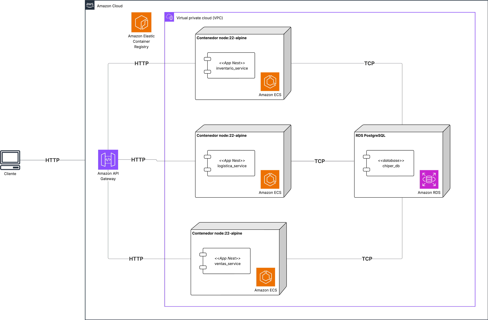
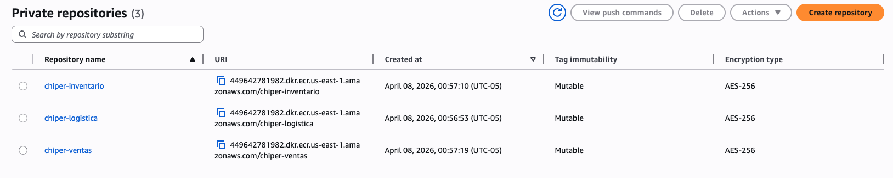
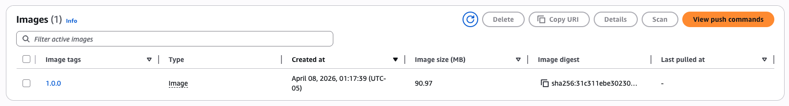

# Lab 4 — Pruebas de Carga en AWS para la Arquitectura de Microservicios

## Etapas del laboratorio

| Etapa                                  | Resumen                                                                                     | Uso de IA generativa                                                                            |
| -------------------------------------- | ------------------------------------------------------------------------------------------- | ----------------------------------------------------------------------------------------------- |
| 1. Experimento y ASRs de escalabilidad | Hipótesis de diseño, escenarios de calidad vinculados (ASRs), diseño y planeación del experimento de carga simultánea en microservicios.       | Uso acotado para ordenar hipotesis; la priorizacion de ASRs debe ser propia en la pregunta 1.                    |
| 2. Analisis arquitectonico             | Evaluacion de estilos (microservicios, API Gateway) y tacticas de escalamiento.             | Recomendado para contrastar trade-offs.                      |
| 3. Despliegue en AWS                   | Publicacion de imagenes, configuracion de RDS, ECS y API Gateway.                           | Recomendado para asistencia operativa (comandos/configuracion), con verificacion manual en AWS. |
| 4. Pruebas de carga simultaneas        | Ejecucion de GET y POST en paralelo para observar aislamiento y escalabilidad por servicio. | Recomendado para automatizar experimentos.                   |
| 5. Interpretacion y entregables        | Analisis de eficiencia de escalamiento y consolidacion de resultados.                       | No recomendado para generar conclusiones sin evidencia cuantitativa.                            |

## Objetivos

- Desplegar la aplicación de Cheapest en una arquitectura de microservicios usando AWS.
- Ejecutar pruebas de carga sobre dos endpoints criticos (GET y POST) en simultaneo.
- Evaluar el atributo de calidad principal del laboratorio: escalabilidad.
- Analizar el comportamiento del sistema distribuido bajo carga: latencia, throughput, errores y capacidad de escalar por servicio.
- Proponer mejoras de arquitectura y configuracion de infraestructura para mejorar escalabilidad y disponibilidad.

## Índice

- [1. Experimento](#1-experimento)
- [2. Arquitectura](#2-arquitectura)
- [3. Tecnologías](#3-tecnologías)
- [4. Despliegue (AWS)](#4-despliegue-aws)
- [5. Pruebas de carga](#5-pruebas-de-carga-con-jmeter)
- [6. Entregables](#6-entregables)

## 1. Experimento

### 1.1 Descripción

| Elemento | Detalle |
|---|---|
| Título | Prueba de carga a arquitectura de microservicios de Cheapest en AWS |
| Propósito | Evaluar la escalabilidad del sistema al ejecutar cargas simultaneas en endpoints GET y POST |
| Resultados esperados | Evidenciar como la separacion en microservicios permite escalar de forma independiente y sostener mayor carga |
| Infraestructura | API Gateway + ECS/Fargate + ECR + RDS + computador personal para ejecutar JMeter |

### 1.2 Hipótesis de diseño

| # | Hipótesis |
| --- | --- |
| H1 | **Si** separamos la aplicación en microservicios (Logística, Inventario, Ventas) desplegados de forma independiente en ECS/Fargate, **entonces** el sistema sostiene 5000 req/min de carga simultánea GET + POST (throughput ≥ 83.3 req/s, error % ≤ 10%), **porque** cada servicio se escala según su propia demanda y una carga pesada en uno no consume la capacidad de los demás. |
| H2 | **Si** aplicamos replicación horizontal de tareas ECS y escalamiento independiente por microservicio, **entonces** el p99 de `POST /logistics/pedidos` se mantiene < 2000 ms bajo carga simultánea, **porque** las tareas adicionales reparten las peticiones y reducen la utilización de cada una. |
| H3 | **Si** usamos una base de datos administrada (RDS) compartida por los servicios, **entonces** el punto de inflexión del sistema lo determinará el acoplamiento con RDS más que la capacidad de cómputo de ECS, **porque** escalar tareas aumenta el número de conexiones y consultas concurrentes contra un único recurso que no escala horizontalmente. |

### 1.3 Escenarios de calidad vinculados


#### REQ1 — Latencia

**Historia de usuario**

- **Yo como** tendero,
- **quiero** confirmar mis pedidos mientras el sistema recibe la carga de otros tenderos,
- **para** recibir la confirmación en un tiempo que no interrumpa la atención a mis clientes.

**Escenario**

| Elemento | Descripción |
| --- | --- |
| Estímulo | Solicitudes de confirmación de pedido (`POST /logistics/pedidos`) ejecutadas en concurrencia con consultas de productos (`GET`), mientras la carga total sube de 8 TPS a 83 TPS. |
| Artefacto | Microservicio de Logística, que expone `/logistics/pedidos` (y la base de datos RDS que usa). |
| Ambiente | Operación normal (8 TPS, 500 req/min) y pico de carga (83 TPS, 5000 req/min) de carga total, GET + POST en simultáneo, sobre la arquitectura desplegada en AWS. |
| Medida de la respuesta | p99 de la confirmación de pedido < 2000 ms. |

#### REQ2 — Disponibilidad

**Historia de usuario**

- **Yo como** tendero,
- **quiero** consultar los productos disponibles para mi tienda durante un evento de alta demanda,
- **para** ofrecerlos a mis clientes sin que la consulta falle.

**Escenario**

| Elemento | Descripción |
| --- | --- |
| Estímulo | Ráfaga de consultas de productos disponibles (`GET /logistics/tenderos/productos-disponibles`) ejecutadas en concurrencia con confirmaciones de pedido (`POST`). |
| Artefacto | Microservicio de Logística, que expone `/logistics/tenderos/productos-disponibles` (y la base de datos RDS que usa). |
| Ambiente | Evento de alta demanda: 83 TPS (5000 req/min) de carga total, GET + POST en simultáneo. |
| Medida de la respuesta | Error % de las consultas <= 10%. |

#### REQ3 — Escalabilidad

**Historia de usuario**

- **Yo como** gerente de operaciones (COO),
- **quiero** que el sistema soporte un crecimiento en el número de confirmaciones de pedido durante un pico comercial,
- **para** atender de forma adecuada las campañas de promociones.

**Escenario**

| Elemento | Descripción |
| --- | --- |
| Estímulo | Crecimiento de la carga de 8 TPS (500 req/min) a 83 TPS (5000 req/min), es decir, un factor de escala de 900% de crecimiento, sobre la confirmación de pedidos (`POST /logistics/pedidos`) en concurrencia con consultas (`GET`). |
| Artefacto | Arquitectura de microservicios completa (API Gateway, ALB, ECS/Fargate, RDS), con el microservicio de Logística como punto de entrada de la confirmación de pedidos. |
| Ambiente | Pico comercial (por ejemplo, promociones) con GET + POST en simultáneo, partiendo de operación normal (8 TPS). |
| Medida de la respuesta | Al alcanzar la carga máxima de la matriz (prueba *Estrés fuerte*, ramp-up de 200 s): throughput total >= 83,3 TPS (req/s) y Error % de las confirmaciones de pedido <= 10%. |

> [!IMPORTANT]
> **Pregunta 1:**
> REQ1, REQ2 y REQ3 pueden degradarse de forma diferente por servicio.
> Antes de desplegar los microservicios, analice qué tan eficiente es escalar el monolito **agregando recursos** (eje X: instancias, vCPU o memoria; no carga). Con sus resultados del **Lab 3** como datos de partida, defina un criterio matemático simple (por ejemplo, ganancia marginal de throughput por recurso agregado, `ΔThroughput / ΔRecursos`), compare sus resultados con el escalamiento ideal (lineal) y explique a partir de qué punto agregar recursos deja de traducirse en throughput proporcional en Cheapest y qué componente de la arquitectura lo explica.
> La respuesta debe apoyarse en los ASRs.

### 1.4 Diseño del experimento

**¿Cómo se va a validar la hipótesis?** Cada escenario de calidad habla de una sola funcionalidad: REQ1 y REQ3 de confirmar pedidos (`POST /logistics/pedidos`) y REQ2 de consultar productos disponibles (`GET /logistics/tenderos/productos-disponibles`). Lo que vamos a probar es cómo se comportan esas funcionalidades **en concurrencia**, es decir, mientras la otra también recibe carga. El playbook de pruebas de carga es el siguiente:

1. **Referencia del monolito.** Con los resultados del Lab 3, analice la eficiencia del escalamiento del monolito al agregar recursos e identifique el punto a partir del cual deja de ser proporcional (Pregunta 1). Este análisis constituye la referencia de comparación para las etapas siguientes.
2. **Despliegue de los microservicios.** Publique la imagen de cada servicio en ECR, cree la base de datos en RDS, despliegue el balanceador de carga y los servicios en ECS, y exponga las rutas mediante API Gateway (sección 4). Al finalizar, verifique con los endpoints de `health` que los tres servicios responden.
3. **Carga de datos base.** La instancia de RDS se crea vacía. Cargue los datos base antes de ejecutar las pruebas; sin ellos, el GET retorna una lista vacía y el POST falla.
4. **Definición de la distribución de carga.** Establezca la proporción de peticiones GET y POST (Pregunta 4) y configure en JMeter dos Thread Groups, uno por endpoint, que se ejecuten simultáneamente (sección 5.1).
5. **Ejecución escalonada de la carga.** Ejecute la matriz de la sección 5.2 de menor a mayor carga, con el mínimo de repeticiones exigido para cada prueba. En cada ejecución registre, por endpoint, el p99, el p95, el throughput y el error %.
6. **Comparación con los umbrales.** Determine en qué escalón deja de cumplirse cada ASR (REQ1, REQ2 y REQ3) e identifique el punto de inflexión de GET, de POST y del sistema completo (criterio en la sección 6.2).
7. **Identificación del cuello de botella.** Si algún ASR se incumple, analice en CloudWatch si la causa es la capacidad de ECS, el acoplamiento entre servicios o la base de datos compartida (Pregunta 2). Evalúe el efecto de escalar el servicio que se satura primero (sección 4.3.2).
8. **Análisis comparativo.** Contraste los resultados con el comportamiento del monolito del Lab 3 y concluya en qué medida la separación en microservicios y el escalamiento independiente de cada servicio contribuyeron al cumplimiento de los ASR (hipótesis H1 a H3).

**¿Qué componentes se van a diseñar o modificar?**

| Componente | Cambio |
| --- | --- |
| ECR | Publicación de la imagen `1.0.0` de cada microservicio (sección 4.1) |
| RDS | Configuración de la base de datos administrada (sección 4.2) |
| Application Load Balancer | Un ALB con un listener y un target group por servicio: da una dirección estable y reparte el tráfico entre las tareas (sección 4.3.1) |
| ECS/Fargate | Servicios con `desired count` y escalamiento independiente por microservicio, registrados en el ALB (sección 4.3.2) |
| API Gateway | Rutas hacia cada microservicio (sección 4.4) |
| JMeter | Dos Thread Groups (GET y POST) ejecutados en simultáneo, con la distribución de carga que usted justifique |

**¿Qué métricas se van a medir?**

| Métrica | Hipótesis / ASR | Umbral |
| --- | --- | --- |
| p99 y p95 por endpoint | H2 / REQ1 | p99 < 2000 ms |
| Error % por endpoint (GET para REQ2, POST para REQ3) | H1 / REQ2, REQ3 | ≤ 10% |
| Throughput total y por endpoint | H1 / REQ3 | ≥ 83.3 req/s a 5000 req/min |
| Punto de inflexión de GET, POST y global; cuello de botella (ECS vs. RDS) | H2, H3 | criterio de la sección 6.2 |

**Escenarios funcionales.** Se prueban dos escenarios funcionales:

1. GET (lectura pesada / consulta con JOINs)
   - Consultar productos que un usuario haya pedido, que esten en promocion y disponibles.

2. POST (escritura pesada / entidad grande)
   - Confirmar o crear pedidos con carga grande (multiples items y datos asociados).

3. Ejecucion simultanea GET + POST
   - Ambas cargas se ejecutan al mismo tiempo para observar aislamiento entre servicios y comportamiento de escalamiento.

### 1.5 Planeación del experimento

**Recursos requeridos**

| Recurso | Detalle |
| --- | --- |
| Infraestructura AWS | API Gateway, ALB, ECS/Fargate, ECR y RDS (PostgreSQL) en su cuenta |
| Herramientas locales | Docker, AWS CLI, JMeter (o el script en Python de la sección 5.4) y los resultados del Lab 3 como referencia |
| Créditos AWS | Ver la nota final; elimine los recursos al terminar |

**Elementos de arquitectura involucrados**

Microservicios de Logística, Inventario y Ventas, API Gateway, Application Load Balancer, base de datos RDS compartida y el generador de carga (JMeter).

**Esfuerzo estimado** (referencia para planear; puede variar según su experiencia con AWS)

| Etapa | Secciones | Esfuerzo aprox. |
| --- | --- | --- |
| Despliegue en AWS | 4 | 1 h |
| Ejecución de la matriz de carga (con repeticiones mínimas) | 5 | 1,5 h |
| Interpretación de resultados y entregables | 6 | 1,5 h |
| **Total** | | **4 h** |

## 2. Arquitectura

### 2.1 Diagrama de despliegue



> [!NOTE]
> El diagrama representa la topología general del despliegue (API Gateway, servicios ECS/Fargate, RDS), pero **no** muestra explícitamente múltiples tareas por servicio ni un `desired count` distinto por microservicio. Las tácticas de "Replicación horizontal de tareas ECS" y "Escalamiento independiente por microservicio" (sección 2.3) se evidencian en la **configuración de ECS (sección 4.3)**, no en el diagrama. No asuma que el diagrama por sí solo demuestra esas tácticas.

### 2.2 Estilos de arquitectura asociados

| Estilos de arquitectura asociados | Analisis (atributos de calidad que favorece y desfavorece) |
| --- | --- |
| Microservicios | Favorece escalabilidad independiente por dominio funcional, despliegue desacoplado y resiliencia localizada.<br>Desfavorece complejidad operativa, observabilidad y mayor costo de coordinacion. |
| API Gateway | Favorece seguridad y control de trafico.<br>Puede desfavorecer latencia adicional por salto de red y posible cuello de botella si no se configura bien. |

### 2.3 Tácticas y patrones

| Tacticas | Analisis (atributos de calidad que favorece y desfavorece) |
| --- | --- |
| Replicacion horizontal | Favorece mayor capacidad de procesamiento y tolerancia a fallos por redundancia.<br>Desfavorece costos y mantenibilidad. |
| Escalamiento independiente por microservicio | Favorece costos, escalabilidad y elasticidad.<br>Desfavorece mantenibilidad. |
| Balanceo de trafico por servicio | Favorece disponibilidad.<br>Desfavorece latencia y mantenibilidad. |
| Uso de base de datos administrada | Favorece disponibilidad y mantenibilidad.<br>Desfavorece costos y portabilidad. |

> [!IMPORTANT]
> **Pregunta 2:**
> Si el sistema no cumple REQ3 durante carga simultánea, ¿cómo determinaría si el problema está en desacoplamiento insuficiente entre microservicios o en capacidad de infraestructura (ECS/RDS/API Gateway)?

## 3. Tecnologías

| Categoría | Tecnologías | Recurso de referencia |
| --- | --- | --- |
| Gateway de entrada | Amazon API Gateway | [Documentación oficial API Gateway](https://docs.aws.amazon.com/apigateway/) |
| Orquestación de contenedores | Amazon ECS (Fargate) | [Documentación oficial Amazon ECS](https://docs.aws.amazon.com/ecs/) |
| Registro de imágenes | Amazon ECR | [Documentación oficial Amazon ECR](https://docs.aws.amazon.com/ecr/) |
| Base de datos relacional | Amazon RDS (PostgreSQL) | [Documentación oficial Amazon RDS](https://docs.aws.amazon.com/rds/) |
| Framework backend | NestJS | [Documentación oficial NestJS](https://docs.nestjs.com/) |
| Lenguaje | TypeScript | [Documentación oficial TypeScript](https://www.typescriptlang.org/docs/) |
| ORM | TypeORM | [Documentación oficial TypeORM](https://typeorm.io/) |
| Pruebas de carga | Apache JMeter | [Documentación oficial Apache JMeter](https://jmeter.apache.org/usermanual/index.html) |

> [!NOTE]
> Si alguna tecnología es nueva para usted (especialmente API Gateway, ECS/Fargate y ECR), se recomienda usar IA generativa antes de iniciar la sección 4 (Despliegue) para explorar en detalle qué hace cada servicio y cómo encaja en la arquitectura de microservicios propuesta (por ejemplo: "¿qué rol cumple ECR frente a ECS y en qué momento del despliegue se usa cada uno?").

## 4. Despliegue (AWS)

Antes de iniciar el despliegue, revise la guía de migración, es importante que entienda los cambios principales ya que los cambios aunque no son el foco del laboratorio, impactan directamente en como debe desplegar y configurar los servicios:

- [Guia de migracion de monolito a microservicios](./guia_migracion_monolito_microservicios.md)

### 4.1 Publicar imágenes en ECR

Debe crear un repositorio por servicio. Los cambios con respecto al monolito están en la rama `microservicios`

| Servicio   | Nombre sugerido del repositorio | Nombre de la imagen | Tag imagen |
| ---------- | --------------------------- | ---------- | ---------- |
| Logistica  | `cheapest-logistica`          | `logistica-service`          | `1.0.0`    |
| Inventario | `cheapest-inventario`         | `inventario-service`         | `1.0.0`    |
| Ventas     | `cheapest-ventas`             | `ventas-service`             | `1.0.0`    |

Para cada servicio debe: construir la imagen, etiquetarla con el URI del repositorio y publicarla en ECR. Haga lo siguiente:

1. Siga el tutorial [Subir imágenes Docker a Amazon ECR](../tutoriales/subir_imagenes%20_a_ecr.md), que explica paso a paso cómo publicar la imagen de un servicio; el tutorial lo hace con `inventario-service` en el repositorio `cheapest-inventario`.
2. Haga el mismo procedimiento para `logistica-service` (repositorio `cheapest-logistica`) y para `ventas-service` (repositorio `cheapest-ventas`), cambiando el nombre del repositorio y de la imagen según la tabla anterior.
3. Use el tag `1.0.0` en los tres servicios. El tutorial usa `0.0.1` como ejemplo, así que reemplácelo por `1.0.0`.
4. Verifique que los tres repositorios existen y que cada uno contiene su imagen con el tag `1.0.0`.

Al final tendrá que ver algo así:

Y dentro de cada repositorio


### 4.2 Configurar base de datos en RDS

Todos los microservicios comparten una única base de datos PostgreSQL en RDS. Para crearla:

1. Siga el tutorial [Crear una instancia RDS PostgreSQL para Cheapest](../tutoriales/crear_instancia_rds.md) (versión CloudShell), que crea la instancia en 6 pasos:
   1. Identifica la VPC y las subredes donde se va a crear la base de datos.
   2. Crea el *DB Subnet Group* que usará la instancia.
   3. Crea el Security Group de RDS y autoriza el puerto 5432 **solo** desde el Security Group de las tareas ECS, de modo que únicamente los microservicios puedan conectarse.
   4. Crea la instancia RDS PostgreSQL (base `Cheapest`, usuario `postgres`).
   5. Espera a que la instancia esté disponible.
   6. Consulta el endpoint de la instancia.
2. Al terminar, anote el endpoint (`DB_HOST`), el nombre de la base (`--db-name`, `Cheapest` en el tutorial) y la contraseña del usuario `postgres`; los necesitará en los pasos siguientes.
3. Cree el esquema y cargue los datos base, siguiendo la sección 4.2.1. Este paso se hace aquí y no en el tutorial, porque usa el script de seed que viene en el código de la rama `microservicios`.
4. Configure las variables de entorno de los microservicios para apuntar a esta RDS (sección 4.3).

#### 4.2.1 Crear el esquema y cargar los datos base

La RDS se crea **vacía**: sin tablas y sin datos. A diferencia del Lab 3, en la rama `microservicios` los servicios **no** ejecutan un seeder al arrancar. Sin este paso, las pruebas de carga no tienen datos: el GET responde una lista vacía y el POST falla porque la tienda, los productos y la moneda del pedido no existen.

- **Esquema (tablas):** lo crea TypeORM (`synchronize`) cuando `DB_SYNCHRONIZE=true`. El script de seed también sincroniza el esquema completo (las entidades de los tres servicios) antes de insertar los datos.
- **Datos:** el script `npm run db:seed` de la rama `microservicios` carga `libs/shared/database/src/seed.sql`, que contiene los mismos UUID fijos que usa el plan de JMeter del Lab 2 (tiendas `bbbbbbbb-...`, productos `aaaaaaaa-...`, moneda `cccccccc-...`, zonas `Zona Norte`/`Zona Sur`). Si detecta que la base ya tiene datos, no inserta nada.

Ejecútelo **una sola vez**, desde su computador, con el repositorio en la rama `microservicios` (después de `npm install`) y **antes** de crear los servicios de ECS.

> [!IMPORTANT]
> La RDS se creó con `--no-publicly-accessible`, por lo que **no es alcanzable desde su computador** sin importar las reglas del Security Group. Correr `npm run db:seed` directamente fallará por timeout, o peor: si no define `DB_HOST`, el script sembrará silenciosamente un Postgres local (hace `process.env.DB_HOST ??= '127.0.0.1'`) y le dará una falsa sensación de éxito.

Para sembrar la RDS desde su computador, hágala temporalmente pública y restrinja el acceso a su propia IP. Los comandos `aws` puede correrlos en CloudShell o en su terminal, pero el paso 1 (`curl`) debe correrlo en su computador, para obtener la IP de su computador y no la de CloudShell:

```bash
# 1. Anote su IP pública actual (corra este comando en SU computador o busque "cuál es mi IP" en Google)
curl -s https://checkip.amazonaws.com

# 2. Haga la instancia temporalmente pública
aws rds modify-db-instance --db-instance-identifier Cheapest-rds --publicly-accessible --apply-immediately

# 3. Espere a que el cambio se aplique (puede tardar 1-2 minutos)
aws rds describe-db-instances --db-instance-identifier Cheapest-rds --query "DBInstances[0].PubliclyAccessible"

# 4. Abra el puerto 5432 SOLO para su IP (no 0.0.0.0/0: expondría las credenciales de la base a internet)
aws ec2 authorize-security-group-ingress --group-id <SG_RDS_ID> --protocol tcp --port 5432 --cidr <SU_IP_PUBLICA>/32
```

Luego, desde su computador, corra el seed apuntando explícitamente a la RDS:

```bash
DB_HOST=<ENDPOINT_RDS> DB_PORT=5432 DB_USERNAME=postgres DB_PASSWORD=<PASSWORD> DB_NAME=Cheapest npm run db:seed
```

> En Windows (PowerShell), defina cada variable antes del comando: `$env:DB_HOST="<ENDPOINT_RDS>"`, `$env:DB_USERNAME="postgres"`, etc., y luego ejecute `npm run db:seed`.

Salida esperada: `Database seeded successfully.` (o `Database already seeded. Skipping.` si ya se había cargado).

> [!WARNING]
> Defina siempre `DB_HOST` al correr el seed. Si lo omite, el script usa `127.0.0.1` y, si tiene un Postgres local corriendo, lo sembrará a él y el comando terminará sin errores aunque la RDS siga vacía.

Al terminar, **revierta los cambios** para no dejar la base expuesta:

```bash
aws rds modify-db-instance --db-instance-identifier Cheapest-rds --no-publicly-accessible --apply-immediately
aws ec2 revoke-security-group-ingress --group-id <SG_RDS_ID> --protocol tcp --port 5432 --cidr <SU_IP_PUBLICA>/32
```

### 4.3 Crear el balanceador y los servicios en ECS

Cada tarea de Fargate recibe una IP nueva cada vez que se reinicia, y API Gateway solo puede apuntar a una dirección. Para que los servicios tengan una dirección estable y para que, al escalar, las tareas nuevas reciban tráfico, delante de los servicios va un **Application Load Balancer (ALB)**: reparte las peticiones entre las tareas de cada servicio y tiene un DNS que no cambia.

#### 4.3.1 Crear el balanceador de carga (ALB)

Siga el tutorial [Configurar un Application Load Balancer para servicios de ECS](../tutoriales/configurar_alb_para_ecs.md), que explica paso a paso cómo crear el ALB:

1. Crear el Security Group del ALB y permitir los puertos 3001 a 3003 (paso 1).
2. Permitir que el ALB llegue a las tareas, agregando al Security Group de las tareas una regla de entrada desde el Security Group del ALB (paso 2).
3. Crear el ALB (paso 3).
4. Crear un target group por servicio, con health check en `/health` (paso 4).
5. Crear un listener por servicio, que reenvía al target group correspondiente (paso 5).

El ALB es **uno solo** y tiene tres listeners, uno por servicio. Use estos valores:

| Servicio | Target group | Puerto del listener | Puerto del contenedor |
| --- | --- | --- | --- |
| Logística | `tg-Cheapest-logistica` | 3001 | 3001 |
| Inventario | `tg-Cheapest-inventario` | 3002 | 3002 |
| Ventas | `tg-Cheapest-ventas` | 3003 | 3003 |

Al terminar, anote el **DNS del ALB** (`<ALB_DNS>`): es la dirección estable que usará en `LOGISTICA_BASE_URL` (abajo) y en las integraciones de API Gateway (sección 4.4). El registro de los servicios en los target groups se hace al crearlos (sección 4.3.2, paso 4).

#### 4.3.2 Crear los servicios en ECS

En esta sección va a desplegar los tres microservicios como servicios de ECS (Fargate). Siga el tutorial [Crear un servicio en Amazon ECS](../tutoriales/crear_instancia_ecs.md), que explica paso a paso cómo desplegar **un** servicio (`inventario`) así:

1. Configurar el Security Group para los puertos de la aplicación (paso 0).
2. Crear el clúster de ECS (paso 1).
3. Escribir el archivo `task-definition.json` (paso 2) y registrarlo (paso 3).
4. Crear el servicio a partir de la task definition (paso 4).
5. Verificar que la tarea esté `RUNNING` (pasos 5 a 8).

El tutorial usa valores de ejemplo (`inventario-task`, puerto `3000`, imagen `inventario_service:v1`, etc.). Usted debe seguir los mismos pasos, pero **reemplazando esos valores por los de las tablas de esta sección**, una vez por cada servicio (Logística, Inventario y Ventas):

- **Paso 0 (Security Group):** use un único Security Group para las tareas de los tres servicios (el mismo que autorizó en RDS en la sección 4.2), con reglas de entrada para los puertos 3001, 3002 y 3003 **desde el Security Group del ALB** (ya lo hizo en 4.3.1). Sin esas reglas, el ALB marca las tareas como `unhealthy` y no les envía tráfico.
- **Paso 1 (clúster):** créelo una sola vez (`Cheapest-cluster`); los tres servicios corren en el mismo clúster.
- **Pasos 2 y 3 (task definition):** en el `task-definition.json` de cada servicio, ponga en `family` el nombre de la columna *Task Definition* de la primera tabla (por ejemplo `td-Cheapest-logistica`), en `image` la URI de la imagen que publicó en la sección 4.1 (con el tag `1.0.0`), en `containerPort` el puerto del servicio y en `environment` las variables de la columna *Variables a declarar*, con los valores de la segunda tabla.
- **Paso 4 (servicio):** use como `--service-name` el nombre de la columna *Servicio ECS* (por ejemplo `svc-Cheapest-logistica`), como `--task-definition` la task definition del servicio y como `--desired-count` el valor de *Desired count inicial*. Además, registre el servicio en su target group con `--load-balancers targetGroupArn=<TG_ARN>,containerName=<NOMBRE_CONTENEDOR>,containerPort=<PUERTO>`: `<TG_ARN>` es el target group del servicio (tabla de 4.3.1) y `containerName` es el `name` del contenedor en su task definition.
- **Pasos 5 a 8 (verificación):** compruebe que la tarea de cada servicio queda en `RUNNING` y que en su target group aparece `healthy` (`aws elbv2 describe-target-health --target-group-arn <TG_ARN>`, puede tardar uno o dos minutos).

Recursos de ECS (Fargate) y parametros necesarios para el proyecto del curso:

| Servicio   | Task Definition        | Servicio ECS            | Puerto contenedor | Desired count inicial | Variables a declarar                                                                         |
| ---------- | ---------------------- | ----------------------- | ----------------- | --------------------- | -------------------------------------------------------------------------------------------- |
| Logistica  | `td-Cheapest-logistica`  | `svc-Cheapest-logistica`  | 3001              | 1                     | `PORT=3001`, `DB_HOST`, `DB_PORT`, `DB_USERNAME`, `DB_PASSWORD`, `DB_NAME`, `DB_SYNCHRONIZE=true`                       |
| Inventario | `td-Cheapest-inventario` | `svc-Cheapest-inventario` | 3002              | 1                     | `PORT=3002`, `DB_HOST`, `DB_PORT`, `DB_USERNAME`, `DB_PASSWORD`, `DB_NAME`, `DB_SYNCHRONIZE=true`, `LOGISTICA_BASE_URL` |
| Ventas     | `td-Cheapest-ventas`     | `svc-Cheapest-ventas`     | 3003              | 1                     | `PORT=3003`, `DB_HOST`, `DB_PORT`, `DB_USERNAME`, `DB_PASSWORD`, `DB_NAME`, `DB_SYNCHRONIZE=true`, `LOGISTICA_BASE_URL` |

Valores de las variables:

| Variable | Valor |
| --- | --- |
| `DB_HOST` | Endpoint de la RDS (paso 6 del tutorial de RDS), por ejemplo `cheapest-rds.xxxxxxxx.us-east-1.rds.amazonaws.com` |
| `DB_PORT` | `5432` |
| `DB_USERNAME` | `postgres` (el `--master-username` de la RDS) |
| `DB_PASSWORD` | La contraseña que definió en `--master-user-password` |
| `DB_NAME` | El `--db-name` de la RDS (`Cheapest` en el tutorial; respete mayúsculas y minúsculas) |
| `DB_SYNCHRONIZE` | `true`: cada servicio crea o actualiza las tablas de sus entidades al arrancar. El código también usa `true` si la variable no está definida, pero declárela explícitamente para no depender de ese valor por defecto |
| `LOGISTICA_BASE_URL` | `http://<ALB_DNS>:3001` (el DNS del ALB de la sección 4.3.1 y el puerto del listener de Logística), sin `/` final ni prefijo `/logistics` (el cliente HTTP lo agrega) |

> [!NOTE]
> Use el nombre `DB_USERNAME`, el mismo del `.env.example`, del `docker-compose.yml` y de la [guía de migración](./guia_migracion_monolito_microservicios.md#4-variables-de-entorno). El código también acepta `DB_USER` como alias, pero use un solo nombre en las tres task definitions.

**Orden de creación:** como `LOGISTICA_BASE_URL` usa el DNS del ALB, que ya conoce desde la sección 4.3.1, puede crear los tres servicios en cualquier orden.

Verifique que todas las tareas queden en estado `RUNNING` y `healthy` en su target group antes de pasar a API Gateway. Puede probar cada servicio a través del ALB con `curl http://<ALB_DNS>:<PUERTO>/health`.

> [!NOTE]
> **¿Quién decide cuántas tareas corren?** Usted. El `desired count` de cada servicio es el número de tareas que ECS debe mantener encendidas: ECS/Fargate solo se encarga de mantener ese número (por ejemplo, reinicia una tarea que se cae) y no lo cambia por su cuenta, porque en este laboratorio **no se configura ningún auto scaling**. Tampoco lo hacen API Gateway ni el ALB: su trabajo es solo enrutar y repartir las peticiones. Todos los servicios empiezan con `desired count = 1` y, si quiere cambiarlo, debe hacerlo manualmente:
>
> ```bash
> aws ecs update-service --cluster Cheapest-cluster --service <SERVICIO_ECS> --desired-count <N>
> ```
>
> `<SERVICIO_ECS>` es el **nombre** del servicio de ECS, el de la columna *Servicio ECS* de la primera tabla (por ejemplo, `svc-Cheapest-logistica`), y `<N>` es el número de tareas que quiere mantener.

**Cómo se escala un servicio en ECS.** Hay dos formas de darle más capacidad a un servicio, y se pueden combinar:

| Estrategia | Qué se cambia | Dónde se configura |
| --- | --- | --- |
| **Horizontal** | Se agregan más tareas iguales. | El `desired count` del servicio ECS. |
| **Vertical** | Se hace más grande cada tarea (más CPU y memoria). | Los campos `cpu` y `memory` de la task definition. |
| **Mixta** | Ambas a la vez: más tareas y más grandes. | El `desired count` y los campos `cpu` y `memory`. |

*Escalamiento horizontal.* Cambie el número de tareas del servicio y verifique que todas queden en `RUNNING`:

```bash
aws ecs update-service --cluster Cheapest-cluster --service svc-Cheapest-logistica --desired-count 2
aws ecs list-tasks --cluster Cheapest-cluster --service-name svc-Cheapest-logistica
```

> [!NOTE]
> Cuando ECS lanza las tareas nuevas, las registra automáticamente en el target group del servicio y el ALB reparte las peticiones entre todas las tareas sanas (por defecto, en turnos). No hay que configurar nada más.

*Escalamiento vertical.* El tamaño de la tarea está en el `task-definition.json` (`cpu` en unidades de CPU, donde 1024 es 1 vCPU, y `memory` en MB; el tutorial de ECS usa `512` y `1024`). Cámbielos por valores mayores, registre una nueva revisión de la task definition y actualice el servicio para que use esa revisión:

```bash
aws ecs register-task-definition --cli-input-json file://task-definition.json
aws ecs update-service --cluster Cheapest-cluster --service svc-Cheapest-logistica --task-definition td-Cheapest-logistica
```

Fargate solo acepta ciertas combinaciones de CPU y memoria:

| `cpu` | Memoria permitida |
| --- | --- |
| 256 (0,25 vCPU) | 512 MB a 2 GB |
| 512 (0,5 vCPU) | 1 GB a 4 GB |
| 1024 (1 vCPU) | 2 GB a 8 GB |
| 2048 (2 vCPU) | 4 GB a 16 GB |
| 4096 (4 vCPU) | 8 GB a 30 GB |

Al actualizar el servicio, ECS reemplaza la tarea por una nueva (con otra IP) y el ALB la registra automáticamente: no hay que actualizar las integraciones de API Gateway ni `LOGISTICA_BASE_URL`.

*Escalamiento mixto.* Combine ambos: primero cambie el tamaño de la tarea en la task definition (vertical) y luego ajuste el `desired count` (horizontal) con los comandos anteriores.

> [!IMPORTANT]
> **Pregunta 3:**
> Suponga que solo puede aumentar `desired count` en un servicio antes de una ventana comercial crítica.
> ¿Cuál escalaría primero en Cheapest y bajo qué evidencia cuantitativa tomaría esa decisión?
> Incluya qué métrica usaría para evitar escalar a ciegas.

### 4.4 Exponer APIs con API Gateway

En esta sección va a exponer los tres microservicios a través de una única API HTTP en API Gateway. Siga el tutorial [Configurar API Gateway para microservicios de Cheapest](../tutoriales/configurar_api_gateway.md) (versión CloudShell), que explica paso a paso cómo exponer un servicio así:

1. Crear la API HTTP (paso 1).
2. Crear la integración de negocio y la integración de health hacia el ALB (paso 2).
3. Crear la ruta de negocio (`ANY /<prefijo>/{proxy+}`) y la ruta de health (`GET /<prefijo>/health`) (paso 3).
4. Crear el stage (paso 4).
5. Obtener la URL de invocación (paso 5) y probar los endpoints (paso 6).

El tutorial deja como variables el prefijo, el puerto y la dirección del backend de cada servicio (`<PREFIJO_SERVICIO>`, `<PUERTO>`, `<ALB_DNS>`). Usted debe seguir los mismos pasos, **reemplazando esas variables por los valores de las tablas de esta sección**:

- **Paso 1:** cree la API **una sola vez**, con el nombre `Cheapest-ms-api` y tipo HTTP API (tabla de recursos globales, más abajo).
- **Pasos 2 y 3:** **repítalos para cada servicio** (Logística, Inventario y Ventas). En `<PREFIJO_SERVICIO>` use el prefijo de la primera tabla (`logistics`, `inventory` o `ventas`), en `<PUERTO>` el puerto del servicio (3001, 3002 o 3003) y en `<ALB_DNS>` el DNS del ALB (sección 4.3.1). Al final debe tener seis rutas: una de negocio y una de health por servicio. La segunda tabla muestra la ruta de health y el backend real al que debe apuntar cada una.
- **Paso 4:** cree el stage con el nombre `lab` y con `--auto-deploy`, tal como lo indica el tutorial.
- **Pasos 5 y 6:** guarde la URL de invocación, porque es la que usará en JMeter, y pruebe con `curl` el `health` de cada servicio.

Recursos de API Gateway (una ruta por servicio) y parametros necesarios:

| Servicio   | Route track (prefijo) |
| ---------- | --------------------- |
| Logistica  | `/logistics/*`        |
| Inventario | `/inventory/*`        |
| Ventas     | `/ventas/*`           |

Ademas del proxy de negocio (`/<prefijo>/{proxy+}`), cree una ruta especifica por servicio para el healthcheck, ya que el `HealthController` de cada microservicio expone `/health` en la raiz del contenedor (sin el prefijo del servicio):

| Servicio   | Ruta en API Gateway | Backend real          |
| ---------- | -------------------- | ---------------------- |
| Logistica  | `GET /logistics/health` | `http://<ALB_DNS>:3001/health` |
| Inventario | `GET /inventory/health` | `http://<ALB_DNS>:3002/health` |
| Ventas     | `GET /ventas/health`    | `http://<ALB_DNS>:3003/health`    |

Recursos globales de API Gateway y parametros necesarios:

| Recurso global | Nombre sugerido | Parametros necesarios                                                                   |
| -------------- | --------------- | --------------------------------------------------------------------------------------- |
| API            | `Cheapest-ms-api` | Tipo **HTTP API** (`--protocol-type HTTP`), CORS y autorizacion `NONE` para el laboratorio. |
| Stage          | `lab`           | Creado con `--auto-deploy`.   |
| Deployment     | — (automatico)  | Con `--auto-deploy`, cada cambio en rutas e integraciones se publica solo en el stage; no necesita crear deployments manuales. |

> [!NOTE]
> Use **HTTP API**, no REST API. Son dos productos distintos de API Gateway con comandos distintos: todos los comandos de este laboratorio y del tutorial (`aws apigatewayv2 ...`) corresponden a HTTP API. Si crea una REST API (`aws apigateway ...` o la opción "REST API" en la consola), esos comandos no le van a funcionar.

### 4.5 Verificación rápida

> [!NOTE]
> Tanto las integraciones de API Gateway como `LOGISTICA_BASE_URL` apuntan al **DNS del ALB**, que no cambia cuando las tareas se reinician o se escalan (el ALB registra las tareas nuevas por su cuenta). Solo tendría que actualizarlos si elimina y vuelve a crear el ALB: en ese caso, actualice las integraciones siguiendo el paso 7 del [tutorial de API Gateway](../tutoriales/configurar_api_gateway.md#7-si-la-dirección-del-backend-cambia-actualizar-la-integración) y registre una nueva revisión de las task definitions de inventario y ventas con el `LOGISTICA_BASE_URL` nuevo.
>
> **Síntoma típico de `LOGISTICA_BASE_URL` incorrecta:** `/inventory/health` y `/ventas/health` responden bien, pero las operaciones de inventario o ventas que validan productos tardan unos 3 segundos (`LOGISTICA_TIMEOUT_MS`) y devuelven `503` con el mensaje `Logistica service is unavailable`.

Desde su computador, pruebe primero el health de cada servicio (no existe un `/health` global unico, cada microservicio expone el suyo bajo su propio prefijo de ruta):

- GET: `https://<API_ID>.execute-api.<REGION>.amazonaws.com/<STAGE>/logistics/health`
- GET: `https://<API_ID>.execute-api.<REGION>.amazonaws.com/<STAGE>/inventory/health`
- GET: `https://<API_ID>.execute-api.<REGION>.amazonaws.com/<STAGE>/ventas/health`

Verifique que los tres respondan correctamente antes de iniciar pruebas de carga.

> [!TIP]
> Si alguna de estas rutas no responde, no diagnostique solo desde API Gateway. Vaya de adentro hacia afuera: (1) que la tarea esté `RUNNING` en ECS; (2) que esté `healthy` en su target group (`aws elbv2 describe-target-health --target-group-arn <TG_ARN>`); (3) que `curl http://<ALB_DNS>:<PUERTO>/health` responda. Si el target está `unhealthy`, revise el Security Group de las tareas (debe permitir el puerto desde el ALB, sección 4.3). Si el `curl` al ALB funciona pero la ruta de API Gateway da 404, la integración de health probablemente quedó apuntando a `/<prefijo>/health` en vez de `/health`.

## 5. Pruebas de carga con JMeter

> Las pruebas base son las mismas de labs anteriores, pero ahora el escenario principal ejecuta GET y POST en simultaneo para evaluar escalabilidad de servicios independientes.

### 5.1 Escenarios de carga

**Qué endpoints se ejecutan en simultáneo.** En cada ejecución de la matriz corren al mismo tiempo dos cargas, cada una sobre una funcionalidad de los ASRs:

| Carga | Endpoint (vía API Gateway) | ASR asociado |
| --- | --- | --- |
| GET: consultar productos disponibles | `GET /lab/logistics/tenderos/productos-disponibles?tiendaId=<UUID>&zona=Zona Norte` | REQ2 |
| POST: confirmar un pedido | `POST /lab/logistics/pedidos` | REQ1 y REQ3 |

El prefijo `/lab` es el nombre del stage que creó en la sección 4.4. Ambas cargas se ejecutan a la vez en el mismo plan de JMeter, cada una en su propio Thread Group; así cada endpoint se mide con el otro compitiendo por los mismos recursos (ECS y RDS).

**Escenarios de carga** (carga total, sumando GET y POST):

- Operación normal: 500 req/min total.
- Evento de promociones (pico): 5000 req/min total.

**Distribución GET/POST.** Se expresa como "% de GET / % de POST" y indica qué proporción de la carga total le corresponde a cada endpoint. Por ejemplo, **60/40** significa que el 60% de los threads (y de las peticiones) va al GET y el 40% al POST; **50/50** significa mitad y mitad. Como en JMeter cada Thread Group es una carga, la distribución se traduce en repartir los threads totales entre los dos grupos. Con 200 threads totales:

| Distribución | Grupo GET | Grupo POST |
| --- | ---: | ---: |
| 60/40 | 120 threads | 80 threads |
| 50/50 | 100 threads | 100 threads |

Para el smoke test use 50/50. Para el resto de la matriz usted escoge la distribución (Pregunta 4) y debe justificarla en el informe.

**Prueba base: smoke test.** Antes de escalar la carga, ejecute una prueba pequeña para confirmar que todo funciona. Siga estos pasos:

1. Descargue el plan [`load_test.jmx`](../lab_2/recursos/load_test.jmx) del Lab 2 y ábralo en JMeter. Ya trae dos Thread Groups, **Grupo GET Request** y **Grupo POST Request**, cada uno con su petición y sus listeners.
2. En el sampler de **cada** Thread Group, cambie estos valores para apuntar a API Gateway en lugar de `localhost`:

   | Campo | Valor |
   | --- | --- |
   | Protocol | `https` |
   | Server Name or IP | `<API_ID>.execute-api.<REGION>.amazonaws.com` (URL de invocación de la sección 4.4, sin `https://` ni el stage) |
   | Port Number | `443` |
   | Path (GET) | `/lab/logistics/tenderos/productos-disponibles?tiendaId=<UUID_TIENDA>&zona=Zona Norte` |
   | Path (POST) | `/lab/logistics/pedidos` |

   Use los UUID que sembró en la sección 4.2.1 (el plan trae los mismos UUID fijos del seed; si los cambió, actualícelos también en el cuerpo del POST).
3. Configure cada Thread Group para el smoke test de la matriz (10 threads totales, repartidos 50/50):

   | | Grupo GET | Grupo POST |
   | --- | --- | --- |
   | Number of Threads | 5 | 5 |
   | Ramp-up period (s) | 5 | 5 |
   | Loop Count | 1 | 1 |

4. Ejecute el plan completo (botón **Start**): JMeter lanza los dos Thread Groups al mismo tiempo.
5. Revise que la prueba sea válida: en **View Results Tree** las peticiones GET deben responder `200` y las POST `2xx`, y el **Error %** debe ser 0. Si hay errores, no siga escalando: revise primero el health de los servicios y los datos base (secciones 4.2.1 y 4.5).
6. Registre, para **cada** Thread Group, el p99, el p95, el throughput y el error % del **Aggregate Report** y del **Summary Report**. Esta es la línea base contra la que comparará el resto de las pruebas.
7. Repita el smoke test las veces que indica la matriz (4 repeticiones).

### 5.2 Matriz mínima de pruebas

Una vez validado el smoke test, escale la carga con el resto de la matriz. La columna **Threads totales** es la suma de los threads de los dos Thread Groups, repartidos según la distribución GET/POST (ver la sección 5.1). Use el mismo ramp-up en ambos grupos.

| Test | Ramp-Up | Threads totales | Loops | Carga concurrente total (req/s) | Repeticiones mínimas |
| --- | --- | --- | --- | --- | ---: |
| Smoke test | 5s | 10 | 1 | 1 | 4 |
| Baja carga | 10s | 40 | 1 | 3 | 4 |
| Carga media | 20s | 200 | 1 | 5 | 4 |
| Operación normal | 50s | 900 | 1 | 9 | 8 |
| Alta carga | 75s | 3000 | N/A | 20 | 4 |
| Muy alta carga | 100s | 6000 | N/A | 30 | 4 |
| Estrés | 150s | 12000 | N/A | 50 | 4 |
| Estrés fuerte | 200s | 24000 | N/A | 90 | 8 |


> [!IMPORTANT]
> El mínimo de repeticiones indicado en la columna "Repeticiones mínimas" **es obligatorio y forma parte de la calificación**. La tabla de entregables (sección 6.2) es una extensión directa de esta matriz: cada fila de 5.2 debe tener tantas filas de resultados en 7.1 como repeticiones mínimas se hayan definido aquí. Entregar la tabla de 7.1 sin haber ejecutado el mínimo de repeticiones de cada Test se considera una matriz de pruebas incompleta.

> [!IMPORTANT]
> **Pregunta 4:**
> La distribución de carga indica cuántas de las peticiones son de consulta (GET) y cuántas de confirmación de pedido (POST). Se escribe "% GET / % POST": por ejemplo, 70/30 significa que de cada 100 peticiones, 70 son GET y 30 son POST; 50/50 significa 50 GET y 50 POST.
> Diseñe una estrategia de distribución de carga GET/POST que represente un lunes de alta demanda en Cheapest (piense cuántos tenderos consultan productos frente a cuántos confirman pedidos).
> ¿Qué distribución escogería para evaluar riesgo real y cuál para estresar el peor caso técnico?
> Justifique por qué no necesariamente deben coincidir.

### 5.3 Ejecutar el resto de la matriz

Después del smoke test, recorra la matriz de arriba hacia abajo (de menor a mayor carga) con el mismo plan de JMeter. Para **cada fila** haga lo siguiente:

1. **Calcule los threads de cada grupo.** Tome los *Threads totales* de la fila y repártalos según la distribución GET/POST que escogió en la Pregunta 4. Ejemplo con la fila *Baja carga* (40 threads totales) y una distribución 60/40: Grupo GET = 40 × 0,6 = **24** threads y Grupo POST = 40 × 0,4 = **16** threads.
2. **Configure los dos Thread Groups.** En *Number of Threads* ponga los valores calculados; en *Ramp-up period* ponga el ramp-up de la fila (10 s en el ejemplo), el **mismo en ambos grupos**; y en *Loop Count* ponga 1. Así los dos grupos empiezan y terminan juntos y la prueba es comparable entre filas.
3. **Limpie los resultados anteriores.** En cada listener (Aggregate Report, Summary Report) use *Clear All* antes de ejecutar; de lo contrario se mezclan las métricas de esta ejecución con las de la anterior.
4. **Ejecute** el plan con **Start** y espere a que terminen ambos Thread Groups. Mientras corre, si puede, observe en CloudWatch el uso de CPU de las tareas ECS de cada servicio y de la RDS.
5. **Registre los resultados por endpoint.** Del Aggregate Report y del Summary Report anote, para el Grupo GET y para el Grupo POST por separado, el p99, el p95, el throughput y el error %. Guárdelos con *Save Table Data* (CSV) para no perderlos y llene la fila correspondiente de la tabla de la sección 6.2.
6. **Repita** la prueba tantas veces como indique la columna *Repeticiones mínimas* (los pasos 3 a 5 en cada repetición), esperando 1 o 2 minutos entre repeticiones para que las tareas y la base de datos se estabilicen, y verificando que las tareas sigan en `RUNNING`.
7. **Decida si continúa.** Si en alguna fila deja de cumplirse un ASR (REQ1, REQ2 o REQ3), marque esa fila como el punto donde se incumple, pero continúe con las filas siguientes para poder ubicar el punto de inflexión (sección 6.2).

Para las filas de *Alta carga* en adelante (más de 450 threads, columna *Loops* = N/A) JMeter deja de ser confiable como generador de carga en su computador. Ejecute esas filas con el script de Python de la sección 5.4, manteniendo la misma distribución GET/POST y el mismo ramp-up de la fila.


### 5.4 Cargas altas con script en Python

Para las filas de la matriz con más de 450 threads, donde JMeter en su computador se vuelve el limitante, use un script en Python como generador de carga (puede ser el mismo de los Labs 2 y 3, apuntando ahora a la URL de API Gateway), manteniendo:

- ejecucion simultanea GET y POST,
- metricas por endpoint (p95, p99, throughput, error %),
- y trazabilidad temporal de resultados.

## 6. Entregables

### 6.1 Evidencias del despliegue

Adjunte capturas del despliegue de la arquitectura en AWS:

- Repositorios ECR con la imagen `1.0.0` de cada servicio (sección 4.1).
- La instancia RDS en estado disponible (sección 4.2).
- Los servicios ECS y la cantidad de tareas por servicio, en estado `RUNNING` (sección 4.3).
- El ALB con sus tres target groups y las tareas en `healthy` (sección 4.3.1).
- La configuración de API Gateway: la API, el stage `lab` y las rutas usadas (sección 4.4).

### 6.2 Tablas de resultados

Para saber si una prueba cumple o no, compare las métricas que registró en JMeter (o en el script) con los umbrales de los ASR:

| ASR | Funcionalidad | Qué medir en cada ejecución | Se cumple si |
| --- | --- | --- | --- |
| REQ1 (latencia) | `POST /logistics/pedidos` | p99 del Grupo POST | p99 < 2000 ms |
| REQ2 (disponibilidad) | `GET /logistics/tenderos/productos-disponibles` | Error % del Grupo GET | Error % <= 10% |
| REQ3 (escalabilidad) | `POST /logistics/pedidos` en el pico de 5000 req/min de carga total | Throughput total de la prueba y Error % del Grupo POST | Throughput total >= 83.3 req/s y Error % <= 10% |

Entregue **dos tablas** (una por endpoint):

- Tabla A: Resultados del **GET** (en escenario simultáneo)
- Tabla B: Resultados del **POST** (en escenario simultáneo)

Formato sugerido (extensión directa de la matriz de la sección 5.2: mismas columnas `Test`, `Ramp-Up` y `Threads totales`, agregando una fila por cada repetición mínima exigida y las métricas medidas):

| Test | Ramp-Up | Threads totales | # Repetición | p99 (ms) | p95 (ms) | Throughput (req/s) | Error % |
| --- | ---: | ---: | ---: | ---: | ---: | ---: | ---: |
| Smoke test | 5s | 10 | 1 |  |  |  |  |
| Smoke test | 5s | 10 | 2 |  |  |  |  |
| ... | ... | ... | ... |  |  |  |  |
| Operación normal | 50s | 900 | 1 |  |  |  |  |
| ... | ... | ... | ... |  |  |  |  |

> [!IMPORTANT]
> Cada tabla debe estar **completa** y respetar el mínimo de ejecuciones exigido por escenario, consistente con la matriz de la sección 5.2:
> - **8 ejecuciones** como mínimo para *Operación normal* y *Estrés fuerte*.
> - **4 ejecuciones** como mínimo para el resto de escenarios (Smoke test, Baja carga, Carga media, Alta carga, Muy alta carga, Estrés).
>
> De cada ejecución se espera reportar todas las columnas de la tabla y **marcar explícitamente** (resaltando la fila o con una nota al pie) la primera fila donde se incumple cada umbral y el registro correspondiente al **punto de inflexión**.

> [!NOTE]
> Recuerde qué es el punto de inflexión: la primera fila de la matriz (de menor a mayor carga) donde el sistema deja de escalar de forma eficiente. Se da en la primera fila donde **al menos uno** de estos casos deja de cumplirse de forma sostenida:
>
> - El throughput deja de crecer en proporción a la carga ofrecida (los threads de la matriz): la curva se aplana mientras la carga sigue subiendo.
> - El p99 empieza a crecer de forma no lineal respecto al aumento de carga.
> - El Error % supera el umbral del ASR correspondiente (<= 10% para REQ2 y REQ3).
>
> Identifíquelo en tres niveles: en la **Tabla A** (GET), en la **Tabla B** (POST) y para el **sistema completo** (GET + POST en simultáneo). Para decidir en qué fila ocurre, compare filas consecutivas de la matriz.

### 6.3 Evidencias de pruebas de carga y prompts

Adjunte evidencias de:

- Configuración de la prueba: los Thread Groups GET y POST en simultáneo (o el script) con la distribución GET/POST que escogió.
- Ejecución de pruebas (capturas de Summary y Aggregate Reports o logs del script). Al menos para la iteración donde **deja de cumplirse** algún ASR y dos iteraciones relevantes más.
- **Prompts utilizados** (si usó IA) y el **script final** (si aplica).

### 6.4 Análisis breve

Incluya un análisis de 1 a 2 páginas que responda los siguientes puntos. Junto a cada uno se indica qué dato debe interpretar para resolverlo:

1. **¿Cuál fue el punto de inflexión de GET y POST cuando se ejecutaron simultáneamente?** Use las Tablas A y B y el criterio de la nota de la sección 6.2.
2. **¿Qué servicio degradó primero y por qué?** Compare, durante las pruebas, el uso de CPU y memoria de las tareas ECS de cada servicio y de la RDS (CloudWatch), y vea cuál se acerca primero al límite.
3. **¿Cómo cambió el comportamiento frente al monolito del Lab 3?** Compare p99, throughput y error % de este lab con los del Lab 3 para niveles de carga equivalentes.
4. **¿Qué tanto aportaría el escalamiento independiente de microservicios al cumplimiento de los ASR?** Con la evidencia de los puntos 2 y 6, explique qué ocurriría si escalara solo el servicio que saturó primero (y no todos) y qué ventaja tendría frente al monolito del Lab 3, que solo puede escalarse completo.
5. **¿El patrón de degradación fue gradual o abrupto?** Mire cómo cambian el p99 y el error % entre filas consecutivas de la matriz: si crecen de forma progresiva, es gradual; si saltan de golpe entre dos filas, es abrupto.
6. **¿Cuál fue el cuello de botella principal (aplicación, red, API Gateway, RDS u otro)?** Use las métricas de CloudWatch de las tareas ECS, de la RDS (CPU y conexiones) y de API Gateway, como en la Pregunta 2.
7. **Dada la evidencia recolectada, ¿qué estrategia de escalamiento en ECS recomiendan (horizontal, vertical o mixta) y por qué?** Apóyese en si el recurso saturado fue CPU o memoria de una tarea (vertical) o la cantidad de peticiones concurrentes (horizontal), y en lo que concluyó en el punto 4.
8. **¿Qué cambios de arquitectura proponen para reducir el acoplamiento con RDS y qué trade-offs introducen?** Parta del cuello de botella del punto 6. Investigue qué tácticas (diferentes de una base de datos por servicio) puede usar y justifique con el contexto de Cheapest.
9. **Si tuvieran que priorizar una inversión de infraestructura para el siguiente pico de 5000 req/min, ¿cuál componente reforzarían primero y cómo justifican la decisión con las medidas de respuesta?** Compare sus resultados de la fila de pico con los umbrales de la sección 6.2.

### 6.5 Respuestas a las preguntas del laboratorio

Incluya en el informe las respuestas argumentadas a la **Pregunta 1 a la Pregunta 4**, planteadas a lo largo del enunciado. Cada respuesta debe incluir los elementos que pide la pregunta y debe ir más allá de lo superficial.

> [!IMPORTANT]
> **¿A dónde se suben los entregables?**
> A la Actividad correspondiente en el aula de Bloque Neón de su sección.

## Nota final (créditos AWS)

Cuando termine:

- Detenga o elimine recursos de ECS, RDS, API Gateway y artefactos no usados en ECR para evitar consumo innecesario de creditos.
