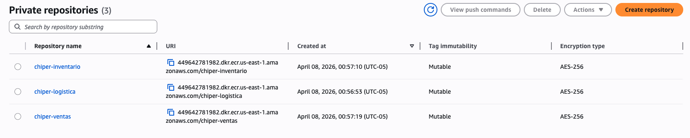
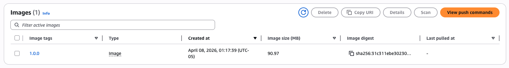

# Warm-up en clase — Lab 4: Pruebas de Carga en AWS para la Arquitectura de Microservicios

## Contexto

Cheapest pasa de monolito a 3 microservicios (Logística, Inventario, Ventas). Los cambios están en la rama `microservicios` del repositorio `Cheapest-api`. Antes de crear nada en ECS, hay que publicar la imagen Docker de cada servicio en su propio repositorio ECR.

## Tarea 

### Publicar imágenes en ECR

Debe crear un repositorio por servicio.

| Servicio   | Nombre sugerido del repositorio | Nombre de la imagen | Tag imagen |
| ---------- | --------------------------- | ---------- | ---------- |
| Logistica  | `cheapest-logistica`          | `logistica-service`          | `1.0.0`    |
| Inventario | `cheapest-inventario`         | `inventario-service`         | `1.0.0`    |
| Ventas     | `cheapest-ventas`             | `ventas-service`             | `1.0.0`    |

Para cada servicio debe: construir una imagen, etiquetar con el URI del repositorio y publicar en ECR.

Tutorial de apoyo:
- [Subir imágenes Docker a Amazon ECR](../tutoriales/subir_imagenes%20_a_ecr.md)

Al final tendrá que ver algo así:

Y dentro de cada repositorio

## Cierre de la sesión

Al terminar, cada equipo debe tener los 3 repositorios ECR creados con su imagen publicada (verificado con las capturas de arriba). Esto es exactamente la sección 4.1 del laboratorio — no hay que rehacerlo después, se sigue directamente con RDS, ECS y API Gateway.
