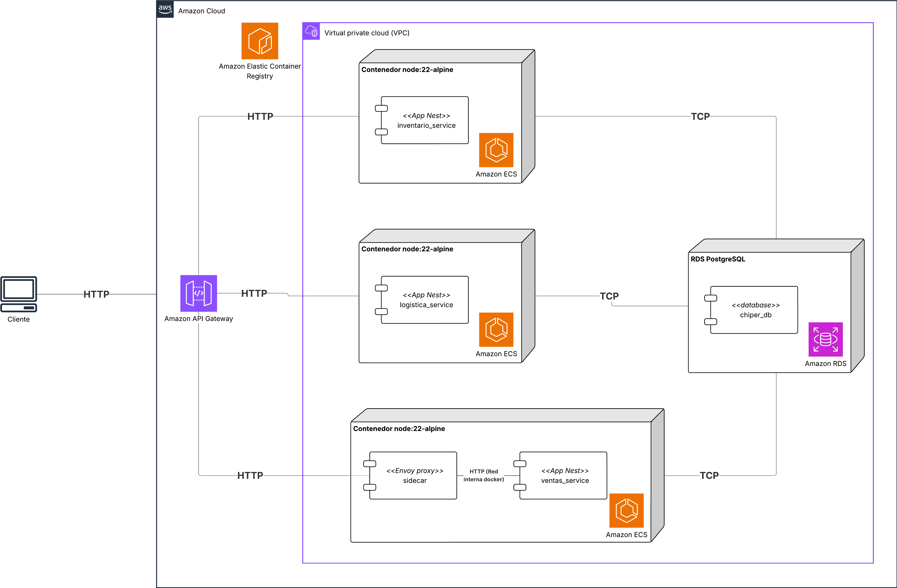
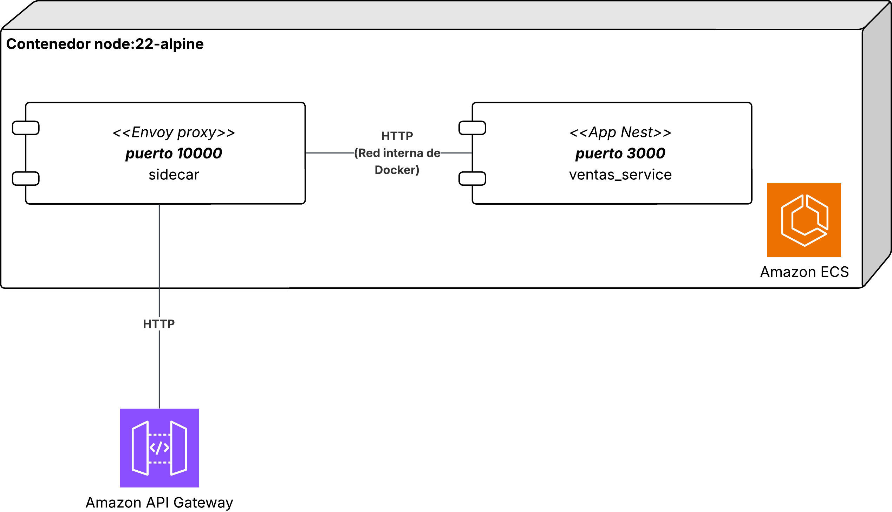
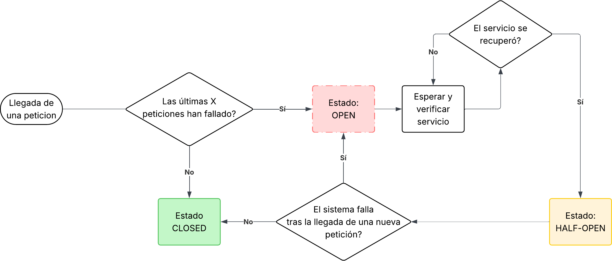

# Lab 5 — Disponibilidad en Microservicios: Circuit Breaker, Retry y Rate Limiting

## Etapas del laboratorio

| Etapa                                      | Resumen                                                                                                          | Uso de IA generativa                                                                                      |
| ------------------------------------------ | ---------------------------------------------------------------------------------------------------------------- | --------------------------------------------------------------------------------------------------------- |
| 1. Contexto del experimento de resiliencia | Modelado del escenario de retry storm y definicion de ASRs de resiliencia para Chiper.                           | Uso acotado para comprender patrones de falla; el criterio de negocio debe ser propio.                    |
| 2. Arquitectura y tacticas                 | Analisis de microservicios, patrón sidecar, graceful degradation, circuit breaker y control de recursos.         | Recomendado para comparar parametros y riesgos de configuracion.                                          |
| 3. Preparacion de infraestructura con IaC  | Despliegue reproducible en AWS mediante CloudFormation y verificacion del stack.                                  | Recomendado para asistir en comandos y troubleshooting de despliegue.                                     |
| 4. Configuración del sidecar de resiliencia | Implementacion de falla controlada en Inventario y configuración del proxy Envoy en Ventas.                     | Recomendado para soporte de implementacion, revision de parametros y pruebas; validar manualmente resultados. |
| 5. Ejecucion de experimentos y analisis    | Comparacion de baseline vs tacticas y evaluacion de impacto en ASRs.                                            | No recomendado para redactar conclusiones sin evidencia empirica del laboratorio.                         |

## Objetivos

- Reproducir experimentalmente un fallo en cascada (cascading failure) provocado por un retry storm, tal como ocurre en sistemas en producción reales.
- Implementar tres tácticas de resiliencia a nivel de infraestructura: retry con backoff exponencial, circuit breaker con graceful degradation, y rate limiting.
- Desplegar la infraestructura del laboratorio usando Infraestructura como Código (IaaC) con AWS CloudFormation.
- Evaluar el impacto de cada táctica sobre los ASRs del negocio de Chiper mediante pruebas de carga.
- Reflexionar sobre las limitaciones de las tácticas locales frente a enfoques de resiliencia distribuida centralizada.

## Índice

- [1. Experimento](#1-experimento)
- [2. Arquitectura](#2-arquitectura)
- [3. Tecnologías](#3-tecnologías)
- [4. Preparación: IaaC con CloudFormation](#4-preparación-iaac-con-cloudformation)
- [5. Configuración del sidecar y ajuste de código](#5-configuración-del-sidecar-y-ajuste-de-código)
- [6. Parte 1 — Reproducir el fallo en cascada](#6-parte-1--reproducir-el-fallo-en-cascada)
- [7. Parte 2 — Aplicar tácticas de resiliencia](#7-parte-2--aplicar-tácticas-de-resiliencia)
- [8. Interpretación de resultados](#8-interpretación-de-resultados)
- [9. Entregables](#9-entregables)

## 1. Experimento

### 1.1 Descripción

| Elemento             | Detalle                                                                                                                                                                 |
| -------------------- | ----------------------------------------------------------------------------------------------------------------------------------------------------------------------- |
| Título               | Resiliencia bajo fallo del servicio de Inventario en la arquitectura de microservicios de Chiper                                                                        |
| Propósito            | Reproducir un cascading failure provocado por un retry storm y mitigarlo con circuit breaker, retry con backoff y rate limiting, implementados vía sidecar Envoy        |
| Resultados esperados | Con las tácticas aplicadas, el servicio de Ventas mantiene disponibilidad y responde con graceful degradation en lugar de errores 500, incluso con Inventario degradado |
| Infraestructura      | CloudFormation + API Gateway + ECS/Fargate + ECR + RDS + computador personal para JMeter                                                                                |

### 1.2 Contexto de negocio

Los lunes por la mañana, los tenderos de Chiper realizan sus reabastecimientos semanales. En estos picos, el servicio de **Inventario**, que valida disponibilidad de stock antes de confirmar un pedido, recibe una carga muy superior a la normal. Sin protecciones, el servicio de **Ventas** (que depende de Inventario) empieza a fallar en cadena: los tenderos no pueden confirmar pedidos, las apps móviles reintentán automáticamente, y ese volumen de reintentos amplifica la carga sobre un servicio ya degradado. El resultado: un sistema que se colapsa a sí mismo.

Este escenario es conocido en la industria como **retry storm** y es uno de los patrones de fallo descritos en el artículo [Failure Mitigation for Microservices: An Intro to Aperture](https://careersatdoordash.com/blog/failure-mitigation-for-microservices-an-intro-to-aperture/) de DoorDash.

> [!IMPORTANT]
> **Pregunta 1:**
> En Chiper, ¿qué decisión de producto y operación debería tomarse primero cuando aparece un retry storm: proteger disponibilidad percibida (respuestas degradadas) o proteger consistencia estricta (rechazar operaciones)?
> Argumente su respuesta considerando impacto en tenderos, riesgo financiero y costo de reconciliación posterior.
> Acompañe la respuesta con un diagrama de decisión (árbol o flujo) que muestre criterios y consecuencias por camino.

Un aspecto crítico de este escenario, y que este lab reproduce explícitamente, es que el fallo es **transitorio**: los sistemas de orquestación modernos como ECS detectan tareas poco saludables mediante health checks y las reinician automáticamente. En la práctica, un servicio degradado por un pico de memoria, un pool de conexiones agotado o un spike de CPU puede recuperarse por sí solo en cuestión de segundos o minutos. El servicio de Inventario en este laboratorio simula exactamente eso: se degrada al arrancar y se recupera automáticamente tras `RECOVERY_TIME_MS` milisegundos. Esto hace que el estado **HALF-OPEN** del circuit breaker no sea solo teórico: cuando Inventario se recupera, el circuit breaker lo detecta y vuelve al estado CLOSED, restaurando el flujo normal sin intervención humana.

### 1.3 ASRs involucrados

| ID    | Descripción                                                                                                                                                                                           | Medidas de respuesta a satisfacer                                                                                                                            |
| ----- | ----------------------------------------------------------------------------------------------------------------------------------------------------------------------------------------------------- | ----------------------------------------------------------------------------------------------------------------------------------------------- |
| ASR-1 | Como tendero, quiero poder confirmar un pedido incluso cuando el servicio de Inventario esté degradado. Un pedido con stock no confirmado es preferible a un error que me impida completar la compra. | Durante fallo total de Inventario, Ventas responde HTTP 200 con `status: pending_stock_confirmation` en p99 < 3000 ms                           |
| ASR-2 | Como negocio, quiero que los reintentos automáticos ante fallos no amplifiquen la carga sobre servicios ya degradados, para evitar empeorar el incidente.                                             | El volumen de requests recibidos por Inventario con reintentos activos no debe superar 2x el volumen de la línea base sin reintentos            |
| ASR-3 | Como negocio, quiero que el tráfico de confirmación de pedidos no se vea afectado por picos de tráfico de baja prioridad (ej. consultas de catálogo masivas).                                         | El rate limiter rechaza el tráfico excedente con HTTP 429 sin que el throughput de pedidos válidos caiga más de un 10% respecto a la línea base |

### 1.4 Qué se va a probar

Se realizan cuatro rondas de pruebas de carga con JMeter sobre `POST /ventas` con Inventario en estado de fallo controlado:

1. **Baseline (sin protecciones)**: el sidecar no está activo; Ventas llama directamente a Inventario sin timeout, retry ni circuit breaker.
2. **Con retry + backoff exponencial** (sidecar activado, solo política de retry): el proxy Envoy reintenta automáticamente ante errores 5xx.
3. **Con circuit breaker + graceful degradation** (sidecar con outlier detection): Envoy abre el circuito y Ventas retorna `pending_stock_confirmation`.
4. **Con las tres tácticas combinadas** (retry + circuit breaker en sidecar + rate limiting en API Gateway).

> [!IMPORTANT]
> **Pregunta 2:**
> Si fuera el líder encargado de ejecutar este plan en Chiper seguiría este orden teniendo en cuenta el riesgo de estos cambios? Describa un plan de migración que mitigue los riesgos asociados.
> Incluya un diagrama de fases (timeline) con hitos, riesgo principal por fase y criterio de salida.

## 2. Arquitectura

### 2.1 Diagrama de despliegue



Note que el el sidecar se despliega como un contenedor adicional dentro de la misma tarea ECS que Ventas, y el tráfico entre Ventas e Inventario pasa a través del proxy Envoy. Esto permite implementar las tácticas de resiliencia sin modificar el código de negocio de Ventas, y ajustar los parámetros de retry y circuit breaker sin necesidad de redesplegar la aplicación.

### 2.2 Estilos de arquitectura asociados

| Estilo | Análisis |
| --- | --- |
| Microservicios | Favorece aislamiento de fallos por servicio y despliegue independiente.<br>Sin tácticas de resiliencia, la comunicación HTTP entre servicios introduce puntos de fallo en cadena. |
| API Gateway | Actúa como punto de control centralizado para rate limiting y throttling.<br>Protege los servicios upstream de picos de tráfico que superan su capacidad. |
| Fallar con gracia (Graceful Degradation) | Favorece continuidad operativa durante incidentes: el sistema entrega respuestas útiles aunque parciales en lugar de fallar completamente.<br>Requiere acuerdos de negocio claros sobre qué funcionalidades pueden degradarse sin romper la experiencia crítica del tendero. |
| Control de recursos (Resource Control) | Favorece estabilidad bajo carga al limitar concurrencia, throughput y consumo por cliente/ruta (throttling, cuotas, aislamiento).<br>Sin una buena calibración, puede rechazar tráfico legítimo y afectar temporalmente la percepción de disponibilidad. |
| Sidecar | Externaliza responsabilidades transversales (resiliencia, observabilidad, seguridad) a un proceso proxy que corre junto al servicio principal.<br>Permite aplicar y cambiar políticas de resiliencia sin modificar el código de negocio ni redesplegar la aplicación. |

### 2.3 Tácticas

| Táctica                                     | Análisis                                                                                                                                                                                                                                                         |
| ------------------------------------------- | ---------------------------------------------------------------------------------------------------------------------------------------------------------------------------------------------------------------------------------------------------------------- |
| Reintentos con backoff exponencial + jitter | Favorece la recuperación automática ante fallos transitorios.<br>Sin backoff ni jitter, los reintentos sincronizados pueden amplificar la carga (thundering herd), agravando el incidente en lugar de resolverlo.                                                |
| Circuit Breaker (CLOSED / OPEN / HALF-OPEN) | Favorece disponibilidad del servicio cliente al dejar de enviar requests a un servicio que ya está fallando.<br>Desfavorece consistencia inmediata: el estado OPEN implica que algunas operaciones retornan respuestas degradadas en lugar de resultados reales. |
| Graceful Degradation (fallback)             | Favorece experiencia de usuario y disponibilidad percibida: el sistema sigue aceptando pedidos en modo degradado.<br>Introduce complejidad en la lógica de negocio para manejar el estado `pending_stock_confirmation`.                                          |
| Rate Limiting (API Gateway throttling)      | Favorece protección de servicios backend ante picos de tráfico y retry storms.<br>Puede afectar a usuarios legítimos si los límites no están bien calibrados para los patrones reales de la demanda.                                                             |
| Proxy sidecar (Envoy)                   | Permite implementar retry y circuit breaker en la capa de red, sin tocar el código de negocio.<br>El sidecar intercepta el tráfico saliente de Ventas hacia Inventario y aplica las políticas configuradas en su archivo YAML.<br>Introduce un salto de red adicional y requiere que los parámetros del sidecar sean coherentes con los timeouts de la aplicación. |

> [!IMPORTANT]
> **Pregunta 3:**
> Retry, circuit breaker y rate limiting pueden entrar en conflicto si se calibran mal.
> Proponga un conjunto coherente de parámetros iniciales para Chiper (timeouts, retries, umbral de apertura, reset timeout, rate y burst) y justifique cómo evitaría inestabilidad sistémica.
> Presente además una gráfica temporal esperada (latencia/error/requests a Inventario) antes y después de aplicar la calibración propuesta.

### 2.4 Patrones de disponibilidad

#### Sidecar

Un **sidecar** es un contenedor auxiliar que se despliega junto al contenedor principal dentro de la misma unidad de ejecución (tarea ECS en este caso). Comparte el namespace de red con el servicio principal, lo que le permite interceptar el tráfico sin que la aplicación lo sepa.



**¿Por qué sidecar en lugar de código?**

En este laboratorio las tácticas de disponibilidad se implementan en el sidecar y no dentro del servicio NestJS por tres razones:

1. **Separación de responsabilidades**: el código de negocio de Ventas no debería saber si el circuito está abierto o cerrado; eso es una política de infraestructura.
2. **Cambios sin redespliegue del servicio**: ajustar `num_retries` o `base_ejection_time` solo requiere actualizar la config del sidecar y reiniciarlo, sin tocar ni recompilar la aplicación.
3. **Consistencia cross-lenguaje**: si mañana Ventas se reescribe en Go o Python, el sidecar sigue funcionando igual, sin reimplementar la lógica de retry en cada SDK.

**Relación entre sidecar y graceful degradation**

El sidecar maneja la red (retry, circuit breaker). La graceful degradation —retornar `status: pending_stock_confirmation` en lugar de propagar el error— es una decisión de negocio que vive en el código de Ventas. El sidecar le comunica al servicio que Inventario está caído (mediante un 503 rápido en lugar de un timeout lento), y el servicio decide qué respuesta dar al cliente.

#### Circuit Breaker

Un **circuit breaker** es un control de fallos que corta el tráfico hacia un servicio cuando detecta errores persistentes. Evita que un servicio degradado reciba más carga y permite al cliente responder rápido con una salida controlada.

**Estados básicos**

- **CLOSED**: el circuito está cerrado y el tráfico fluye normalmente.
- **OPEN**: el circuito está abierto, el tráfico se corta inmediatamente y se devuelve un error o respuesta degradada.
- **HALF-OPEN**: tras un tiempo de espera, el circuito permite pasar algunos requests de prueba para verificar si el servicio se ha recuperado. Si esos requests tienen éxito, el circuito vuelve a CLOSED; si fallan, vuelve a OPEN.



**Cómo se ve en Chiper**

- Ventas llama a Inventario a traves del sidecar Envoy.
- Si Inventario empieza a fallar (timeouts o 5xx), Envoy cuenta los errores.
- Tras `consecutive_5xx`, abre el circuito (OPEN) y responde 503 inmediato.
- Ventas detecta el 503 y aplica graceful degradation.

**Por qué importa**

- Reduce el p99 de Ventas al evitar timeouts largos.
- Protege a Inventario de recibir mas trafico cuando ya esta degradado.
- Permite detectar la recuperacion automatica de Inventario (HALF-OPEN) sin intervencion humana.

**Riesgo si se calibra mal**

- Umbral demasiado bajo: el circuito abre con fallos transitorios y corta trafico legitimo.
- Umbral demasiado alto: tarda en abrir y el sistema sigue colapsando en cascada.

#### Retries (reintentos)

Los **reintentos** permiten recuperar solicitudes ante fallos transitorios (timeouts cortos, reinicios, errores 5xx momentaneos). Para evitar sincronizacion masiva, se usan **backoff exponencial + jitter**.

**Flujo tipico**

```
intento 1 -> falla
espera base_interval (+/- jitter)
intento 2 -> falla
espera min(2x, max_interval)
intento 3 -> exito o error final
```

**Cómo se ve en Chiper**

- Envoy reintenta automaticamente cuando Inventario responde 5xx.
- El timeout total de la ruta debe cubrir el tiempo de reintentos.
- El numero de reintentos debe respetar ASR-2: no puede duplicar en exceso el trafico hacia Inventario.

**Por qué importa**

- Mejora disponibilidad cuando el fallo es breve.
- Si el fallo es persistente, los retries solo amplifican carga y empeoran el incidente.

#### Graceful Degradation

La **graceful degradation** es una decision de negocio: el servicio devuelve una respuesta util aunque parcial cuando un componente critico no esta disponible. No evita la falla, pero protege la experiencia del usuario.

**Cómo se ve en Chiper**

- Si Inventario no responde, Ventas registra el pedido con `status: pending_stock_confirmation`.
- El tendero recibe confirmacion de pedido, pero la verificacion de stock queda diferida.

**Por qué importa**

- Mantiene la disponibilidad percibida (ASR-1) aun con Inventario degradado.
- Requiere reglas claras: que significa "pendiente", cuanto tiempo puede estarlo, y como se reconcilia.


### 2.5 Nueva dependencia: Ventas → Inventario

En este laboratorio se introduce explícitamente una dependencia HTTP entre servicios: **Ventas llama a Inventario** para verificar disponibilidad de stock antes de registrar una venta. Esta dependencia es el punto de fallo que se va a explorar. **Si Inventario se degrada, sin protecciones Ventas también falla.**

## 3. Tecnologías

| Categoría                          | Tecnologías                                        |
| ---------------------------------- | -------------------------------------------------- |
| Infraestructura como Código        | AWS CloudFormation                                 |
| Gateway de entrada + Rate Limiting | Amazon API Gateway (throttling por stage)          |
| Orquestación de contenedores       | Amazon ECS (Fargate)                               |
| Registro de imágenes               | Amazon ECR                                         |
| Base de datos relacional           | Amazon RDS (PostgreSQL)                            |
| Framework backend                  | NestJS                                             |
| Lenguaje                           | TypeScript                                         |
| ORM                                | TypeORM                                            |
| Proxy sidecar                       | Envoy Proxy                                       |
| Pruebas de carga                   | Apache JMeter                                      |

## 4. Preparación: IaaC con CloudFormation

### 4.1 ¿Qué es Infraestructura como Código?

En los labs anteriores, la infraestructura se creó paso a paso desde la consola de AWS: security groups, instancias EC2, RDS, ECS, API Gateway. Este enfoque manual tiene un problema: es propenso a errores, difícil de reproducir y no deja registro de qué se configuró exactamente.

**Infraestructura como Código (IaaC)** resuelve esto declarando la infraestructura en un archivo de texto (código), que puede versionarse, revisarse y ejecutarse de forma reproducible. **AWS CloudFormation** es el servicio nativo de AWS para esto: usted define un *template* YAML o JSON que describe los recursos, y CloudFormation se encarga de crearlos, actualizarlos o eliminarlos.

### 4.2 Template CloudFormation del laboratorio

Se provee el archivo `lab_5/recursos/cloudformation_template.yaml` con toda la infraestructura del laboratorio declarada. Lea el template antes de ejecutarlo: cada sección tiene comentarios que explican qué recurso crea y por qué.

El template incluye:

| Sección            | Recursos creados                                                              |
| ------------------ | ----------------------------------------------------------------------------- |
| `Parameters`       | ARNs de imágenes ECR, credenciales RDS, VPC/subnets                           |
| `VPC y Networking` | VPC, subnets públicas/privadas, Internet Gateway, Security Groups             |
| `RDS`              | Instancia PostgreSQL, subnet group, security group de base de datos           |
| `ECS Cluster`      | Cluster Fargate compartido, roles IAM de ejecución                            |
| `Task Definitions` | Una por servicio (Logistica, Inventario, Ventas) con variables de entorno     |
| `ECS Services`     | Un servicio ECS por Task Definition, conectado a su ALB                       |
| `Load Balancers`   | ALB por servicio con Target Groups y Health Checks                            |
| `API Gateway`      | HTTP API con rutas `/logistica/*`, `/inventario/*`, `/ventas/*` y stage `lab` |

### 4.3 Preparar parámetros

Antes de desplegar, publique las imágenes Docker en ECR y anote los URIs. En este laboratorio hay **cuatro imágenes**: las tres del monorepo más la del sidecar Envoy.

| Servicio          | Repositorio sugerido     | Tag     | Dockerfile                          |
| ----------------- | ------------------------ | ------- | ----------------------------------- |
| Logística         | `chiper-logistica`       | `2.0.0` | `apps/logistica/Dockerfile`         |
| Inventario        | `chiper-inventario`      | `2.0.0` | `apps/inventario/Dockerfile`        |
| Ventas            | `chiper-ventas`          | `2.0.0` | `apps/ventas/Dockerfile`            |
| Ventas sidecar    | `chiper-ventas-sidecar`  | `1.0.0` | `apps/ventas/sidecar/Dockerfile`    |

Tutorial de apoyo:
- [Subir imágenes Docker a Amazon ECR](../tutoriales/subir_imagenes%20_a_ecr.md)

> Use el tag `2.0.0` para distinguir las imágenes con las modificaciones de este lab de las del Lab 4. La rama de trabajo para este laboratorio es **`availability`**.
> Recuerde que debe construir el sidecar como una imagen Docker aparte, usando el Dockerfile en `apps/ventas/sidecar/`, y subirla a ECR también.

### 4.4 Desplegar el stack

```bash
aws cloudformation deploy  --template-file lab_5/recursos/cloudformation_template.yaml  --stack-name chiper-lab5  --parameter-overrides LogisticaImageUri=<URI_ECR_LOGISTICA>:2.0.0 InventarioImageUri=<URI_ECR_INVENTARIO>:2.0.0 VentasImageUri=<URI_ECR_VENTAS>:2.0.0  VentasSidecarImageUri=<URI_ECR_SIDECAR>:2.0.0 DBPassword=<SU_CONTRASEÑA>  --capabilities CAPABILITY_NAMED_IAM  --region us-east-1
```

Monitoree el progreso en la consola de AWS → CloudFormation → Stack `chiper-lab5` → pestaña **Events**.

### 4.5 Verificar el despliegue

Una vez el stack esté en estado `CREATE_COMPLETE`:

```bash
# Obtener la URL del API Gateway
aws cloudformation describe-stacks --stack-name chiper-lab5 --query "Stacks[0].Outputs[?OutputKey=='ApiGatewayUrl'].OutputValue" --output text
```

Desde su computador verifique que los tres servicios responden:

```
GET https://<API_ID>.execute-api.<REGION>.amazonaws.com/lab/logistica/health
GET https://<API_ID>.execute-api.<REGION>.amazonaws.com/lab/inventario/health
GET https://<API_ID>.execute-api.<REGION>.amazonaws.com/lab/ventas/health
```

Los tres deben retornar HTTP 200 antes de continuar.

## 5. Configuración del sidecar y ajuste de código

Las modificaciones de este laboratorio se dividen en tres partes:

1. La inyección de fallos en Inventario (ya implementada en el código base).
2. La **configuración del sidecar Envoy** en Ventas: aquí es donde usted define los parámetros de retry y circuit breaker.
3. Un ajuste mínimo en el servicio de Ventas para la graceful degradation.

### 5.1 Lógica de inyección de fallos con auto-recuperación en Inventario

El servicio de Inventario ya incorpora un mecanismo de fallo transitorio controlado por dos variables de entorno:

- `FAULT_DELAY_MS`: delay artificial en ms que se agrega a cada respuesta durante el período de fallo.
- `RECOVERY_TIME_MS`: tiempo en ms desde el arranque del proceso hasta que el servicio se recupera automáticamente.

Este código ya existe en `apps/inventario/src/fault.middleware.ts` y se aplica en el endpoint `GET /inventory/items/disponibilidad/:productoId` que Ventas consume. No es necesario modificarlo.

### 5.2 El sidecar Envoy: arquitectura y flujo

El directorio `apps/ventas/sidecar/` contiene tres archivos:

| Archivo            | Rol                                                                              |
| ------------------ | -------------------------------------------------------------------------------- |
| `Dockerfile`       | Imagen base `envoyproxy/envoy:v1.31` + `gettext-base` para la sustitución de variables |
| `entrypoint.sh`    | Al arrancar, sustituye `${INVENTARIO_UPSTREAM_HOST}` y `${INVENTARIO_UPSTREAM_PORT}` en el template y lanza Envoy |
| `envoy.yaml.tmpl`  | Configuración de Envoy con los parámetros de retry y circuit breaker — **usted debe completar los valores marcados con `???`** |


**Variables de entorno del sidecar:**

| Variable                   | docker-compose         | ECS (mismo task)          |
| -------------------------- | ---------------------- | ------------------------- |
| `INVENTARIO_UPSTREAM_HOST` | `inventario`           | `<ALB DNS de inventario>` |
| `INVENTARIO_UPSTREAM_PORT` | `3002`                 | `80`                      |

**Variable de entorno del contenedor ventas:**

| Variable              | Valor en ECS          | Por qué                                              |
| --------------------- | --------------------- | ---------------------------------------------------- |
| `INVENTARIO_BASE_URL` | `http://localhost:10000` | En ECS los containers del mismo task comparten la red; el sidecar escucha en ese puerto |
| `INVENTARIO_TIMEOUT_MS` | `9000`              | Debe ser mayor que el timeout total del sidecar para no abortar antes de que Envoy resuelva los reintentos |

### 5.3 Completar la configuración de Envoy

Abra `apps/ventas/sidecar/envoy.yaml.tmpl`. Encontrará seis parámetros marcados con `???` y un comentario `TODO` que explica el criterio de diseño de cada uno. Debe reemplazar cada `???` con el valor que usted considera correcto.

Los seis puntos a completar son:

| # | Parámetro Envoy          | Sección              | Qué controla                                                                 |
| - | ------------------------ | -------------------- | ---------------------------------------------------------------------------- |
| 1 | `timeout`                | `route`              | Tiempo máximo total que el sidecar espera por una respuesta (incluyendo todos los reintentos) |
| 2 | `num_retries`            | `retry_policy`       | Número máximo de reintentos ante errores 5xx                                 |
| 3 | `base_interval`          | `retry_back_off`     | Espera base entre reintentos (Envoy añade ±25% de jitter automáticamente)    |
| 4 | `max_interval`           | `retry_back_off`     | Espera máxima entre reintentos                                               |
| 5 | `consecutive_5xx`        | `outlier_detection`  | Errores 5xx consecutivos que abren el circuito (estado OPEN)                 |
| 6 | `base_ejection_time`     | `outlier_detection`  | Tiempo que el circuito permanece OPEN antes de intentar HALF-OPEN            |

**Restricciones de calibración** (úselas para justificar sus valores en la sección de análisis):

- `timeout` de la ruta ≥ `connect_timeout` × (1 + `num_retries`) + backoff acumulado; de lo contrario los reintentos son abortados por el propio sidecar.
- `num_retries` × factor de amplificación ≤ 2× tráfico baseline (ASR-2).
- `base_ejection_time` < `RECOVERY_TIME_MS` de Inventario, para que el estado HALF-OPEN pueda detectar la recuperación automática del servicio.

> [!IMPORTANT]
> **Pregunta 3:**
> Documente en su entregable los valores que eligió para cada `TODO`, la justificación cuantitativa de cada uno y cómo garantiza que no violan ASR-2.

**Verificar la configuración de Envoy localmente antes de subir a ECR:**

```bash
# Construir la imagen del sidecar
docker build -t chiper-ventas-sidecar:local apps/ventas/sidecar/

# Lanzar el sidecar apuntando a un inventario local (para verificar que el YAML es válido)
docker run --rm \
  -e INVENTARIO_UPSTREAM_HOST=host.docker.internal \
  -e INVENTARIO_UPSTREAM_PORT=3002 \
  -p 10000:10000 -p 9901:9901 \
  chiper-ventas-sidecar:local

# En otra terminal: verificar que Envoy está listo
curl http://localhost:9901/ready
```

Si el YAML tiene errores de sintaxis o valores inválidos (como `???` sin reemplazar), Envoy imprimirá el error y saldrá. Corrija antes de publicar la imagen.

### 5.4 Ajuste de código: graceful degradation en Ventas

El sidecar maneja la capa de red. La decisión de negocio —qué responder al cliente cuando Inventario está caído— debe estar en el código de Ventas.

Cuando el circuito está OPEN, el sidecar devuelve HTTP 503 a Ventas. El cliente HTTP (`InventarioDisponibilidadClient`) convierte ese 503 en una excepción `ServiceUnavailableException`. Sin manejo explícito, esa excepción se propaga y Ventas retorna 503 al tendero.

El único cambio de código necesario es en `libs/ventas/src/services/venta.service.ts`: capturar la excepción y retornar la respuesta degradada:

```typescript
// Agregar ServiceUnavailableException al import existente de @nestjs/common
import {
  BadRequestException,
  Injectable,
  NotFoundException,
  ServiceUnavailableException,   // ← nuevo
} from '@nestjs/common';

// Tipo de retorno del método create (agrega la unión con el tipo degradado)
async create(dto: CreateVentaDto): Promise<VentaResponseDto | PendingStockConfirmationDto> {
  // ...
  // Reemplazar la llamada directa a isDisponible por un bloque try/catch:
  try {
    const disponible = await this.inventarioClient.isDisponible(item.productoId);
    if (!disponible) {
      throw new BadRequestException(
        `Producto con id ${item.productoId} sin stock disponible`,
      );
    }
  } catch (error) {
    // El sidecar abrió el circuito o Inventario no está disponible:
    // registrar la venta en modo degradado en lugar de cascadear el fallo.
    if (error instanceof ServiceUnavailableException) {
      return {
        ...dto,
        status: 'pending_stock_confirmation',
        message:
          'Pedido registrado. La disponibilidad de stock será confirmada próximamente.',
      };
    }
    throw error;  // otros errores (BadRequest, Not Found) se propagan normalmente
  }
  // ...
}
```

> Este cambio ya está aplicado en la rama `availability`. Revise el archivo para entender la implementación completa antes de continuar.

### 5.5 Variables de entorno adicionales

Actualice las Task Definitions del template CloudFormation con las siguientes variables:

| Servicio          | Variable                   | Valor para pruebas                                                         |
| ----------------- | -------------------------- | -------------------------------------------------------------------------- |
| Inventario        | `FAULT_DELAY_MS`           | `0` (baseline) / `5000` (degradado: 5s de delay)                           |
| Inventario        | `RECOVERY_TIME_MS`         | `600000` (el servicio se recupera 10 minutos después de arrancar)          |
| Ventas            | `INVENTARIO_BASE_URL`      | `http://localhost:10000` (apunta al sidecar en ECS)                        |
| Ventas            | `INVENTARIO_TIMEOUT_MS`    | `9000`                                                                     |
| Ventas sidecar    | `INVENTARIO_UPSTREAM_HOST` | `<ALB DNS del servicio de Inventario>`                                     |
| Ventas sidecar    | `INVENTARIO_UPSTREAM_PORT` | `80`                                                                       |

> Configure `base_ejection_time` del sidecar en un valor inferior a `RECOVERY_TIME_MS` (600s) para que el estado HALF-OPEN pueda detectar la recuperación automática de Inventario.

## 6. Parte 1 — Reproducir el fallo en cascada

### 6.1 Configurar el fallo

1. En la consola de AWS → ECS → Task Definition `td-chiper-inventario`, cree una nueva revisión con:
   - `FAULT_DELAY_MS=5000`
   - `RECOVERY_TIME_MS=600000`
2. Actualice el servicio ECS de Inventario para que use la nueva revisión y espere que las tareas sean reemplazadas.
3. Asegúrese de que **el task de Ventas esté desplegado sin el sidecar** para este baseline: use la Task Definition con un solo container (ventas) y `INVENTARIO_BASE_URL` apuntando directamente al ALB de Inventario.

> Con esta configuración, Inventario arrancará degradado y responderá con 5s de delay. Pasados 10 minutos desde el arranque, se recuperará automáticamente. Anote el momento exacto de arranque de la tarea (visible en ECS → Tasks → Started at) para correlacionarlo con las métricas de JMeter.

### 6.2 Pruebas de carga

Ejecute JMeter con carga sobre `POST /ventas`. El endpoint de Ventas hace una llamada interna a Inventario, que ahora responde con 5 segundos de delay. Las metricas clave serán visibles desde Cloudwatch.

#### ¿Qué es CloudWatch y cómo ver métricas?

**Amazon CloudWatch** es el servicio de observabilidad de AWS para ver métricas (series de tiempo), logs y alarmas. En este lab lo usará principalmente para observar **cuántas requests llegan a Inventario** y **cuántos errores 5xx** se producen durante cada prueba.

**Abrir CloudWatch (consola AWS):**

1. Verifique la región: arriba a la derecha seleccione **us-east-1** (la misma región donde desplegó el stack).
2. En la consola de AWS use el buscador y abra **CloudWatch**.
3. En el menú izquierdo: **Metrics** → **All metrics**.

**Ver requests y errores hacia Inventario (vía ALB/Target Group):**

1. En **All metrics** seleccione el namespace **ApplicationELB**.
2. Abra **TargetGroup, LoadBalancer** (o similar). Si no lo ve, pruebe también **LoadBalancer**.
3. Identifique el *target group* de Inventario (normalmente incluye “inventario” en el nombre) y marque estas métricas:
  - `RequestCount` (tráfico total hacia el target group)
  - `HTTPCode_Target_5XX_Count` (errores 5xx generados por el servicio)
  - `TargetResponseTime` (latencia del target vista por el ALB; no reemplaza el p99 de JMeter, pero ayuda a correlacionar)
4. En el gráfico, ajuste:
  - **Time range** al intervalo exacto de su prueba JMeter
  - **Period** a 1 minuto (recomendado) para ver cambios con claridad
  - **Statistic**: `Sum` para `RequestCount` y `HTTPCode_Target_5XX_Count`

> Para estimar *requests/s* desde CloudWatch: si su `RequestCount` es por minuto (period=60s), entonces $\text{req/s} \approx \text{RequestCount}/60$.

| Test | Ramp-Up | Threads | Loops |
| --- | --- | --- | --- |
| Baja carga | 10s | 50 | 1 |
| Carga media | 20s | 200 | 1 |
| Operación normal | 50s | 500 | 1 |
| Alta carga | 75s | 1500 | N/A |

Registre para cada escenario: p99, error %, throughput total, y throughput recibido por Inventario (visible en CloudWatch).

### 6.3 Qué observar

- Latencia de Ventas: ¿cómo se propaga el delay de 5s de Inventario?
- Error % de Ventas: ¿empieza a devolver errores 500 o 503?
- Requests totales a Inventario: ¿aumentan con el tiempo?
- **Recuperación espontánea**: ¿qué sucede con la latencia de Ventas a los 600s del arranque de Inventario? ¿El sistema se recupera solo? ¿Cuánto tarda Ventas en notar que Inventario ya está bien?
- Punto de colapso: ¿a partir de cuántos threads el sistema deja de responder?

> Anote estos valores como Base. Son el punto de comparación para las tácticas. La recuperación espontánea en el baseline es el caso de control: sin circuit breaker, el sistema se recupera cuando Inventario se recupera, pero el tiempo de recuperación percibido por Ventas puede ser mayor de lo esperado.

## 7. Parte 2 — Aplicar tácticas de resiliencia

Aplique y pruebe cada táctica de forma incremental, usando la misma matriz de carga de la Parte 1 para comparabilidad. En todas las rondas excepto la primera, el task de Ventas incluye el sidecar Envoy.

### 7.1 Táctica 1 — Retry con backoff exponencial + jitter (sidecar)

Active el sidecar en la Task Definition de Ventas. Para esta ronda, configure el sidecar **solo con la política de retry** (deje `outlier_detection` comentado o con `enforcing_consecutive_5xx: 0`). Publique las imágenes `2.1.0` y actualice el servicio ECS.

El sidecar se activa en la Task Definition agregando el container `ventas-sidecar` junto a `ventas` y ajustando `INVENTARIO_BASE_URL=http://localhost:10000` en el container de ventas.

**Comportamiento esperado**: ante un fallo de Inventario, el sidecar reintenta automáticamente con el backoff que usted configuró, antes de devolver error a Ventas.

**Qué medir**:
- ¿El p99 de Ventas mejora respecto al baseline?
- ¿El volumen de requests a Inventario aumenta? ¿En qué factor? (verificar ASR-2 — no debe superar 2×)
- ¿El error % de Ventas mejora? Si Inventario falla consistentemente, el retry no resolverá el error, solo lo retrasará.
- Verifique los logs del sidecar en CloudWatch (grupo de logs del container `ventas-sidecar`): debe ver los reintentos con sus intervalos de backoff.

> **Observación clave**: el retry solo ayuda con fallos transitorios. Para fallos persistentes (como el delay de 5s que simulamos), el retry amplifica la carga sin mejorar la disponibilidad. Este es el problema que el circuit breaker resuelve.

### 7.2 Táctica 2 — Circuit Breaker con graceful degradation (sidecar + código)

Active la `outlier_detection` en el sidecar con los valores que definió en `envoy.yaml.tmpl`. Publique la imagen del sidecar `2.2.0` y actualice el servicio ECS.

**Comportamiento esperado**:
- Primeras llamadas: el circuito está **CLOSED**; las llamadas llegan a Inventario y fallan (delay 5s → timeout).
- Tras `consecutive_5xx` errores seguidos: el sidecar eyecta el host y el circuito pasa a **OPEN**.
- En estado OPEN: el sidecar rechaza las llamadas inmediatamente con 503. Ventas captura el 503 y retorna `status: pending_stock_confirmation` con HTTP 200 en p99 muy bajo.
- Tras `base_ejection_time` segundos: el sidecar intenta **HALF-OPEN** enviando una sola request de prueba a Inventario.
  - Si Inventario sigue degradado: la prueba falla → vuelve a OPEN.
  - **Si Inventario se recuperó** (después de los 600s): la prueba tiene éxito → el circuito vuelve a **CLOSED** y el flujo normal se restaura automáticamente.

Esta es la demostración clave del laboratorio: el circuit breaker no solo protege durante el fallo, sino que **detecta la recuperación** del servicio sin intervención humana.

**Cómo observar el estado del circuito en tiempo real:**

```bash
# Desde su máquina, con port-forward al puerto admin del sidecar (9901)
# o accediendo al endpoint de admin si está expuesto en la Task Definition
curl http://localhost:9901/clusters | grep -E "ejected|cx_active|rq_total"
```

El campo `outlier_detection.ejections_active` > 0 indica que el circuito está OPEN.

**Qué medir**:
- ¿El p99 de Ventas cae significativamente una vez el circuito está OPEN?
- ¿El error % de Ventas llega a 0% una vez que el circuito está abierto?
- ¿Cuántos requests llegan a Inventario en estado OPEN vs. estado CLOSED?
- **¿En qué momento exacto el circuito pasa a CLOSED tras la recuperación de Inventario?**
- Observe los logs de acceso del sidecar en CloudWatch para identificar las transiciones de estado.

### 7.3 Táctica 3 — Rate Limiting en API Gateway

Configure throttling en el stage `lab` del API Gateway para limitar el tráfico entrante.

**Configuración sugerida**:

| Parámetro | Valor | Justificación |
| --- | --- | --- |
| Rate (req/s) | 100 | Límite sostenido para operación normal de Chiper |
| Burst | 200 | Permite absorber picos breves sin rechazar pedidos legítimos |

Pasos en la consola de AWS:

1. API Gateway → seleccione `chiper-ms-api`.
2. Stage `lab` → **Default route throttling**.
3. Configure `Rate` y `Burst` con los valores de la tabla.
4. Haga clic en **Save**.

**Prueba**: ejecute una carga que supere el rate limit (ej. 300 req/s). Observe que API Gateway devuelve HTTP 429 para las requests que superan el límite. Las requests dentro del límite deben seguir respondiendo normalmente.

**Qué medir**:
- ¿Qué porcentaje de las requests recibe HTTP 429?
- ¿El throughput de las requests que pasan el límite se mantiene estable?
- ¿Cómo cambia el comportamiento de Inventario al estar protegido por el rate limit?

### 7.4 Combinación de las tres tácticas

Con las tres tácticas activas simultáneamente (sidecar completo + rate limiting en API Gateway), ejecute la misma matriz de carga. Esta es la configuración final del laboratorio.

> [!IMPORTANT]
> **Pregunta 4:**
> Si las tres tácticas cumplen ASRs en este laboratorio, ¿qué riesgo residual seguiría existiendo para una operación real de Chiper a mayor escala?
> Responda identificando al menos dos clases de fallos que estas tácticas no resuelven por sí solas y qué capacidad adicional haría falta.
> Incluya un diagrama de arquitectura objetivo (estado actual vs capacidades faltantes) para mostrar dónde se cerrarían esos riesgos residuales.

Complete la tabla comparativa (ver entregables).

## 8. Interpretación de resultados

Analice los resultados con enfoque en disponibilidad:

- p99 y error % de Ventas en cada ronda (baseline, táctica 1, táctica 2, tácticas combinadas).
- Requests recibidos por Inventario en cada ronda (CloudWatch: ECS invocation count o ALB request count).
- Transiciones de estado del circuit breaker correlacionadas con la carga (logs del sidecar en CloudWatch).
- Requests rechazadas por API Gateway (HTTP 429).

### 8.1 Umbrales por ASR

- **ASR-1**: Ventas responde HTTP 200 con `pending_stock_confirmation` en p99 < 3000 ms durante fallo de Inventario. Se verifica en la ronda con circuit breaker activo en el sidecar.
- **ASR-2**: Requests a Inventario con retry activo ≤ 2× los requests de la línea base. Se verifica comparando CloudWatch entre ronda baseline y ronda táctica 1.
- **ASR-3**: Con rate limiting activo, throughput de pedidos válidos cae < 10% respecto a la línea base dentro del límite. Se verifica en la ronda con rate limiting.

## 9. Entregables

### 9.1 Tabla comparativa de tácticas

Entregue una tabla con los resultados de las cuatro rondas:

| Ronda | p99 Ventas (ms) | Error % Ventas | Requests/s a Inventario | HTTP 429 % |
| --- | ---: | ---: | ---: | ---: |
| Baseline (sin sidecar, sin protecciones) | | | | N/A |
| Sidecar: retry + backoff | | | | N/A |
| Sidecar: circuit breaker + graceful degradation | | | | N/A |
| Sidecar completo + rate limiting API Gateway | | | | |

Incluya también una tabla por escenario de carga (misma estructura que labs anteriores):

| # threads | Ramp-up (s) | p99 (ms) | p95 (ms) | Throughput (req/s) | Error % |
| ---: | ---: | ---: | ---: | ---: | ---: |
| 50 | 10 | | | | |
| 200 | 20 | | | | |
| 500 | 50 | | | | |
| 1500 | 75 | | | | |

Presente una tabla por ronda de pruebas.

### 9.2 Evidencias

Adjunte capturas de:

- Stack CloudFormation en estado `CREATE_COMPLETE`.
- Task Definition de Ventas mostrando los **dos containers**: `ventas` y `ventas-sidecar`.
- Servicios ECS de los tres microservicios en estado RUNNING.
- API Gateway con throttling configurado devolviendo HTTP 429.
- `envoy.yaml.tmpl` con los valores completados por el equipo (los seis `TODO`).
- Logs de CloudWatch del container `ventas-sidecar` mostrando: reintentos (acceso log con múltiples líneas por request) y transiciones de estado del circuit breaker (`ejections_active`).
- Respuesta HTTP 200 con `status: pending_stock_confirmation` capturada en JMeter durante el fallo de Inventario.
- Summary Report de JMeter para la ronda baseline y la ronda con tácticas combinadas.

### 9.3 Evidencias y prompts

Adjunte:
- Prompts utilizados (si usó IA).
- Scripts adicionales de carga (si aplica).

### 9.4 Análisis breve

Incluya un análisis de 1 a 2 páginas que responda:

1. ¿Por qué el retry sin backoff ni jitter puede empeorar una situación de fallo? Relacione la respuesta con el ASR-2 y con el escenario de Chiper (tenderos reintentando pedidos en el pico del lunes).
2. ¿Qué diferencia operativa tiene para un tendero recibir un error 500 frente a `status: pending_stock_confirmation`? ¿Bajo qué condiciones la degradación es aceptable para el negocio?
3. ¿En qué momento el circuit breaker debería pasar a estado HALF-OPEN? ¿Qué riesgos hay en abrir demasiado pronto frente a demasiado tarde?
4. ¿Cómo se complementan retry y circuit breaker en el sidecar? ¿Pueden conflictuarse? Describa un escenario concreto donde usarlos juntos sin coordinación podría generar un problema.
5. ¿Por qué el rate limiting en API Gateway protege mejor ante un retry storm que el rate limiting implementado dentro del propio servicio?
6. En este laboratorio las tácticas de resiliencia se implementaron en un sidecar en lugar de en el código de negocio. ¿Qué ventajas concretas tuvo este enfoque? ¿En qué escenarios el sidecar no sería suficiente y se necesitaría lógica de resiliencia dentro de la aplicación?
7. Lea el artículo [Failure Mitigation for Microservices: An Intro to Aperture](https://careersatdoordash.com/blog/failure-mitigation-for-microservices-an-intro-to-aperture/) de DoorDash. ¿Qué problema específico resuelve Aperture que el sidecar Envoy de este lab no resuelve? ¿En qué punto del crecimiento de Chiper tendría sentido adoptar un enfoque centralizado como ese?
8. ¿Qué ventajas concretas tuvo desplegar con CloudFormation frente a la configuración manual del Lab 4? ¿En qué escenarios del negocio de Chiper (ej. expansión a México o Brasil, un incidente que requiera reconstruir el ambiente) sería esta capacidad crítica?

## Nota final (créditos AWS)

Cuando termine el laboratorio, elimine todos los recursos para evitar consumo innecesario de créditos:

```bash
aws cloudformation delete-stack --stack-name chiper-lab5 --region us-east-1
```

Verifique en la consola que el stack pase a estado `DELETE_COMPLETE` y que no queden recursos huérfanos (especialmente instancias RDS e imágenes en ECR).
