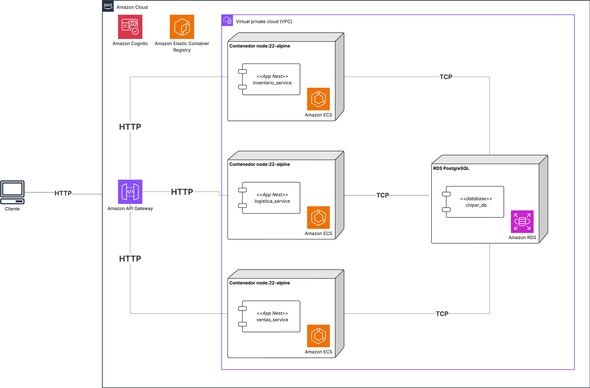

# Lab 6 — Aseguramiento de Microservicios con JWT: Secuestro de Token y Revocación Rápida

## Etapas del laboratorio

| Etapa | Resumen | Uso de IA generativa |
| --- | --- | --- |
| 1. Experimento y ASRs de seguridad | Definición del incidente (token theft) y criterios medibles de contención. | Uso acotado para ordenar hipótesis; los umbrales deben ser propios. |
| 2. Arquitectura y tácticas | JWT en el borde y en servicios, TTL corto y revocación en Cognito. | Recomendado para contrastar trade-offs (UX vs seguridad) y riesgos residuales. |
| 3. Preparación en AWS (IaC) | Despliegue reproducible con CloudFormation: microservicios + API Gateway + Cognito. | Recomendado para asistencia operativa; verifique manualmente en AWS. |
| 4. Implementación de seguridad (código) | Autenticación JWT y RBAC por rol en microservicios (Nest). | Recomendado para soporte de implementación y revisión; validar manualmente. |
| 5. Ejecución del incidente y contención | Simular robo de refresh token, revocar y medir ventana de exposición. | No recomendado para redactar conclusiones sin evidencia del experimento. |

## Objetivos

- Implementar autenticación basada en JWT en una arquitectura de microservicios de Chiper, usando Amazon Cognito como emisor.
- Mostrar el límite de JWT “stateless”: un access token comprometido no se puede invalidar instantáneamente sin chequeos stateful.
- Aplicar una táctica de contención práctica: access tokens de vida corta (2–5 min) + revocación de refresh token / global sign-out.
- Validar autorización por rol (RBAC) dentro de microservicios y diferenciar 401 vs 403.
- Medir y reportar la ventana máxima de exposición del incidente.

## Índice

- [1. Experimento](#1-experimento)
- [2. Arquitectura](#2-arquitectura)
- [3. Tecnologías](#3-tecnologías)
- [4. Preparación: IaaC con CloudFormation](#4-preparación-iaac-con-cloudformation)
- [5. Implementación mínima en microservicios](#5-implementación-mínima-en-microservicios)
- [6. Parte 1 — Incidente: secuestro de token](#6-parte-1--incidente-secuestro-de-token)
- [7. Parte 2 — Contención: revocación rápida](#7-parte-2--contención-revocación-rápida)
- [8. Entregables](#8-entregables)

## 1. Experimento

### 1.1 Descripción

| Elemento | Detalle |
| --- | --- |
| Título | Secuestro de credenciales/tokens y contención por revocación rápida en Chiper |
| Propósito | Minimizar el impacto de un refresh token comprometido, midiendo ventana de exposición y tiempo de contención |
| Resultados esperados | Tras revocar, el atacante no puede refrescar tokens; su acceso muere cuando expira el access token vigente |
| Infraestructura | CloudFormation + API Gateway (HTTP API) + Cognito + ECS/Fargate + computador personal (curl/Postman) |

### 1.2 Contexto de negocio

Chiper maneja información sensible y acciones de alto impacto (p. ej., pedidos, devoluciones y notas crédito). Un secuestro de credenciales (phishing, malware, filtración de tokens en herramientas) es un incidente realista que hace que el atacante no necesite romper el cifrado si no que le baste con obtener un token válido.

Para refrescar conceptos:

- **Access token**: credencial de corta vida que viaja en cada request (`Authorization: Bearer`). Debe incluir las claims necesarias (todo lo que sea necesario para identificar al usuario) y su verificación es local (firma, issuer, audience). Mientras no expire, un servicio que confia en su firma lo acepta.
- **Refresh token**: credencial de larga vida que **no** se usa para llamar APIs; solo sirve para pedir nuevos access tokens.
- **Flujo minimo**: login -> recibe access+refresh -> usa access para APIs -> cuando expira, usa refresh para obtener un access nuevo. Si revoca el refresh, se corta la re-emision pero el access actual sigue valido hasta expirar.

> [!WARNING]
> Recuerde que un token JWT **no es un token cifrado** solo **firmado**. Cualquiera que lo obtenga puede leer su contenido.

> [!IMPORTANT]
> **Pregunta 1:**
> Suponga que un atacante obtiene el refresh token de un usuario de Chiper.
> ¿Qué puede hacer el atacante con un refresh token válido aunque usted cambie la contraseña del usuario?
> Responda en términos de “capacidad” y “ventana de tiempo”, no en definiciones.

### 1.3 ASRs

| ID    | Descripción                                                                                                                                                                                                                                                                                                            |
| ----- | ---------------------------------------------------------------------------------------------------------------------------------------------------------------------------------------------------------------------------------------------------------------------------------------------------------------------- |
| ASR-1 | Como agente de servicio al usuario, dado que un token ha sido comprometido, quiero revocar rápidamente sesiones comprometidas para minimizar el impacto de un secuestro de credenciales. Esto debe suceder, desde detección, revocar y verificar contención en menos de 2 minutos                                      |
| ASR-2 | Como auditor, dado el sistema bajo prueba, quiero que los intentos de acceso indebido queden claramente diferenciados por tipo de falla para facilitar investigación y respuesta. Sin token: 401. Token válido sin grupo requerido: 403. Token inválido/tampered: 401 esto debe quedar registrado el 100% de las veces |


> [!IMPORTANT]
> **Pregunta 2:**
> Elija el tiempo de vida para access token y justifíquelo.
> Debe incluir: (1) ventana de exposición (tiempo que un token es válido), (2) impacto en la experiencia de usuario y operación, (3) impacto en costo/latencia, (4) justificación basada en el contexto de negocio de Chiper.

## 2. Arquitectura

### 2.1 Diagrama de componentes


Note que AWS Cognito es un servicio autogestionado y será el único cambio frente a la arquitectura del Lab 4.

### 2.2 Tácticas de seguridad aplicadas

| Táctica                                                | Qué resuelve                                                     |
| ------------------------------------------------------ | ---------------------------------------------------------------- |
| Autenticación en el borde (API Gateway JWT authorizer) | Rechaza requests sin token/inválidos antes de llegar a servicios |
| Validación JWT en microservicios                       | Defensa en profundidad ante bypass del gateway                   |
| RBAC por grupo (`cognito:groups`)                      | Evita que un usuario ejecute acciones administrativas            |
| TTL corto + revocación refresh/global sign-out         | Contención rápida del incidente                                  |

#### 2.2.1 Autenticación en el borde (API Gateway JWT authorizer)

**Qué hace**

- Rechaza requests **sin `Authorization: Bearer`** o con JWT inválido *antes* de enviar tráfico a ECS.
- Valida de forma “criptográfica” (firma) y “lógica” básica (issuer/audience/exp) usando el emisor (Cognito).
- Reduce carga y ruido operacional: evita que servicios paguen por requests claramente inválidas.

**Qué NO hace (riesgos residuales)**

- No invalida un access token robado “en caliente”: si el token es válido y no ha expirado, el gateway lo aceptará.
- No reemplaza la autorización fina dentro de servicios (p. ej. reglas de negocio por endpoint/rol/recurso).
- No cubre bypass internos (tráfico servicio a servicio, accesos directos al LB/servicio, errores de config o rutas sin authorizer).

**Trade-offs**

- Pro: caída temprana, menor latencia promedio para requests inválidas, menor costo/consumo en backend.
- Contra: riesgo de “falso sentido de seguridad” si los microservicios dejan de validar.

#### 2.2.2 Validación JWT en microservicios (defensa en profundidad)

**Por qué existe si ya hay gateway**

En microservicios, el gateway es un control potente pero no infalible. La validación en servicio cubre:

- Rutas expuestas accidentalmente sin authorizer.
- Acceso directo a servicios.
- Requests internos o integraciones futuras (servicio a servicio) donde el gateway no esté en el medio.

**Validaciones mínimas recomendadas qué validar**

- Firma contra el JWKS de Cognito.
- `iss` (issuer) y `aud` (audience) correctos.
- `exp` y tolerancia de reloj (clock skew) acotada.
- `token_use`: asegurarse de que se trata de **access token** (no ID token).

Esto soporta ASR-2: diferenciación consistente de fallas y registro.

#### 2.2.3 RBAC por grupo (`cognito:groups`)

**Qué hace**

- Restringe acciones por rol/grupo (p. ej. `admin`, `ops`, `tendero`) usando la claim `cognito:groups` presente en el access token.
- Permite que una misma API tenga endpoints públicos (health), autenticados (usuario) y privilegiados (admin) con reglas claras.

#### 2.2.4 TTL (Tiempo de vida) corto + revocación de refresh token / global sign-out (contención)

JWT es “stateless”: una vez emitido, un access token firmado seguirá siendo aceptado por verificadores hasta que expire. Por eso, para contener un incidente realista:

- Hacemos el access token **de vida corta** (reduce exposición).
- Cortamos la **capacidad de re-emisión** revocando el refresh token o ejecutando global sign-out (corta sesiones).

**Qué resuelve**

- Si un atacante roba un refresh token, puede emitir access tokens nuevos por mucho tiempo. La revocación corta ese canal.
- Si un atacante ya tiene un access token vigente, el daño queda acotado por el TTL (minutos, no horas).

**Trade-offs**

- TTL más corto: mejor contención, pero más renovaciones y más sensibilidad a fallos del flujo de refresh.
- TTL más largo: menos fricción, pero peor seguridad (más minutos de acceso tras robo).


> [!IMPORTANT]
> **Pregunta 3:**
> Si solo puede implementar una cosa por semana: (A) JWT authorizer en API Gateway o (B) validación JWT + RBAC en cada microservicio.
> ¿Cuál elige y por qué? Debe argumentar con superficie de ataque y radio de impacto.

## 3. Tecnologías

| Categoría | Tecnologías |
| --- | --- |
| Infraestructura como Código | AWS CloudFormation |
| Orquestación de contenedores | Amazon ECS (Fargate) |
| Gateway de entrada + autenticación | Amazon API Gateway (HTTP API) + JWT authorizer |
| Proveedor de identidad (IdP) / emisor de tokens | Amazon Cognito (User Pool, App Client) |
| Estándar de tokens | JWT (access token + refresh token) |

## 4. Preparación: IaaC con CloudFormation

Este lab incluye un template de CloudFormation basado en el Lab 4, extendido con Cognito y un JWT authorizer.

### 4.1 Desplegar el stack

Desde la carpeta `lab_6/recursos/`:

```bash
aws cloudformation deploy \
  --stack-name chiper-lab6-jwt \
  --template-file cloudformation_template.yaml \
  --capabilities CAPABILITY_NAMED_IAM \
  --parameter-overrides \
    LogisticaImageUri=<URI_ECR_LOGISTICA> \
    InventarioImageUri=<URI_ECR_INVENTARIO> \
    VentasImageUri=<URI_ECR_VENTAS> \
    DBPassword=<PASSWORD>
```

Al finalizar, guarde los **Outputs** del stack:

- `ApiGatewayUrl`
- `CognitoUserPoolId`
- `CognitoUserPoolClientId`
- `CognitoIssuerUrl`

### 4.2 Verificación rápida (health)

Los endpoints de health deben ser **públicos** para monitoreo:

- `GET <ApiGatewayUrl>/logistica/health`
- `GET <ApiGatewayUrl>/inventario/health`
- `GET <ApiGatewayUrl>/ventas/health`

## 5. Implementación mínima en microservicios

TODO


> [!IMPORTANT]
> **Pregunta 4:**
> ¿Por qué es peligroso devolver 403 cuando el token está ausente o es inválido?
> Relacione su respuesta con enumeración de endpoints y debugging operacional.

## 6. Parte 1 — Incidente: secuestro de token

Este ejercicio simula que un atacante obtiene un **refresh token** de un usuario.

Siga los comandos en `recursos/auth_cli.md` para:

1. Crear un usuario de prueba (o usar uno existente).
2. Hacer login y obtener `ACCESS_TOKEN` + `REFRESH_TOKEN`.
3. Probar un endpoint protegido con `ACCESS_TOKEN`.
4. Como “atacante”, usar `REFRESH_TOKEN` para emitir nuevos access tokens repetidamente.

Endpoint protegido para el experimento:

- `POST <ApiGatewayUrl>/ventas`

> [!IMPORTANT]
> **Pregunta 5:**
> Si el refresh token ya fue robado, ¿qué cambia (y qué NO cambia) si el usuario hace logout en el front-end?
> Responda con un diagrama de flujo simple del refresh.

## 7. Parte 2 — Contención: revocación rápida

Aplique contención desde Cognito:

- Opción A: Revocar el refresh token.


Verifique dos cosas:

1. El refresh token ya no permite emitir nuevos access tokens.
2. El access token que ya estaba emitido sigue funcionando **hasta expirar**.

Reporte:

- Hora de detección
- Hora de revocación
- Hora de verificación
- TTL configurado de access token
- Ventana máxima de exposición observada

## 8. Entregables

1. **Tabla de políticas** (mínimo 6 filas): endpoint, método, protegido/público, rol requerido, código esperado (200/401/403).
2. **Evidencia del incidente**:
   - Requests exitosas usando refresh token (antes de revocar).
   - Fallo del refresh tras revocar (error devuelto por Cognito).
   - Request fallida después de expirar el access token (401).
3. **Cálculo** de ventana máxima de exposición y justificación del TTL.
4. Respuestas a las preguntas 1–5.

> Nota: al terminar, elimine el stack para evitar costos:
>
> ```bash
> aws cloudformation delete-stack --stack-name chiper-lab6-jwt
> ```
