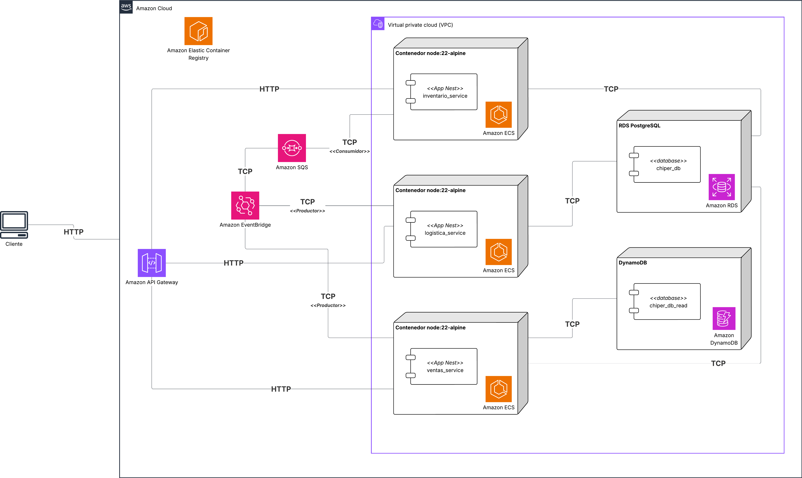
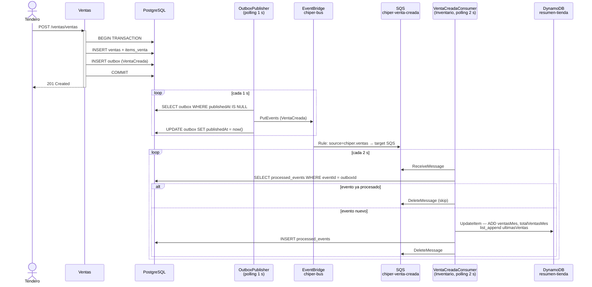
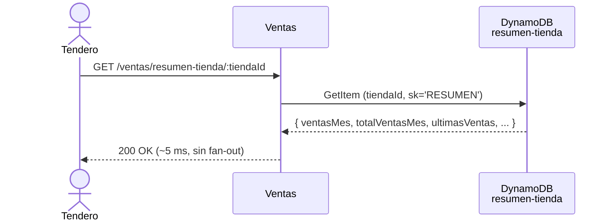
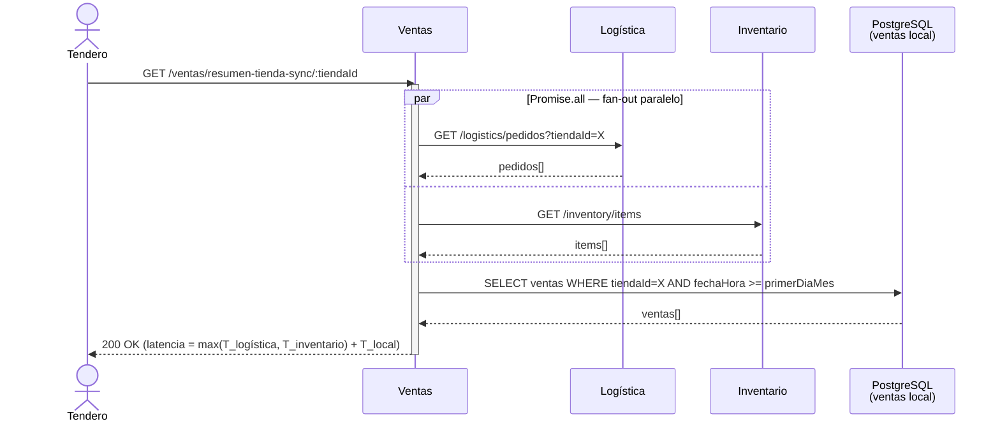
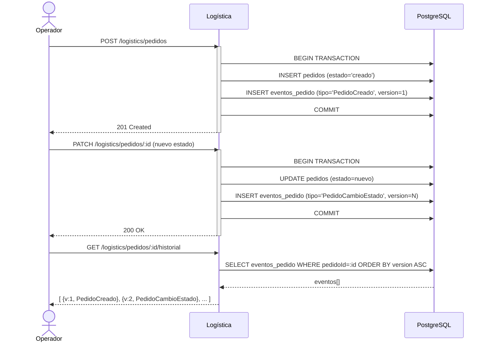

# Lab 8 - Microservicios Orientados a Eventos: CQRS, Event Sourcing y Patrones de Confiabilidad

## Etapas del laboratorio

| Etapa | Resumen | Uso de IA generativa |
| --- | --- | --- |
| 1. Experimento y ASRs | Contextualizar EDA como respuesta a las limitaciones del Lab 7 y definir criterios de éxito con los mismos ASRs. | Uso acotado para ordenar hipótesis; la justificación de la arquitectura debe ser propia. |
| 2. Arquitectura y conceptos | Análisis de EDA, CQRS, Event Sourcing, Outbox e idempotencia como conjunto coherente. | Recomendado para contrastar trade-offs de consistencia eventual vs. fuerte. |
| 3. Infraestructura (CloudFormation) | Despliegue de EventBridge, SQS, DynamoDB en AWS. | Recomendado para asistencia operativa; verifique manualmente en la consola. |
| 4. Parte 1 - Event Sourcing | Completar el event store de Pedidos y verificar el historial de transiciones. | Recomendado para soporte de implementación; validar comportamiento real. |
| 5. Parte 2 - Outbox + CQRS | Conectar el write model con el read model vía Outbox e idempotencia. | Recomendado para soporte; no sustituye la comprensión del flujo de eventos. |
| 6. Experimento comparativo | Medir EDA vs. síncrono bajo la misma matriz del Lab 7 y verificar ASRs. | No recomendado para generar conclusiones sin evidencia cuantitativa propia. |

## Objetivos

- Implementar una arquitectura orientada a eventos que satisfaga los mismos ASRs que el patrón síncrono del Lab 7 no pudo cumplir.
- Separar modelos de escritura (PostgreSQL) y lectura (DynamoDB) mediante CQRS, eliminando el fan-out en tiempo de consulta.
- Implementar Event Sourcing para el ciclo de vida de Pedidos, habilitando la re-proyección del estado a partir del log de eventos.
- Aplicar el patrón Outbox para garantizar entrega at-least-once de eventos, e idempotencia en el consumer para manejar duplicados.
- Comparar cuantitativamente la latencia EDA vs. síncrona y reflexionar sobre los trade-offs y limitaciones de EDA.

## Índice

- [1. Experimento](#1-experimento)
- [2. Arquitectura](#2-arquitectura)
- [3. Tecnologías](#3-tecnologías)
- [4. Preparación: IaaC con CloudFormation](#4-preparación-iaac-con-cloudformation)
- [5. Parte 1 - Event Sourcing: historial de Pedidos](#5-parte-1--event-sourcing-historial-de-pedidos)
- [6. Parte 2 - Outbox y CQRS Read Model](#6-parte-2--outbox-y-cqrs-read-model)
- [7. Experimento comparativo](#7-experimento-comparativo)
- [8. Entregables](#8-entregables)

---

## 1. Experimento

### 1.1 Descripción

| Elemento | Detalle |
| --- | --- |
| Título | EDA como solución al compounding de latencia: CQRS y Event Sourcing en Chiper |
| Propósito | Demostrar que los mismos ASRs que el endpoint síncrono del Lab 7 violó bajo carga se satisfacen con un read model pre-computado, y cuantificar los trade-offs de consistencia eventual que esto introduce |
| Resultados esperados | `GET /ventas/resumen-tienda/:tiendaId` (EDA) responde con p99 < 100 ms bajo cualquier nivel de carga; `GET /ventas/resumen-tienda-sync/:tiendaId` (síncrono) viola ASR-1 a alta carga por el fan-out; `POST /ventas/ventas` responde 201 aunque Inventario esté con desired count = 0 |
| Infraestructura | CloudFormation + ECS/Fargate + EventBridge + SQS + DynamoDB + RDS + computador personal para JMeter |

### 1.2 Contexto de negocio

En el Lab 7, el endpoint `GET /ventas/resumen-operativo` -que llama síncronamente a Logística e Inventario- violó ASR-1 (p99 < 2000 ms) a cargas donde los servicios individuales funcionaban correctamente. La causa estructural fue el **fan-out síncrono**: la latencia del orquestador es la suma de las latencias de sus dependientes, y bajo carga esa suma crece de forma no lineal. La Pregunta 3 del Lab 7 les pidió proponer una alternativa. Este laboratorio implementa esa alternativa.

Chiper tiene tres necesidades que la arquitectura síncrona no puede satisfacer simultáneamente:

**1. Resumen instantáneo bajo pico de demanda.** Los tenderos consultan su dashboard en quincena y fines de semana, exactamente cuando el sistema está más cargado. El endpoint del Lab 7 falló en ese momento. Con CQRS, el read model está pre-computado en DynamoDB: cada consulta es un `GetItem` de ~5 ms independientemente de la carga.

**2. Resiliencia en el registro de ventas.** Una venta debe poderse registrar aunque el servicio de Inventario esté en un depliegue parcial o saturado. Con EDA, `POST /ventas/ventas` escribe en PostgreSQL y en el Outbox; la respuesta llega en milisegundos sin esperar a Inventario. Los eventos se procesan cuando Inventario se recupera.

**3. Re-proyectabilidad del read model.** Si el consumer de Inventario tiene un bug que corrompe el read model de DynamoDB, ¿cómo se restaura? Solo es posible si los eventos están almacenados. El **event store** de Pedidos y el Outbox de Ventas son las fuentes de verdad que permiten reconstruir cualquier proyección en cualquier momento -incluyendo proyecciones futuras, como los modelos de demanda del equipo de forecasting de Chiper.

> [!IMPORTANT]
> **Pregunta 1:**
> Si el servicio de Inventario tarda 1500 ms en procesar el último evento `VentaCreada`, ¿cuánto tarda `GET /ventas/resumen-tienda/:tiendaId`?
> Distinga con precisión entre **latencia de consulta** (tiempo que experimenta el tendero) y **latencia de procesamiento del evento** (tiempo que tarda el consumer en actualizar el read model).
> ¿Qué cambió en la dependencia temporal entre el servicio de Ventas y el de Inventario respecto al Lab 7?

### 1.3 ASRs

Los ASRs son **idénticos a los del Lab 7**. El objetivo es demostrar que EDA los satisface donde el patrón síncrono falló.

| ID | Descripción | Métrica a satisfacer |
| --- | --- | --- |
| ASR-1 | Como tendero, quiero consultar el resumen operativo de mi tienda en un tiempo razonable para tomar decisiones de reabastecimiento. | p99 < 2000 ms durante operación normal (500 req/min) |
| ASR-2 | Como COO, quiero mantener una baja tasa de error incluso durante eventos de alta demanda para no perder operaciones de tenderos. | Error % ≤ 10% durante pico (5000 req/min) |
| ASR-3 | Como tendero, quiero que si uno de los servicios de Chiper está lento, mi consulta del resumen de tienda siga respondiendo sin fallar por completo. | Con Inventario en `desired count = 0`, error % de `GET /ventas/resumen-tienda/:tiendaId` = 0% |

Adicionalmente, EDA introduce una propiedad nueva que la arquitectura síncrona no podía ofrecer:

| ID | Descripción | Métrica |
| --- | --- | --- |
| ASR-EDA-4 | Como COO, quiero que el resumen de tienda refleje ventas recientes en un tiempo acotado para no tomar decisiones con datos muy obsoletos. | El campo `ultimaActualizacion` del read model refleja la última venta en < 10 s bajo carga normal |

> [!IMPORTANT]
> **Nótese la tensión entre ASR-1 y ASR-EDA-4.** ASR-1 exige latencia de consulta baja (servida por DynamoDB, independiente del procesamiento de eventos). ASR-EDA-4 exige que los datos sean recientes (depende de la velocidad del consumer). Son propiedades del sistema que viven en partes distintas del flujo y tienen trade-offs distintos.

### 1.4 Por qué EDA cambia el perfil de latencia

**Fan-out secuencial — Lab 7 `GET /ventas/resumen-operativo`:**

El Lab 7 llamaba a Logística e Inventario de forma secuencial, por lo que la latencia era la suma de ambas:

$$T_{\text{lab7}} \geq T_{\text{logistica}} + T_{\text{inventario}} + T_{\text{ventas\_local}} + 2\,\delta_{\text{red}}$$

**Fan-out paralelo — Lab 8 `GET /ventas/resumen-tienda-sync/:tiendaId`:**

`resumen-tienda-sync` hace las mismas llamadas pero en **paralelo** (`Promise.all`), el mejor caso posible para una arquitectura síncrona:

$$T_{\text{resumen\_sync}} \geq \max(T_{\text{logistica}},\; T_{\text{inventario}}) + T_{\text{ventas\_local}} + \delta_{\text{red}}$$

El paralelismo reduce la latencia nominal, pero **no elimina el problema estructural**: la respuesta sigue acotada por el servicio más lento. Bajo carga, cuando $\rho_i \to 1$ en cualquier dependiente, $T_i$ crece de forma no lineal (cola M/M/1) y el endpoint absorbe ese crecimiento aunque el otro servicio esté sano. Un servicio saturado contamina la latencia del endpoint completo, sin importar si las llamadas son secuenciales o paralelas.

Ambos patrones comparten la misma debilidad estructural: el **fan-out en tiempo de consulta** acopla temporalmente al orquestador con sus dependientes. EDA rompe ese acoplamiento moviendo el fan-out al tiempo de escritura, como se verá en el experimento de la Sección 7.

---

## 2. Arquitectura

### 2.1 Diagrama de componentes



### 2.2 Flujo de eventos

#### Write path — registro de una venta (Outbox + EDA)



#### Read path EDA — consulta del resumen



#### Read path síncrono — control del experimento



#### Event Sourcing — ciclo de vida de un Pedido



### 2.3 Estilos de arquitectura

#### Event-Driven Architecture (EDA)

En EDA los servicios se comunican publicando y consumiendo **eventos** a través de un broker, en lugar de llamarse directamente. El productor publica un evento y continúa; no sabe quién lo consumirá ni cuándo.

**Cómo se ve en Chiper**

Ventas publica `VentaCreada` en EventBridge cuando registra una venta. Inventario consume ese evento desde SQS cuando puede, a su propio ritmo. Los dos servicios nunca se llaman directamente en este flujo.

**Por qué importa**

- Elimina el acoplamiento temporal: Ventas responde al tendero sin esperar a Inventario.
- El write path (`POST /ventas/ventas`) no depende de la disponibilidad de Inventario: si Inventario está caído, los eventos se acumulan en SQS y se procesan cuando se recupera.
- El read path (`GET /ventas/resumen-tienda`) no genera ningún fan-out: solo lee DynamoDB.

**Riesgo**

- Introduce **consistencia eventual**: el read model puede estar algunos segundos detrás del write model. Si un tendero consulta el resumen inmediatamente después de registrar una venta, puede no verla reflejada todavía.
- Los errores en el consumer no son visibles al productor: un bug en Inventario puede corromper el read model silenciosamente durante horas (ver Pregunta 5).

**Cambios en el código**

Para soportar EDA se creó el módulo compartido `libs/shared/eventbridge/src/eventbridge.service.ts`. Es un wrapper sobre `@aws-sdk/client-eventbridge` que expone un método `publish()` tipado con la interfaz `ChiperEvent`:

```typescript
// libs/shared/eventbridge/src/chiper-event.interface.ts
export interface ChiperEvent {
  source: 'chiper.ventas' | 'chiper.logistica';
  detailType: 'VentaCreada' | 'PedidoCreado' | 'PedidoCambioEstado';
  detail: Record<string, unknown>;
}
```

`EventBridgeService` es consumido por `OutboxPublisherService` (no por los servicios de negocio directamente). Los servicios de negocio solo escriben en la tabla `outbox`; el publisher se encarga del resto.

Para consumir eventos desde SQS, `VentaCreadaConsumer` (en Inventario) usa `setInterval` + `ReceiveMessageCommand` directamente desde `@aws-sdk/client-sqs`, sin dependencia de frameworks externos:

```typescript
// libs/inventario/src/consumers/venta-creada.consumer.ts
onModuleInit() {
  setInterval(() => this.poll(), 2000); // polling cada 2 s
}
```

---

#### CQRS (Command Query Responsibility Segregation)

CQRS separa el modelo de **escritura** (commands) del modelo de **lectura** (queries) en estructuras de datos distintas, optimizadas para cada propósito. No son dos bases de datos obligatoriamente, pero sí dos modelos distintos.

**Cómo se ve en Chiper**

- **Write model**: PostgreSQL con tablas normalizadas (`ventas`, `items_venta`). Se optimiza para integridad transaccional.
- **Read model**: DynamoDB con un documento desnormalizado por tienda (`{ tiendaId, ventasMes, totalVentasMes, ultimasVentas }`). Se optimiza para lecturas rápidas con un solo `GetItem`.

La tabla de Ventas en PostgreSQL no se consulta cuando un tendero pide su resumen. Esa consulta va directamente a DynamoDB.

**Por qué importa**

- `GET /ventas/resumen-tienda/:tiendaId` responde en ~5 ms sin importar la carga del sistema, porque lee un documento ya pre-computado.
- El write model puede cambiar su esquema sin afectar el read model, y viceversa.
- El read model se puede reconstruir desde cero reproduciendo los eventos del Outbox (re-proyección).

**Riesgo**

- El read model puede quedar **inconsistente** si el consumer tiene un bug o se cae durante un período. No hay garantía de que ambos modelos estén sincronizados en todo momento.
- Tener dos modelos implica más superficie operativa: hay que monitorear que el consumer esté procesando y que el read model no esté desactualizado más allá del umbral de ASR-EDA-4.

**Cambios en el código**

Se agregaron dos módulos para el read model:

- `libs/shared/dynamo/src/dynamo.service.ts` — crea el `DynamoDBDocumentClient` de `@aws-sdk/lib-dynamodb` a partir de variables de entorno (`AWS_REGION`, `AWS_ENDPOINT_URL`). Se registra como provider en los módulos de Inventario y Ventas.
- `libs/ventas/src/services/resumen-tienda.service.ts` — nuevo servicio que ejecuta un `GetCommand` en DynamoDB con `{ tiendaId, sk: 'RESUMEN' }` y retorna el documento directamente:

```typescript
// libs/ventas/src/services/resumen-tienda.service.ts
async getResumen(tiendaId: string): Promise<ResumenTiendaDto | null> {
  const result = await this.dynamoService.client.send(
    new GetCommand({ TableName: this.tableName, Key: { tiendaId, sk: 'RESUMEN' } }),
  );
  return result.Item ? (result.Item as ResumenTiendaDto) : null;
}
```

El write model (PostgreSQL) no fue modificado. La tabla `ventas` y `items_venta` siguen siendo las mismas; lo único que cambió es que `VentaService.create()` ahora también escribe en la tabla `outbox` dentro de la misma transacción (ver patrón Outbox).

---

#### Event Sourcing

En Event Sourcing el **log de eventos** es la fuente de verdad, no el estado actual. El estado actual de una entidad se obtiene reproduciendo todos los eventos en orden. Los eventos son inmutables y se agregan de forma append-only.

**Cómo se ve en Chiper**

La tabla `eventos_pedido` registra cada transición de estado de un Pedido: `PedidoCreado`, `PedidoCambioEstado`. Cada evento tiene una versión monotónica. La tabla `pedidos` sigue existiendo como proyección del estado actual (cache), pero si se corrompe, puede reconstruirse reproduciendo los eventos.

**Por qué importa**

- Si el read model de DynamoDB se corrompe por un bug en el consumer, se puede reconstruir reproduciendo todos los eventos `VentaCreada` del Outbox desde el origen.
- Es posible crear **proyecciones nuevas** a partir del log histórico de eventos sin tocar producción: el equipo de forecasting de Chiper puede consumir todos los `VentaCreada` para entrenar modelos de demanda.
- El historial de transiciones de un Pedido (`GET /logistics/pedidos/:id/historial`) es una consulta directa al event store, no una reconstrucción desde logs de auditoría.

**Riesgo**

- La tabla de eventos **crece indefinidamente** (append-only). Sin una estrategia de archivado o snapshotting, la re-proyección completa desde el evento 1 se vuelve lenta con el tiempo.
- No toda anomalía se puede corregir con event replay: si el consumer ejecutó una acción externa irreversible (ej. envió un email o descontó stock en un sistema externo), el replay no deshace ese efecto (ver Pregunta 5).

**Cambios en el código**

Se agregó la entidad `EventoPedido` en `libs/logistica/src/repositories/entities/evento-pedido.entity.ts`:

```typescript
@Entity('eventos_pedido')
@Index(['pedidoId', 'version'])
export class EventoPedido {
  @PrimaryGeneratedColumn('uuid') id: string;
  @Column('uuid')                 pedidoId: string;
  @Column('varchar', { length: 100 }) tipo: string;  // 'PedidoCreado' | 'PedidoCambioEstado'
  @Column('jsonb')                payload: Record<string, unknown>;
  @Column('int')                  version: number;   // monotónico por pedidoId
  @Column('timestamp')            occurredAt: Date;
  @CreateDateColumn()             createdAt: Date;
}
```

`PedidoService` fue modificado para escribir en `eventos_pedido` dentro de la misma transacción del write de dominio. Los métodos `nextVersion()` y `appendEvent()` del repositorio son las **tareas 1.1 y 1.2** que los estudiantes deben completar — están marcados con `throw new Error('Not implemented')` en el código base.

Se agregó también el endpoint `GET /logistics/pedidos/:id/historial` en `pedido.controller.ts`, que delega a `EventoPedidoRepository.findByPedidoId()` (ya implementado).

---

### 2.4 Patrones de confiabilidad

#### Outbox

El patrón Outbox resuelve el problema de **publicar un evento de forma confiable cuando se produce un cambio en la base de datos**. Sin él, hay una brecha entre el `save()` en PostgreSQL y el `publish()` en EventBridge: si el proceso muere entre los dos, el evento se pierde aunque el dato esté guardado.

**Cómo se ve en Chiper**

Cuando `VentaService.create()` registra una venta, escribe en la tabla `ventas` **y** en la tabla `outbox` dentro de la **misma transacción PostgreSQL**. Si la transacción hace commit, el evento existe en `outbox`. Si hace rollback, tampoco existe el evento. `OutboxPublisherService` lee el outbox cada 1 s, publica en EventBridge y marca `publishedAt = now()`.

```
POST /ventas/ventas
  ├── INSERT ventas        ┐
  └── INSERT outbox        ┘  misma transacción → atomicidad garantizada

OutboxPublisherService (polling 1 s):
  SELECT * FROM outbox WHERE publishedAt IS NULL
  → PutEvents en EventBridge
  → UPDATE outbox SET publishedAt = now()
```

**Por qué importa**

- Garantiza que si el dato se guardó, el evento **se publicará eventualmente**: no puede haber una venta registrada sin su correspondiente `VentaCreada` en EventBridge.
- El productor no necesita que EventBridge esté disponible en el momento del write: la entrega se delega al publisher que reintenta de forma autónoma.

**Riesgo**

- Si el publisher publica exitosamente pero muere antes de marcar `publishedAt`, al reiniciar **publicará el mismo evento otra vez** (at-least-once, no exactly-once). Por eso el consumer necesita idempotencia.
- El polling cada 1 s introduce una latencia mínima entre el write y la publicación del evento, lo cual contribuye a la ventana de consistencia eventual de ASR-EDA-4.

**Cambios en el código**

Se creó la entidad compartida `libs/shared/outbox/src/outbox-entry.entity.ts`:

```typescript
@Entity('outbox')
export class OutboxEntry {
  @PrimaryGeneratedColumn('uuid') id: string;
  @Column('varchar') eventSource: string;   // 'chiper.ventas' | 'chiper.logistica'
  @Column('varchar') eventType: string;     // 'VentaCreada' | 'PedidoCreado' | ...
  @Column('uuid')    aggregateId: string;
  @Column('jsonb')   payload: Record<string, unknown>;
  @Column('timestamp', { nullable: true, default: null }) publishedAt: Date | null;
  @CreateDateColumn() createdAt: Date;
}
```

`VentaService.create()` y `PedidoService.create/update()` fueron modificados para escribir en `outbox` dentro de la transacción del write de dominio usando `dataSource.transaction()`:

```typescript
// libs/ventas/src/services/venta.service.ts (fragmento)
await this.dataSource.transaction(async (manager) => {
  const venta = await manager.save(Venta, ventaData);
  await manager.save(OutboxEntry, {
    eventSource: 'chiper.ventas',
    eventType: 'VentaCreada',
    aggregateId: venta.id,
    payload: { ventaId: venta.id, tiendaId: venta.tiendaId, total: venta.total, ... },
  });
});
```

`OutboxPublisherService` en `libs/shared/outbox/src/outbox-publisher.service.ts` es un servicio de background pre-construido que corre en todos los servicios que usan el módulo Outbox. Los estudiantes no lo implementan; solo necesitan entender su flujo para responder la Pregunta 2.

---

#### Idempotencia

La idempotencia garantiza que **procesar el mismo evento dos veces produce el mismo resultado que procesarlo una sola vez**. Es necesaria cuando el sistema de entrega es at-least-once (SQS + Outbox).

**Cómo se ve en Chiper**

`VentaCreadaConsumer` usa el `outboxId` del evento como clave de idempotencia. Antes de actualizar DynamoDB, consulta la tabla `processed_events`:

```
¿Existe processed_events WHERE eventId = outboxId?
  SÍ → skip (el evento ya fue procesado, no hacer nada)
  NO → updateResumenTienda() en DynamoDB
     → INSERT processed_events (eventId, eventType)
     → deleteMessage() de SQS
```

Se usa `outboxId` y no `ventaId` porque el mismo evento `VentaCreada` puede ser publicado dos veces por el Outbox (si el publisher murió entre publicar y marcar). Esos dos mensajes tienen el mismo `outboxId`, lo que permite detectar el duplicado.

**Por qué importa**

- Sin idempotencia, un duplicado de `VentaCreada` incrementaría `ventasMes` en 2 en lugar de 1 en DynamoDB, produciendo totales incorrectos en el resumen del tendero.
- La tabla `processed_events` actúa como un registro local de lo que ya fue procesado, sin necesidad de coordinar con el productor.

**Riesgo**

- Existe una ventana de vulnerabilidad entre `updateResumenTienda()` y el `INSERT processed_events`: si el proceso muere en ese instante, el siguiente intento actualizará DynamoDB dos veces (el primer intento ya actualizó pero no registró el evento como procesado). Mitigación: hacer el `INSERT processed_events` en la misma transacción que cualquier efecto en PostgreSQL, y diseñar las operaciones en DynamoDB para ser lo más idempotentes posible (ej. `SET` en vez de `ADD` donde aplique).
- La tabla `processed_events` crece con el tiempo. Requiere una política de retención (ej. eliminar eventos con más de 30 días).

**Cambios en el código**

Se creó la entidad `libs/inventario/src/repositories/entities/processed-event.entity.ts`:

```typescript
@Entity('processed_events')
export class ProcessedEvent {
  @PrimaryColumn('uuid') eventId: string;   // = outboxId del evento recibido
  @Column('varchar')     eventType: string;
  @CreateDateColumn()    processedAt: Date;
}
```

El flujo completo del consumer es la **Tarea 3.2** que los estudiantes implementan en `VentaCreadaConsumer.processMessage()`. El esqueleto ya existe con el check de idempotencia y la llamada a `updateResumenTienda()` — los estudiantes deben entender el orden y la razón de cada paso.

> [!IMPORTANT]
> **Pregunta 2:**
> El `OutboxPublisherService` lee entradas de la tabla `outbox` con `publishedAt IS NULL`, las publica en EventBridge y marca `publishedAt = now()`.
> Considere este escenario: el publisher publica exitosamente en EventBridge, pero el proceso muere antes de ejecutar `UPDATE outbox SET publishedAt = now()`. Al reiniciar, vuelve a leer la misma entrada y la publica nuevamente.
>
> ¿Qué garantía de entrega tiene el sistema con el patrón Outbox (at-most-once, at-least-once, o exactly-once)?
> ¿Qué escenario concreto de Chiper hace que at-most-once sea **inaceptable** para el evento `VentaCreada`? Piense en el impacto sobre el read model de DynamoDB.

---

## 3. Tecnologías

| Categoría | Tecnología |
| --- | --- |
| Event broker | AWS EventBridge (custom bus `chiper-bus`) |
| Cola de mensajes | Amazon SQS (estándar + DLQ) |
| Read model / CQRS | Amazon DynamoDB (on-demand, document store) |
| Write model / Event Store | PostgreSQL + TypeORM (sin cambios estructurales) |
| Infraestructura como Código | AWS CloudFormation |
| Orquestación de contenedores | Amazon ECS (Fargate) |
| Framework backend | NestJS + TypeScript |
| Pruebas de carga | Apache JMeter |

---

## 4. Preparación: IaaC con CloudFormation

### 4.1 Prerequisitos

Este lab parte del stack del **Lab 7** (ECS + RDS + API Gateway). Asegúrese de tener:
- Las imágenes de los tres servicios publicadas en ECR desde la rama `chiper-eda`
- El stack del Lab 7 desplegado (o el de Lab 4 como base)

Use el tag `4.0.0` para las imágenes de esta rama:

| Servicio | Repositorio ECR | Tag |
| --- | --- | --- |
| Logística | `chiper-logistica` | `4.0.0` |
| Inventario | `chiper-inventario` | `4.0.0` |
| Ventas | `chiper-ventas` | `4.0.0` |

### 4.2 Desplegar el stack

```bash
aws cloudformation deploy \
  --stack-name chiper-lab8-eda \
  --template-file laboratorios/lab_8/recursos/cloudformation_template.yaml \
  --capabilities CAPABILITY_NAMED_IAM \
  --parameter-overrides \
    LogisticaImageUri=<URI_ECR_LOGISTICA>:4.0.0 \
    InventarioImageUri=<URI_ECR_INVENTARIO>:4.0.0 \
    VentasImageUri=<URI_ECR_VENTAS>:4.0.0 \
    DBPassword=<PASSWORD>
```

Al finalizar, guarde los **Outputs** del stack:

| Output | Uso |
| --- | --- |
| `ApiGatewayUrl` | Base URL para las pruebas de carga |
| `EventBusBusName` | Nombre del bus de EventBridge |
| `VentaCreadaQueueUrl` | URL de la cola SQS para el consumer |
| `ResumenTiendaTableName` | Nombre de la tabla DynamoDB |

### 4.3 Variables de entorno por servicio

El template CloudFormation configura estas variables automáticamente en las Task Definitions de ECS:

| Variable | Servicio | Descripción |
| --- | --- | --- |
| `AWS_REGION` | todos | Región AWS |
| `EVENTBRIDGE_BUS_NAME` | logistica, ventas | Nombre del custom bus |
| `SQS_VENTA_CREADA_URL` | inventario | URL de la cola SQS |
| `DYNAMO_TABLE_RESUMEN` | inventario, ventas | Nombre de la tabla DynamoDB |

### 4.4 Verificación rápida

```bash
# Verificar que el endpoint síncrono (Lab 7) sigue funcionando
GET <ApiGatewayUrl>/ventas/resumen-operativo

# Verificar el nuevo endpoint EDA (debe retornar 404 si no hay ventas aún)
GET <ApiGatewayUrl>/ventas/resumen-tienda/<tiendaId>

# Verificar historial de pedidos (crear un pedido y avanzar estados primero)
GET <ApiGatewayUrl>/logistics/pedidos/<pedidoId>/historial
```

---

## 5. Parte 1 - Event Sourcing: historial de Pedidos

### 5.1 Concepto

En el modelo actual, la tabla `pedidos` tiene una columna `estado` que se **sobreescribe** con cada transición. Si un pedido pasa de `creado` a `aprobado`, el estado anterior desaparece. No hay forma de saber cuándo ocurrió cada transición, ni reconstruir el historial de un pedido para una auditoría.

**Event Sourcing** resuelve esto con un principio simple: en lugar de actualizar el estado, **agregar un evento** que describe lo que ocurrió. La tabla `eventos_pedido` es un append-only log:

```
pedidoId | tipo               | payload                        | version | occurredAt
─────────┼────────────────────┼────────────────────────────────┼─────────┼──────────────
abc-123  | PedidoCreado       | { estado: 'creado', ... }      | 1       | 2024-01-15T10:00
abc-123  | PedidoCambioEstado | { anterior: 'creado',          | 2       | 2024-01-15T10:05
         |                    |   nuevo: 'aprobado', ... }     |         |
abc-123  | PedidoCambioEstado | { anterior: 'aprobado',        | 3       | 2024-01-15T11:30
         |                    |   nuevo: 'enAlistamiento' }    |         |
```

La **versión monotónica** garantiza el orden de los eventos. Reproduciendo los eventos en orden, se puede reconstruir el estado del pedido en cualquier punto del tiempo.

**¿Por qué esto importa para Chiper?** Si el read model de DynamoDB tiene un error de cálculo (bug en el consumer), los eventos almacenados permiten **re-proyectar** el read model desde cero. Sin el event store, los eventos ya fueron procesados por EventBridge y no son recuperables.

### 5.2 Implementación

> El código vive en la rama `chiper-eda` del repositorio `chiper-api-microservices`.
> Las entidades `EventoPedido` y `OutboxEntry` ya están definidas. Los repositorios tienen métodos con `throw new Error('Not implemented')` que deben completarse.

#### Tarea 1.1 - Completar `EventoPedidoRepository`

Archivo: `libs/logistica/src/repositories/evento-pedido.repository.ts`

Implemente `nextVersion(pedidoId)` y `appendEvent(data)`:

```typescript
async nextVersion(pedidoId: string): Promise<number> {
  // Buscar el último evento del pedido ordenado por version DESC.
  // Si no existe ninguno, retornar 1.
  // Hint: this.repository.findOne({ where: { pedidoId }, order: { version: 'DESC' } })
}

async appendEvent(data: Omit<EventoPedido, 'id' | 'createdAt'>): Promise<EventoPedido> {
  // Crear y guardar el evento.
  // Hint: const entity = this.repository.create(data); return this.repository.save(entity);
}
```

#### Tarea 1.2 - Revisar `PedidoService.update()`

Archivo: `libs/logistica/src/services/pedido.service.ts`

El método `update()` ya tiene el esqueleto que llama a `eventoPedidoRepository.nextVersion(id)`. Verifique que:
1. La llamada a `appendEvent()` ocurre **dentro de la transacción** junto con el `UPDATE pedidos` y el `INSERT outbox`.
2. El evento `PedidoCambioEstado` incluye `estadoAnterior`, `estadoNuevo` y `version`.
3. Sólo se registra el evento si `dto.estado` es diferente al estado actual.

#### Tarea 1.3 - Verificar el endpoint de historial

El endpoint `GET /logistics/pedidos/:id/historial` ya está registrado en `PedidoController`. Verifique que `getHistorial()` en `PedidoService` retorna los eventos ordenados por `version ASC`.

#### Verificación de Event Sourcing

```bash
# 1. Crear un pedido
POST <ApiGatewayUrl>/logistics/pedidos
# Anotar el pedidoId

# 2. Avanzar el estado tres veces
PATCH <ApiGatewayUrl>/logistics/pedidos/<pedidoId>
{ "estado": "aprobado" }

PATCH <ApiGatewayUrl>/logistics/pedidos/<pedidoId>
{ "estado": "enAlistamiento" }

PATCH <ApiGatewayUrl>/logistics/pedidos/<pedidoId>
{ "estado": "alistado" }

# 3. Consultar el historial
GET <ApiGatewayUrl>/logistics/pedidos/<pedidoId>/historial
```

La respuesta debe mostrar **4 eventos** en orden: `PedidoCreado` (versión 1) + 3 `PedidoCambioEstado` (versiones 2, 3, 4).

---

## 6. Parte 2 - Outbox y CQRS Read Model

### 6.1 Concepto: el problema de at-most-once

En la versión más simple del patrón, el service haría:

```typescript
await this.ventaRepository.save(venta);           // DB commit
await this.eventBridgeService.publish(event);     // llamada a AWS
```

Si EventBridge falla entre estas dos líneas (error de red, throttle, outage parcial), la venta quedó registrada en PostgreSQL pero el evento nunca se publicó. El read model de DynamoDB nunca se actualizará. ASR-EDA-4 se viola indefinidamente.

**El patrón Outbox** resuelve esto con atomicidad local:

```typescript
// Una sola transacción PostgreSQL:
await this.dataSource.transaction(async (manager) => {
  await manager.save(Venta, ventaData);           // write de dominio
  await manager.save(OutboxEntry, outboxData);    // registro de intención
});
// Si la transacción commit, el evento está garantizado en el Outbox.
// El OutboxPublisherService lee el Outbox y publica a EventBridge de forma separada.
```

La garantía: **si el write de dominio ocurre, el evento se publicará eventualmente** (at-least-once, puede publicarse más de una vez si el publisher falla entre publicar y marcar `publishedAt`).

### 6.2 Concepto: idempotencia en el consumer

Dado que el Outbox garantiza at-least-once delivery, el consumer puede recibir el mismo evento más de una vez. Sin idempotencia:
- `VentaCreada` llega dos veces → `ventasMes` se incrementa dos veces → read model incorrecto.

La estrategia usada en este lab: **tabla de eventos procesados** en PostgreSQL.

```typescript
// Antes de procesar:
const alreadyProcessed = await processedEventRepo.findOne({ where: { eventId } });
if (alreadyProcessed) return; // skip

// Procesar + registrar (idealmente en la misma transacción):
await dynamoService.updateResumen(payload);
await processedEventRepo.save({ eventId, eventType: 'VentaCreada' });
```

> [!IMPORTANT]
> **Pregunta 3:**
> SQS entrega at-least-once. Con el patrón Outbox implementado, el evento `VentaCreada` puede llegar al consumer de Inventario más de una vez.
>
> **Sin idempotencia**, describa qué estado queda incorrecto en DynamoDB si el consumer procesa el mismo `VentaCreada` dos veces. Sea específico: ¿qué campos del documento se ven afectados y cómo?
>
> **Con la idempotencia implementada**, explique por qué usar `outboxId` (y no `ventaId`) como `eventId` para el check de idempotencia es la decisión correcta. ¿Qué escenario cubriría que `ventaId` no cubriría?

### 6.3 Implementación

#### Tarea 2.1 - Revisar el write transaccional en `VentaService`

Archivo: `libs/ventas/src/services/venta.service.ts`

El método `create()` ya escribe `Venta` y `OutboxEntry` en la misma transacción. Verifique:
1. El `payload` del `OutboxEntry` incluye todos los campos que el consumer de Inventario necesita (`ventaId`, `tiendaId`, `total`, `fechaHora`, `items`).
2. La transacción incluye tanto el `save(Venta)` como el `save(OutboxEntry)`.
3. Si la transacción falla, no queda ningún registro ni en `ventas` ni en `outbox`.

#### Tarea 2.2 - Revisar `OutboxPublisherService` (pre-construido)

Archivo: `libs/shared/outbox/src/outbox-publisher.service.ts`

Este servicio es pre-construido. Léalo y entienda:
1. ¿Cada cuánto tiempo hace el polling?
2. ¿Qué pasa si EventBridge falla al publicar un entry?
3. ¿Qué pasa si el proceso muere entre la publicación y el `UPDATE publishedAt`?

#### Tarea 3.1 - Revisar `updateResumenTienda()` en `VentaCreadaConsumer`

Archivo: `libs/inventario/src/consumers/venta-creada.consumer.ts`

El método `updateResumenTienda()` ya tiene la expresión DynamoDB completa. Verifique que los `ExpressionAttributeValues` son correctos:
- `:uno` → `1` (para el `ADD ventasMes`)
- `:total` → `Number(payload.total)` (para el `ADD totalVentasMes`)
- `:nuevaVenta` → array de un elemento con `{ ventaId, fechaHora, total }`

#### Tarea 3.2 - Revisar `processMessage()` con idempotencia

Archivo: `libs/inventario/src/consumers/venta-creada.consumer.ts`

El método `processMessage()` ya implementa el check de idempotencia. Analice el flujo completo y responda la Pregunta 3.

#### Tarea 3.3 - Revisar `ResumenTiendaService.getResumen()`

Archivo: `libs/ventas/src/services/resumen-tienda.service.ts`

El método `getResumen()` ya hace el `GetItem` de DynamoDB. Verifique que la clave `{ tiendaId, sk: 'RESUMEN' }` coincide con la clave que el consumer escribe en `updateResumenTienda()`.

#### Verificación del flujo completo

```bash
# 1. Crear al menos 5 ventas para una misma tiendaId
POST <ApiGatewayUrl>/ventas/ventas
{ "tiendaId": "<tiendaId>", ... }

# 2. Esperar ~5 segundos para que el Outbox publique y el consumer procese

# 3. Consultar el read model
GET <ApiGatewayUrl>/ventas/resumen-tienda/<tiendaId>

# Respuesta esperada:
{
  "tiendaId": "<tiendaId>",
  "ventasMes": 5,
  "totalVentasMes": <suma de totales>,
  "ultimasVentas": [...],
  "ultimaActualizacion": "<timestamp>"
}

# 4. Consultar la tabla outbox en PostgreSQL (opcional)
# Verificar que publishedAt no es NULL para los registros creados
SELECT id, event_type, published_at FROM outbox ORDER BY created_at DESC LIMIT 10;
```

---

## 7. Experimento comparativo

### 7.1 Setup

El experimento compara **dos endpoints que responden la misma pregunta** sobre la misma infraestructura AWS:

| Endpoint | Patrón | Variable que representa |
| --- | --- | --- |
| `GET /ventas/resumen-tienda-sync/:tiendaId` | Síncrono: fan-out a Logística + Inventario **en tiempo de consulta** | Control |
| `GET /ventas/resumen-tienda/:tiendaId` | EDA CQRS: lectura directa de DynamoDB, fan-out ocurrió en tiempo de escritura | Tratamiento |

Ambos endpoints responden la misma pregunta (resumen de una tienda), por lo que la única variable que cambia es **cuándo** ocurre el fan-out. Esto aisla el efecto arquitectónico que queremos medir: el costo del fan-out síncrono en tiempo de consulta.

> [!NOTE]
> El Lab 7 usaba `GET /ventas/resumen-operativo`, que respondía una pregunta diferente (resumen global, no por tienda). Usar ese endpoint como control confunde dos variables a la vez: la arquitectura EDA y la especificidad de la consulta. En este lab usamos un control nuevo -`resumen-tienda-sync`- que responde exactamente la misma pregunta que el endpoint EDA, eliminando el confusor.

**Prerequisito**: antes de ejecutar las pruebas, asegúrese de que el read model de DynamoDB tenga datos para la `tiendaId` que usará en el test. Cree al menos 20 ventas para esa tienda y espere que el consumer las procese (verificar `GET /ventas/resumen-tienda/:tiendaId` devuelve 200).

Configure dos Thread Groups en JMeter con la **misma `tiendaId`**, ejecutados simultáneamente:
- Thread Group 1: `GET /ventas/resumen-tienda-sync/<tiendaId>` (control síncrono)
- Thread Group 2: `GET /ventas/resumen-tienda/<tiendaId>` (tratamiento EDA)

### 7.2 Matriz de carga

Use la misma configuración de JMeter de los labs anteriores:

| Test | Ramp-Up | Threads | Loops | Carga aprox. (req/s) |
| --- | ---: | ---: | ---: | ---: |
| Smoke test | 5 s | 10 | 1 | 1 |
| Baja carga | 10 s | 40 | 1 | 3 |
| Carga media | 20 s | 200 | 1 | 5 |
| Operación normal | 50 s | 900 | 1 | 9 |
| Alta carga | 75 s | 3 000 | N/A | 20 |
| Estrés | 150 s | 12 000 | N/A | 50 |

> Ejecute al menos **6 repeticiones** para operación normal y estrés.

> [!IMPORTANT]
> **Pregunta 4:**
> Escale Inventario a `desired count = 0` en ECS (simula un deploy o una saturación total) y ejecute la Fase de **Alta carga**.
>
> 1. ¿Qué responde `POST /ventas/ventas`? ¿Qué responde `GET /ventas/resumen-tienda/:tiendaId` (EDA)? ¿Qué responde `GET /ventas/resumen-tienda-sync/:tiendaId` (síncrono)? ¿Qué pasa con los mensajes en la cola SQS mientras Inventario está caído?
> 2. Contraste los tres comportamientos: el write path EDA, el read path EDA y el read path síncrono ante la misma falla.
> 3. ¿Qué ASR satisface ahora que la **Fase 3 del Lab 7** violaba? ¿Qué nuevo riesgo introduce esta resiliencia (piense en el tamaño de la cola SQS acumulada y en la ventana de datos potencialmente obsoletos)?

### 7.3 Métricas a recolectar

Para cada nivel de carga, reporte en la Tabla A:

| Métrica | `resumen-tienda-sync` (síncrono) | `resumen-tienda` (EDA) |
| --- | --- | --- |
| p99 (ms) | | |
| p95 (ms) | | |
| Throughput (req/s) | | |
| Error % | | |

En CloudWatch, compare el `RequestCount` del Target Group de **Logística** e **Inventario** durante las pruebas de carga para el mismo período de tiempo:
- `resumen-tienda-sync` genera N requests a Logística + N requests a Inventario por cada N consultas (fan-out 1:2 observable en las métricas)
- `resumen-tienda` genera **cero** requests a Logística e Inventario en tiempo de consulta

Esta diferencia en los Target Groups de CloudWatch es la evidencia más directa de que el fan-out fue eliminado del read path.

### 7.4 Escenario de fallo - reflexión sobre limitaciones de EDA

> [!IMPORTANT]
> **Pregunta 5:**
> El equipo de Chiper despliega una nueva versión del consumer de Inventario con un bug: en lugar de `ADD ventasMes :uno`, usa `ADD ventasMes :dos` (incrementa en 2 en vez de 1). El bug pasa a producción durante 2 horas antes de ser detectado.
>
> Responda con precisión:
> 1. ¿Qué datos en **DynamoDB** son incorrectos? ¿Qué datos en **PostgreSQL** son correctos?
> 2. ¿Cómo se detectaría el bug? ¿Qué tipo de alerta o métrica lo habría surfaceado antes?
> 3. Para corregir DynamoDB, ¿qué información necesita? ¿Puede obtenerla del event store (`eventos_pedido`) o de la tabla `outbox` de Ventas? ¿Cómo sería el proceso de re-proyección?
> 4. ¿Existe algún estado que **no** pueda recuperarse automáticamente con event replay en este diseño? ¿Por qué?
> 5. ¿Qué limitación estructural de EDA revela este escenario comparado con un sistema síncrono tradicional donde Inventario actualiza su estado directamente en cada llamada?

---

## 8. Entregables

### 8.1 Tabla A - Comparación de latencia: síncrono (fan-out) vs. EDA (read model)

Ambos endpoints responden la misma consulta (`resumen-tienda/:tiendaId`); la única diferencia es la arquitectura.

| Nivel de carga | threads | p99 `resumen-tienda-sync` (ms) | p99 `resumen-tienda` EDA (ms) | Factor de mejora | Error % sync | Error % EDA |
| --- | ---: | ---: | ---: | ---: | ---: | ---: |
| Smoke test | 10 | | | | | |
| Baja carga | 40 | | | | | |
| Carga media | 200 | | | | | |
| Operación normal | 900 | | | | | |
| Alta carga | 3 000 | | | | | |
| Estrés | 12 000 | | | | | |

Marque en **rojo** las filas donde el endpoint síncrono viola ASR-1 (p99 > 2000 ms).
Marque en **verde** las filas donde el endpoint EDA satisface ASR-1 (p99 < 2000 ms).

Adicionalmente, reporte el `RequestCount` de CloudWatch de los Target Groups de Logística e Inventario durante el nivel de **Operación normal** para ambos Thread Groups. El endpoint sync debe mostrar ~900 requests a cada servicio downstream; el endpoint EDA debe mostrar 0.

### 8.2 Tabla B - Historial de eventos de un Pedido

Muestre la respuesta completa de `GET /logistics/pedidos/:id/historial` para un pedido que haya pasado por al menos **4 transiciones de estado**:

| version | tipo | estadoAnterior | estadoNuevo | occurredAt |
| ---: | --- | --- | --- | --- |
| 1 | PedidoCreado | - | creado | |
| 2 | PedidoCambioEstado | creado | aprobado | |
| 3 | PedidoCambioEstado | aprobado | enAlistamiento | |
| 4 | PedidoCambioEstado | enAlistamiento | alistado | |

### 8.3 Evidencias técnicas

Adjunte capturas de:

- Consola AWS → EventBridge: custom bus `chiper-bus` en estado `ACTIVE`.
- Consola AWS → SQS: cola `chiper-venta-creada` con el número de mensajes procesados y la DLQ.
- Consola AWS → DynamoDB: tabla `chiper-resumen-tienda` con al menos un ítem visible en la consola.
- `GET /ventas/resumen-tienda/:tiendaId` retornando el documento JSON completo.
- JMeter Summary Report para ambos Thread Groups en cada nivel de carga (capturas side-by-side: `resumen-tienda-sync` vs. `resumen-tienda`).
- CloudWatch → RequestCount del Target Group de **Logística** e **Inventario**: captura side-by-side durante el nivel de Operación normal para `resumen-tienda-sync` vs. `resumen-tienda`. Debe mostrar fan-out 1:2 en el sync y 0 requests en el EDA.
- ECS → Inventario con `desired count = 0` durante la prueba de resiliencia (Pregunta 4).
- ECS → Ventas respondiendo 201 a `POST /ventas/ventas` mientras Inventario está en desired count = 0.

### 8.4 Respuestas a las preguntas

Incluya las respuestas a las Preguntas 1–5 en el informe.

### 8.5 Análisis (2–3 páginas)

Responda:

1. ¿En qué nivel de carga el endpoint síncrono violó ASR-1? ¿El endpoint EDA llegó a violarlo? ¿Qué explica la diferencia estructural?
2. ¿El endpoint EDA satisface ASR-3 con Inventario en `desired count = 0`? ¿El endpoint síncrono lo satisfacía con Inventario en `desired count = 1`? Compare ambos resultados.
3. ¿Qué sacrificó Chiper al adoptar EDA para el resumen? Nombre dos escenarios de negocio concretos donde la **consistencia eventual** sería un problema real para Chiper.
4. ¿En qué punto el overhead operativo de EDA (EventBridge + SQS + DynamoDB + Outbox + idempotencia) deja de valer la pena? ¿Cuándo no recomendaría este patrón?
5. Responda la Pregunta 5 (escenario de fallo). ¿Qué limitación de EDA revela ese escenario y cómo se mitigaría en producción?

---

> **Nota:** Al terminar, elimine los recursos para evitar costos:
>
> ```bash
> aws cloudformation delete-stack --stack-name chiper-lab8-eda
> ```
