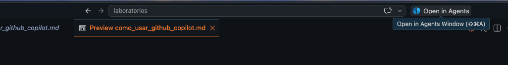
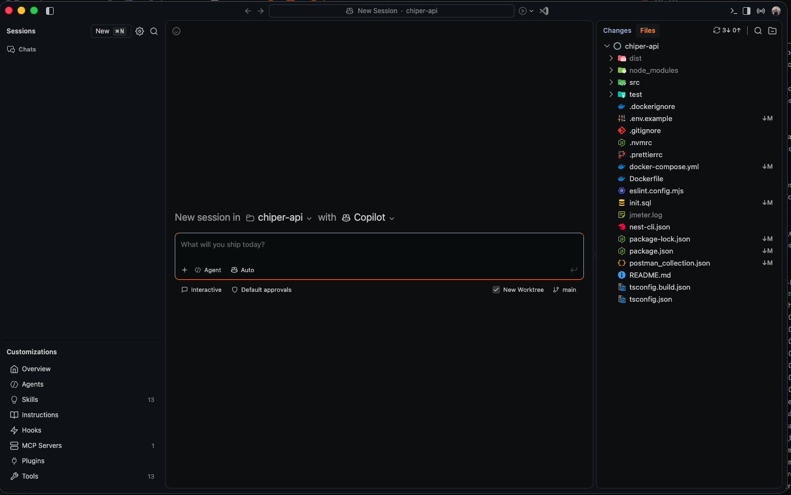
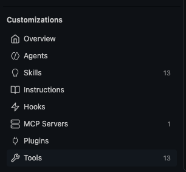

# Tutorial Github Copilot

GitHub Copilot es un asistente de programación integrado en Visual Studio Code. Puede ayudarte de varias formas: sugiriendo código mientras se escribe, respondiendo preguntas en el chat, planeando tareas antes de implementarlas y ejecutando flujos autónomos mediante agentes. En VS Code, estas capacidades aparecen distribuidas entre sugerencias inline, chat, selección de modelos y modos de trabajo como Ask, Plan y Agent.

##  1. Acceso a la configuración de Copilot

Como parte del [Github Students Developer Pack](https://education.github.com/pack), usted tiene acceso a copilot. Si todavía no ha solicitado acceso puedo hacerlos en el enlace.
Antes de solicitar los beneficios asegure que su cuenta de Github está asociada al correo Uniandes.

Una vez tenga acceso (**el proceso dura aproximadamente 72hrs**), sincronice su VSCode con su cuenta de **Github** (el que usó para inscribirse al students developer pack).

Siga los pasos para terminar de autenticar su cuenta de Github y sea redirigido nuevamente al editor

## 2. Panel de uso y sugerencias inline

Aquí se ve el panel de estado de Copilot en VS Code. Este panel muestra varias cosas importantes:

- **Copilot Pro Usage**: resumen del uso de tu plan.
- **Inline Suggestions**: sugerencias automáticas dentro del editor.
- **Chat messages**: uso de mensajes en el chat.
- **Premium requests**: consumo de solicitudes premium.

Desde este panel puede monitorear el uso de Copilot y ajustar cómo quieres recibir sugerencias. Las solicitudes premium tienen un límite mensual (aproximadamente 300 peticiones), por lo que debe medir su uso de el agente y debe decidir de forma inteligente que modelo usar, esto se explicará más adelante.
## 3. Vista de Chat

    
    

        
A su izquierda verá la pestaña <b>CHAT</b> y la sección <b>SESSIONS</b>.
        El chat de Copilot sirve para interactuar en lenguaje natural con el asistente. Aquí puede:
        

        <ul>
            <li>Pedir explicaciones de código</li>
            <li>Solicitar refactorizaciones</li>
            <li>Generar pruebas</li>
            <li>Consultar errores</li>
            <li>Pedir documentación</li>
            <li>Revisar decisiones de diseño</li>
        </ul>
    

 
La sección **Sessions** permite organizar conversaciones por tarea o contexto. En la práctica, cada sesión funciona como un hilo de trabajo separado que NO comparten el contexto.

## 5. Selección de modelos
Copilot ofrece varios modelos de lenguaje para diferentes propósitos. En la configuración, puedes elegir entre:
- **Auto:** Copilot selecciona el modelo más adecuado según la tarea. Su consumo será 10% más bajo pero no tendrá el control sobre el modelo
- **Modelos legacy:** Algunos modelos antiguos como GPT-4.1 o GPT-4o no consumen creditos premium (0x) pero tienen capacidades limitadas. Son útiles para tareas simples o cuando está cerca de su límite mensual.
- **Modelos ligeros:** Algunos modelos nuevos con capacidades reducidas como Haiku o los modelos mini de OpenAI consumen menos créditos (entre 0x y 0.33x) y son ideales para tareas que no requieren un entendimiento profundo, como generar código boilerplate, escribir comentarios o realizar refactorizaciones simples.
- **Modelos premium:** Modelos avanzados como GPT-5.3-Codex O Gemini 3.1 Pro ofrecen capacidades superiores para tareas complejas como diseño de arquitectura, generación de código avanzado o resolución de problemas difíciles. Sin embargo, su consumo es mayor (1x), por lo que se recomienda usarlos de forma estratégica.

## 6. Modos de trabajo: Agent, Ask y Plan

GitHub Copilot tiene diferentes modos de trabajo.

- **Ask:** Este modo es para preguntas directas y respuestas rápidas. Es ideal para consultas específicas sobre código, errores o conceptos. El modelo responde a la pregunta sin ejecutar acciones adicionales.
- **Plan:** En este modo, puede pedirle a Copilot que le ayude a planificar una tarea antes de implementarla. El modelo puede generar un plan de acción detallado, incluyendo pasos a seguir, consideraciones de diseño y posibles soluciones. Es útil para tareas complejas que requieren una estrategia clara antes de escribir código.
- **Agent:** Este modo permite ejecutar flujos de trabajo autónomos mediante agentes. Puede configurar un agente para realizar tareas específicas, como revisar código, generar pruebas o incluso desplegar aplicaciones. El agente puede interactuar con el entorno de desarrollo y tomar decisiones basadas en el contexto. Adicionalmente puede generar código y ejecutar comandos y herramientas.

## 7. Adjuntar contexto al prompt
Con el botón + puede adjuntar archivos, fragmentos de código o incluso URLs para que el modelo tenga más contexto al responder. Esto es especialmente útil para preguntas relacionadas con código específico o para proporcionar información adicional que el modelo pueda necesitar para generar una respuesta precisa.

## 8. Comandos rápidos con slash y arroba

En el chat, con el comando **@** puede mencionar archivos o incluso funciones o líneas específicas de código para que el modelo las tenga en cuenta al generar su respuesta. Esto es útil para preguntas relacionadas con código específico o para proporcionar contexto adicional para modificaciones concretas.

Con el comando **/** puede acceder a comandos rápidos para realizar acciones específicas, como generar pruebas, refactorizar código o revisar errores. Estos comandos permiten interactuar de forma más eficiente con el modelo, puede leer la descripción de cada comando para entender su función y aplicarlos según la necesidad.

## 9. Copilot Agents

Además del modo **Agent** dentro del chat de VS Code (sección 6), GitHub Copilot ofrece una **ventana de Agentes** dedicada, pensada para ejecutar tareas de forma más autónoma y sobre uno o varios repositorios/carpetas de trabajo.

Para abrirla, use el botón **Open in Agents** ubicado en la parte superior derecha de VS Code (atajo `Shift+Cmd+A` en Mac o `Ctrl+Alt+A` en Windows).

Esto abre una ventana independiente con una vista general de sus sesiones de agentes:

En esta vista encuentra:

- **Sessions**: el historial de sesiones de agentes que ha ejecutado, similar a las sesiones del chat pero orientadas a tareas completas en lugar de conversaciones puntuales.
- **Selector de carpeta/repositorio** (`chiper-api` en el ejemplo): permite elegir sobre qué proyecto trabajará el agente.
- **Selector de modelo** (`Copilot` en el ejemplo): igual que en el chat, puede elegir qué modelo usará el agente para ejecutar la tarea.
- **Modo Agent / Auto**: define si el agente pide confirmación en cada paso (`Interactive`) o ejecuta de forma más autónoma.
- **New Worktree**: permite que el agente trabaje sobre un *worktree* aislado de Git, evitando modificar directamente su rama de trabajo actual hasta que usted revise los cambios.
- **Panel de Changes/Files** (derecha): muestra en tiempo real los archivos que el agente ha modificado, permitiéndole revisar el diff antes de aceptarlo.

Esta ventana es útil cuando quiere delegar tareas más largas o complejas (por ejemplo, "agrega pruebas unitarias a todos los controladores" o "corrige este bug e implementa la migración correspondiente") y revisar los cambios como si fuera un pull request, en lugar de ir aprobando cada sugerencia dentro del editor.

### Customizations

En el panel izquierdo de la ventana de Agentes encontrará la sección **Customizations**, que le permite personalizar el comportamiento de Copilot para su proyecto:

- **Overview**: resumen general de la configuración del agente para el repositorio actual.
- **Agents**: permite definir agentes personalizados con instrucciones y alcance específico (por ejemplo, un agente especializado en revisar seguridad o en escribir pruebas).
- **Skills**: capacidades reutilizables que el agente puede invocar para tareas concretas.
- **Instructions**: instrucciones persistentes que se aplican a todas las sesiones del agente sobre el proyecto (similar a un `CLAUDE.md` o `.github/copilot-instructions.md`), útil para fijar convenciones de código, estilo o restricciones del equipo.
- **Hooks**: comandos que se ejecutan automáticamente en respuesta a eventos del agente (por ejemplo, correr el linter después de cada cambio).
- **MCP Servers**: servidores del [Model Context Protocol](https://modelcontextprotocol.io/) conectados, que le dan al agente acceso a herramientas o datos externos (bases de datos, APIs, documentación, etc.).
- **Plugins**: extensiones adicionales que amplían las capacidades del agente.
- **Tools**: lista de herramientas disponibles para el agente (lectura/escritura de archivos, ejecución de comandos, búsqueda en el código, etc.), y le permite habilitar o deshabilitar cuáles puede usar.

Configurar estas secciones, especialmente **Instructions**, es una buena práctica cuando se trabaja en equipo, ya que asegura que todos los agentes sigan las mismas convenciones del proyecto sin tener que repetirlas en cada prompt.

## 10. Diseñar prompts efectivos (Prompt Engineering)

Un prompt bien estructurado multiplica el valor que se puede obtener de la IA, ya sea en el chat, en modo Agent o en la ventana de Agentes. A continuación se presentan cinco principios para escribir mejores prompts:

1. **Claridad y especificidad**: evite instrucciones vagas. En lugar de pedir *"Refactor this"*, especifique el lenguaje, el objetivo y el criterio de éxito, por ejemplo: *"Refactoriza este código Python para mejorar legibilidad y separar responsabilidades en funciones distintas."*

2. **Estructura guiada**: divida la solicitud en pasos claros, siguiendo el orden **contexto → intención → limitaciones → tarea**. Una estructura útil es asignarle un rol al modelo: *"You are [rol]... Your main goal is... You cannot... Instructions"*.

3. **Incluir ejemplos**: cuando sea posible, muestre un ejemplo de *antes/después* del código esperado, o mencione casos parecidos que ya se hayan resuelto en el proyecto. Esto ayuda al modelo a alinear su respuesta con el estilo y las convenciones existentes.

4. **Incluir restricciones**: mencione explícitamente qué NO se debe hacer (por ejemplo, "no modifiques los tests existentes") y defina los límites técnicos del sistema (versión de lenguaje, librerías permitidas, arquitectura a respetar).

5. **Iteración y retroalimentación**: rara vez el primer prompt produce el resultado ideal. Ajuste el prompt según la respuesta obtenida, dando retroalimentación puntual, por ejemplo: *"Eso no era lo que quería, enfócate solo en modularidad."*

Aplicar estos principios es especialmente importante al usar la ventana de Agentes (sección 9), ya que el agente ejecutará tareas de forma más autónoma y con menos supervisión paso a paso, por lo que un prompt claro y bien delimitado reduce la necesidad de correcciones posteriores.
