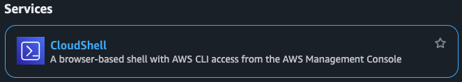

# Crear una instancia EC2 y conectarse por SSH

## Objetivos
Crear una instancia de Elastic Compute Cloud (EC2) para usar un recurso computacional base dentro AWS.
## Marco conceptual
### Amazon Elastic Compute Cloud (EC2)
EC2 es el servicio de AWS que ofrece máquinas virtuales (VMs) bajo demanda. El catálogo de configuración es amplio y permite escoger el sistema operativo, almacenamiento, memoria RAM, capacidad de red, procesador, entre otras opciones. Una instancia de EC2 hace referencia a una máquina virtual dentro del servicio. En las instancias se puede ejecutar cualquier software. Cabe aclarar que los programas requerirán de algunas capacidades mínimas. Por ejemplo, entrenar un modelo de lenguaje de gran tamaño requiere de más capacidad de computación que ejecutar un programa simple de una calculadora.

Más información en: [Amazon EC2](https://docs.aws.amazon.com/es_es/AWSEC2/latest/UserGuide/concepts.html)

### Imagen de máquina de Amazon (AMI)

Una AMI es el software inicial de una instancia EC2. Este software normalmente hace referencia a un sistema operativo específico para un tipo de instancia. Algunos sistemas operativos que se encuentran en las AMIs son: Amazon Linux, macOS, Ubuntu, Windows, entre otros. Las AMIs también son capaces de guardar estados del sistema en general y así pueden contener otros programas preinstalados en el sistema operativo. Usted también puede crear sus propias imágenes de máquina a partir de instancias EC2 existentes.

Más información en: [Imágenes de máquina de Amazon (AMI) en Amazon EC2](https://docs.aws.amazon.com/es_es/AWSEC2/latest/UserGuide/AMIs.html)

### Conexión por SSH

Para administrar las instancias EC2 ya creadas es importante poder establecer una conexión desde su computador. Esta conexión se logra con Secure Shell (SSH) que es un protocolo de conexión remota y le permite acceder a la terminal de la instancia EC2 que desee. En este curso se utilizarán las conexiones SSH siempre que se usen instancias EC2.

## Tutorial consola AWS
El siguiente tutorial usará la herramienta CloudShell para crear los grupos de seguridad, de igual forma si desea usar la consola de AWS puede seguir el siguiente [tutorial](https://docs.aws.amazon.com/es_es/AWSEC2/latest/UserGuide/EC2_GetStarted.html)

## Tutorial Cloudshell
### 0. Instancia EC2 a crear
La instancia que vamos a crear en el tutorial está definida en la siguiente tabla

| Parámetro         | Valor                        |
| ----------------- | ---------------------------- |
| Nombre            | `Cheapest-app`                 |
| AMI               | Ubuntu Server 24.04 LTS      |
| Tipo de instancia | `t2.medium`                  |
| IP pública        | Habilitar                    |
| Security Groups   | `Cheapest-ssh` + `Cheapest-http` |
| Almacenamiento    | 8 GB                         |
| AZ (Zona)         | `<AZ_ASIGNADA>`              |
### 1. Abrir AWS CloudShell

1. Inicie sesión en la **AWS Console**.
2. En la barra superior seleccione el ícono de **CloudShell**.

El ícono luce así:


3. Espere a que se abra la terminal.

CloudShell ya incluye:
- AWS CLI
- Credenciales configuradas automáticamente
- Acceso a la cuenta actual
### 2. Crear un Key Pair  
La instancia utilizará una **clave SSH** para autenticación.  
  
Ejecute:  
  
``` bash  
aws ec2 create-key-pair --key-name Cheapest-key --query 'KeyMaterial' --output text > Cheapest-key.pem
```

Esto le dará la llave para poder acceder a la máquina que va a crear a través de ssh ya sea desde cloudshell o desde su terminal

Para usarla, cambie los permisos de la clave:
``` bash
chmod 400 Cheapest-key.pem
```

### 3. Obtener el ID de los Security Groups

Buscamos los grupos creados previamente. ([Tutorial Security Groups](crear_security_groups.md))

``` bash
aws ec2 describe-security-groups --filters Name=group-name,Values=Cheapest-ssh,Cheapest-http --query "SecurityGroups[*].GroupId"
```

Ejemplo de salida:

``` json
[  
  "sg-01abc123",  
  "sg-02def456"  
]
```

Guarde estos IDs.
### 4. Obtener la AMI de Ubuntu 24.04

Las AMIs son identificadores de imágenes de sistemas operativos. Estos cambian constantemente, por lo que se busca la más reciente utilizando el siguiente comando:

``` bash
aws ec2 describe-images --owners 099720109477 --filters "Name=name,Values=ubuntu/images/*/ubuntu-*-24.04-*" "Name=architecture,Values=x86_64" "Name=state,Values=available" --query "Images | sort_by(@,&CreationDate)[-1].ImageId" --output text
```

Ejemplo de salida:

```
ami-123abc456
```

Note que este comando usa expresiones regulares para traer la versión que haga match con la última imagen de ubuntu 24.04. (El id que aparece en owners es el de Canonical, organización que mantiene las imágenes oficiales de Ubuntu en AWS). El filtro `architecture,Values=x86_64` es importante: sin él, el comando puede devolver una imagen `arm64`, que no es compatible con instancias `t2.medium` (x86_64) y hace fallar el `run-instances` con un error de arquitectura.

Guarde el **ImageId**.

> [!NOTE]
> Los códigos AMI y los sistemas operativos que ofrece AWS cambian constantemente, en caso de que el anterior comando no le retorne ningún AMI disponible, puede seguir el [tutorial de aws](https://docs.aws.amazon.com/es_es/AWSEC2/latest/UserGuide/finding-an-ami.html) para encontrar AMIs
### 5. Obtener el ID de la Subnet según la AZ asignada

Cada zona de disponibilidad (AZ) tiene una o más subnets asociadas dentro de la VPC. Debe usar la subnet que corresponda a la AZ indicada en la tabla del paso 0.

Ejecute el siguiente comando reemplazando `<AZ_ASIGNADA>` con el valor de su tabla (por ejemplo `us-east-1a`):

```bash
aws ec2 describe-subnets \
  --filters "Name=availability-zone,Values=<AZ_ASIGNADA>" \
  --query "Subnets[*].{SubnetId:SubnetId,AZ:AvailabilityZone,CIDR:CidrBlock,VPC:VpcId}"
```

Ejemplo de salida:

```json
[
    {
        "SubnetId": "subnet-0abc1234",
        "AZ": "us-east-1a",
        "CIDR": "172.31.0.0/20",
        "VPC": "vpc-0def5678"
    }
]
```

Guarde el **SubnetId** que corresponda a su AZ asignada.

> [!NOTE]
> Si aparecen varias subnets para la misma AZ, use cualquiera de ellas, ya que todas pertenecen a la misma zona.

### 6. Crear la instancia EC2
Ejecute:

``` bash
aws ec2 run-instances --image-id <AMI_ID> --instance-type <INSTANCE_TYPE> --key-name <KEY_NAME> --security-group-ids <SG_ID_1> <SG_ID_2> <SG_ID_N> --subnet-id <SUBNET_ID> --associate-public-ip-address --block-device-mappings '[{"DeviceName":"/dev/sda1","Ebs":{"VolumeSize":8}}]' --tag-specifications 'ResourceType=instance,Tags=[{Key=Name,Value=<NOMBRE_INSTANCIA>}]'
```
Esto creará la instancia.
### 7. Obtener la IP pública

Para consultar la IP pública:
```bash
aws ec2 describe-instances --filters "Name=tag:Name,Values=<NOMBRE_INSTANCIA>" --query "Reservations[*].Instances[*].PublicIpAddress" --output text
```

Ejemplo:

`34.203.15.21`

Guarde la IP.
# Conectarse por SSH

Las instancias Ubuntu utilizan el usuario: `ubuntu`

# Conexión desde Linux / macOS

Desde su terminal use ssh para conectarse
``` bash
ssh -i Cheapest-key.pem ubuntu@IP_PUBLICA
```
# Conexión desde Windows

## Opción 1 — Windows Terminal / PowerShell

Si Windows tiene OpenSSH instalado:

``` bash
ssh -i Cheapest-key.pem ubuntu@IP_PUBLICA
```
## Opción 2 — PuTTY

1. Abrir **PuTTYgen**
2. Convertir `Cheapest-key.pem` a `Cheapest-key.ppk`
3. Abrir **PuTTY**
4. Configurar:
Host: ubuntu@IP_PUBLICA
5. En **SSH → Auth** seleccionar el archivo `.ppk`.

# Instalar Docker en Ubuntu
Para instalar docker en ubuntu puede usar el [tutorial](./instalar_docker_en_una_maquina_EC2.md)
# Resultado final

Se ha creado una instancia EC2 con:

|Parámetro|Valor|
|---|---|
|Nombre|`Cheapest-app`|
|AMI|Ubuntu 24.04|
|Tipo|`t2.medium`|
|Almacenamiento|8 GB|
|Acceso SSH|habilitado|
|API|puerto 3000 habilitado|

Esta instancia servirá para ejecutar el **backend del sistema Cheapest**

## Eliminar la instancia EC2

Si ya no necesita la instancia creada, puede eliminarla usando **AWS CloudShell** con el siguiente comando.

Primero obtenga el **InstanceId** de la instancia `Cheapest-app`:

```bash
aws ec2 describe-instances --filters "Name=tag:Name,Values=<NOMBRE_INSTANCIA>" --query "Reservations[*].Instances[*].InstanceId"
```

Luego elimine la instancia usando el id anterior
```
aws ec2 terminate-instances --instance-ids <ID_INSTANCIA>
```

Salida esperada:
``` json
{  
    "TerminatingInstances": [  
        {  
            "InstanceId": "i-1234567890abcdef",  
            "CurrentState": {  
                "Name": "shutting-down"  
            },  
            "PreviousState": {  
                "Name": "running"  
            }  
        }  
    ]  
}
```

Una vez completado el proceso, la instancia desaparecerá de la lista de instancias activas.