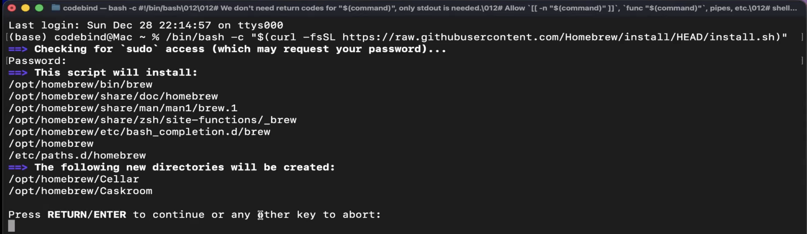

# Instalar Homebrew (brew)

## 1. ¿Qué es Homebrew?

Homebrew (`brew`) es un gestor de paquetes para macOS (y Linux) que permite instalar, actualizar y desinstalar aplicaciones y librerías directamente desde la línea de comandos, sin tener que buscar ni descargar instaladores manualmente. Brew se encarga de descargar el paquete solicitado y resolver automáticamente las dependencias que necesite, dejándolo listo para usar en la terminal.

Puede consultar más información en el sitio oficial: [https://brew.sh/](https://brew.sh/)

## 2. Instalación de Homebrew

1. Abra la terminal de su computador.
2. Ejecute el siguiente comando de instalación:

```bash
/bin/bash -c "$(curl -fsSL https://raw.githubusercontent.com/Homebrew/install/HEAD/install.sh)"
```

3. Durante el proceso, la instalación le pedirá presionar `Enter` para continuar (y es posible que le solicite su contraseña de usuario). La terminal se verá de forma similar a la siguiente imagen:



## 3. Instalación de paquetes con brew

Siguiente, para algunos laboratorios va a ser necesario que instale algunos paquetes, por ejemplo `awscli` o `jq`. Para instalar cualquier paquete con brew, el comando general es:

```bash
brew install <nombre-paquete>
```

A continuación, los comandos específicos para instalar `awscli` y `jq`.

## Instalación de awscli con brew

```bash
brew install awscli
```

Verifique que quedó instalado correctamente con:

```bash
aws --version
```

## Instalación de jq con brew

```bash
brew install jq
```

Verifique que quedó instalado correctamente con:

```bash
jq --version
```
